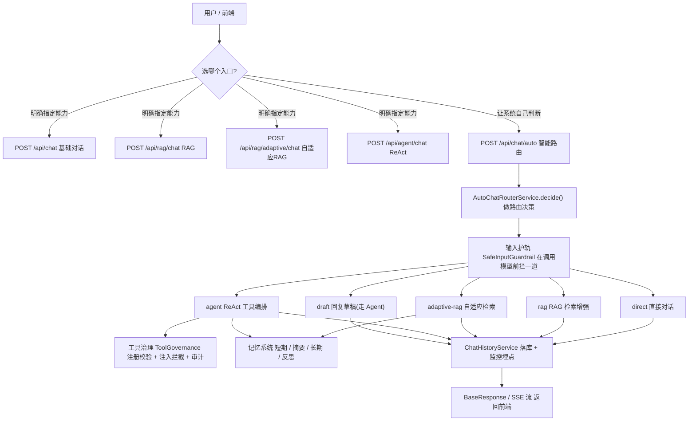

# 01 架构总览与请求生命周期

> 在动手抠任何一个子系统之前，先站在山顶看一眼整张地图：这套系统由哪几块拼成？一个请求从 HTTP 进来到 JSON 出去，到底走了哪些岔路口？
>
> 读完本章你能回答:
> - InfiniteChat-Agent 的 5 大子系统分别是什么，谁负责干什么活？
> - 一个聊天请求进了 Controller 之后，是怎么被分流到「直接对话 / RAG / 自适应 RAG / Agent / 草稿」这 5 条路径之一的？
> - `AutoChatRouterService` 凭什么决定走哪条路？关键词命中、斜杠命令、兜底，优先级是怎样的？
> - 安全护轨、记忆、监控这些「横切关注点」是怎么贴在主流程上的？

## 一句话定位

本章是整套文档的「总目录 + 主控制流图」。它不深挖任何单个子系统的内部细节（那是后面 02~09 章的事），而是帮你建立一张**全景拓扑**：知道每个请求会经过哪些环节、岔到哪条路，后面读细节时心里就有坐标了。

## 为什么需要它（动机：没有它会怎样）

假设你是第一次接手这个项目。你打开 `controller` 目录，看到 8 个 Controller、十几个路由；再翻 `service`，发现 `RagQueryService`、`AdaptiveRagOrchestrator`、`ReActAgentOrchestrator`、`MemoryAgent`、`ToolGovernanceService`…… 名字一个比一个唬人。

如果没有一张总图，你大概率会犯两个错：

1. **盲人摸象**：以为「RAG」就是全部，结果发现还有个「Adaptive RAG」，两者还不一样，到底啥区别？
2. **找不到入口**：用户在前端打一句「帮我对比一下 A 和 B 方案」，这句话最终是被哪段代码处理的？你顺着 `/chat` 找了半天，发现真正的智能分流在 `/chat/auto` 里。

本章就是来解决这两个问题的。先给你一张地图，再带你走一遍「一个请求的完整生命周期」，把这些唬人的名字串成一条清晰的流水线。

## 核心概念（用大白话 + 小表格解释术语）

这套系统本质上是「**一个聪明的前台 + 五个专业窗口**」。前台（路由器）听你说一句话，判断你想办什么事，然后把你领到对应的专业窗口去办。

先把 5 大子系统和它们的「窗口」说清楚：

| 子系统（窗口） | 大白话 | 它解决什么问题 | 对应后续章节 |
| --- | --- | --- | --- |
| 基础对话 Direct/Stream | 一个会聊天、能记住上下文的普通 ChatBot | 闲聊、不需要查资料也不需要动工具的问题 | [02-basic-chat-streaming.md](02-basic-chat-streaming.md) |
| RAG 检索 | 「带着资料回答」的助手，答完还告诉你出处 | 问知识库里有的事实，要求有引用、不许瞎编 | [03-rag-retrieval.md](03-rag-retrieval.md) |
| Adaptive RAG | 会先「想一下要不要查、查几轮、查哪种」的进阶 RAG | 复杂问题，需要规划检索策略 + 评估证据够不够 | [04-adaptive-rag.md](04-adaptive-rag.md) |
| ReAct Agent | 会「边想边动手」的智能体，能调用工具、读写记忆 | 需要查时间、发邮件、记住某件事这类「动作」 | [05-react-agent.md](05-react-agent.md) |
| 横切层（安全 + 记忆 + 监控） | 不是窗口，是贴在所有窗口上的「保安 + 秘书 + 摄像头」 | 拦截攻击、跨会话记忆、全链路可观测 | [06](06-governance-guardrail.md) / [07](07-memory-system.md) / [09](09-observability.md) |

几个一开始容易混的术语，先用大白话点破：

| 术语 | 唬人解释 | 大白话 |
| --- | --- | --- |
| RAG | Retrieval-Augmented Generation | 答题前先去资料库「翻书」，把翻到的内容塞给大模型再让它答，这样它不容易瞎编 |
| ReAct | Reasoning + Acting | 让大模型「想一步、做一步、看结果、再想」，像人解题时打草稿一样 |
| Agent / 智能体 | 自主决策的 AI 实体 | 不只会说话，还会自己决定「该调哪个工具」并真的去调 |
| 路由（Router） | 请求分发 | 前台：听你一句话，决定把你领去哪个窗口 |
| 横切关注点 | Cross-cutting concern | 每个窗口都要用到、但又不属于任何单个窗口的公共能力（如安全检查、记录日志） |

> 关于「横切」再多说一句：安全护轨、记忆、监控这三样东西，无论你走哪条路径都可能用到。它们不是流水线上的某一个工位，而是「贯穿整条流水线」的公共设施——所以叫横切。本章只点到为止，细节在 06/07/09 章。

## 工作流程（含 mermaid 图）

先看一张「主控制流」总图。它回答的核心问题是：**一句话从进系统到出系统，到底怎么走。**



读图要点（一句话版）：

1. **两类入口并存**。前端既可以「点名」走某个能力（如 `/api/chat`、`/api/agent/chat`），也可以把判断权交给系统，走智能路由 `/api/chat/auto`。
2. **智能路由是本章主角**。`/api/chat/auto` 进来后，先经过 `AutoChatRouterService.decide()` 做一次路由决策，分出 5 条路。
3. **安全、记忆、治理是「路上」的检查站**，不同路径会经过不同的检查站。
4. **所有路径最后都汇到一起**：写历史、埋监控点、统一封装成 `BaseResponse` 或 SSE 流返回。

## 代码走读（关键类/方法 + path:line，讲清控制流）

### 1. 启动类：先看系统「关掉」了什么

`agent/src/main/java/com/lou/infinitechatagent/InfiniteChatAgentApplication.java:8`

```java
@SpringBootApplication(exclude = {AutoConfig.class, RedisEmbeddingStoreAutoConfiguration.class})
public class InfiniteChatAgentApplication { ... }
```

这是一个标准 Spring Boot 启动类，但 `exclude` 透露了两个设计意图：

- 排除 `AutoConfig`（DashScope 的自动配置）——说明模型的接入不走开箱自动装配，而是项目自己用「模型工厂」掌控（详见 [08-model-factory.md](08-model-factory.md)）。
- 排除 `RedisEmbeddingStoreAutoConfiguration`——Redis 在这里只当「短期会话记忆」用，**不**用作向量库；向量库是 PgVector。这点很容易踩坑，记住它。

### 2. 八个 Controller：系统的全部「门牌号」

所有路由都带 `/api` 前缀（来自 `server.servlet.context-path: /api`）。下表把 8 个 Controller 一次列清楚，建立全景。**别去背，知道「想找某类功能去哪个 Controller」即可。**

| Controller | 类路径根映射 | 代表性路由（相对 `/api`） | 干什么 |
| --- | --- | --- | --- |
| `AutoChatController` | `/chat/auto` | `POST /chat/auto`、`POST /chat/auto/stream` | 智能路由总入口，本章重点 |
| `AiChatController` | （无类级前缀） | `POST /chat`、`POST /streamChat` | 基础对话 / 流式对话 |
| `RagChatController` | `/rag` | `POST /rag/chat` | 带引用的 RAG 问答 |
| `AdaptiveRagController` | `/rag/adaptive` | `POST /rag/adaptive/chat` | 自适应 RAG |
| `AgentController` | `/agent` | `POST /agent/chat`、`GET /agent/tools`、`GET /agent/tools/audit` | ReAct Agent + 工具清单 + 工具审计 |
| `MemoryController` | `/memory` | `POST /memory/write`、`POST /memory/correct`、`POST /memory/agent/context`、`GET /memory/user/{userId}` | 记忆读写、纠错、反思 |
| `RagDocumentController` | `/rag/documents` | `POST /rag/documents/ingest`、`/upload`、`/text`、`GET /rag/documents/jobs/{jobId}` | 文档入库（向量化） |
| `KnowledgeController` | （无类级前缀） | `POST /insert` | 运行时插入一条 QA 知识 |
| `ChatHistoryController` | `/chat` | `GET /chat/sessions`、`GET /chat/model-status`、`POST /chat/model-config`、`GET /chat/models` | 会话历史 + 模型状态/切换 |

> 注：清单里其实是 9 个 `@RestController` 类（含 `ChatHistoryController`）。本章重点是前 8 个业务入口，`ChatHistoryController` 偏运维侧，会在 [08](08-model-factory.md) / [10](10-run-and-api-reference.md) 章再展开。

注意一个细节：`AiChatController` 的 `POST /chat`（基础对话）和 `ChatHistoryController` 的 `@RequestMapping("/chat")`（会话管理）共用 `/chat` 这个前缀，但因为方法级路径不同（`/chat` vs `/chat/sessions` 等），互不冲突。看代码时别被这个绕进去。

### 3. 路由决策的心脏：`AutoChatRouterService.decide()`

这是本章最该看懂的方法。它就是那个「前台」，逻辑非常直白——**斜杠命令优先，其次关键词命中，最后兜底走直接对话**。

`agent/src/main/java/com/lou/infinitechatagent/chat/AutoChatRouterService.java:56`

控制流如下（按代码顺序就是优先级顺序）：

第一步，先看是不是「斜杠命令」强制指定（`decide` 的 `forcedCommand` 分支，第 58~67 行）。如果用户输入以 `/` 开头，命中下面这张映射表就**直接拍板**，不再看关键词：

`agent/src/main/java/com/lou/infinitechatagent/chat/AutoChatRouterService.java:259`

```java
String route = switch (command) {
    case "/streaming-chat", "/direct-chat" -> ROUTE_DIRECT;
    case "/agent-chat"   -> ROUTE_AGENT;
    case "/adaptive-rag" -> ROUTE_ADAPTIVE_RAG;
    case "/rag-chat"     -> ROUTE_RAG;
    case "/reply-draft"  -> ROUTE_DRAFT;
    default -> null;   // 不是已知命令，当普通文本处理
};
```

命中斜杠命令时，决策里会带上 `forced=true`，并把命令后面的正文剥出来当真正的 prompt（第 257~258 行 `rest` / `cleanPrompt`）。

第二步，如果不是斜杠命令，就按关键词命中，**从「最特殊」到「最普通」依次判断**（第 69~82 行）。顺序很关键，命中即返回：

| 判断顺序 | 命中关键词（节选，中英混合） | 路由到 | 含义 |
| --- | --- | --- | --- |
| 1 | `draft` / `reply` / `回复` / `草稿` | `draft` | 想让你帮忙起草一段回复 |
| 2 | `use tool` / `agent` / `send email` / `remember` / `记住` / `调用工具` | `agent` | 涉及工具、记忆、动作编排 |
| 3 | `compare` / `analyze` / `why` / `引用` / `分析` / `对比` | `adaptive-rag` | 需要规划和证据评估的复杂问题 |
| 4 | `document` / `docs` / `rag` / `知识库` / `文档` | `rag` | 想查知识库、要落地资料 |
| 5 | （以上都不命中） | `direct` | 普通对话，兜底 |

> 大白话理解这个优先级：「起草」最具体，先认；其次是「要动手做事」（Agent）；再次是「要带脑子分析」（Adaptive RAG）；然后是「单纯查资料」（RAG）；什么都不沾就当闲聊（Direct）。

第三步，决策出来后，`chat()`（第 85 行）调用 `execute()`，用一个 `switch` 把 5 条路由分别派发到对应的处理方法：

`agent/src/main/java/com/lou/infinitechatagent/chat/AutoChatRouterService.java:162`

```java
return switch (decision.getRoute()) {
    case ROUTE_AGENT        -> fromAgent(request, decision, requestId, false);
    case ROUTE_DRAFT        -> fromAgent(request, decision, requestId, true); // draft=true
    case ROUTE_ADAPTIVE_RAG -> fromAdaptiveRag(request, decision, requestId);
    case ROUTE_RAG          -> fromRag(request, decision, requestId);
    case ROUTE_DIRECT       -> fromDirect(request, decision, requestId);
    default                 -> fromDirect(request, decision, requestId);
};
```

注意 `draft` 和 `agent` 共用同一个 `fromAgent()`，区别只是 `draft=true` 时会先把用户的话包一层「帮我起草一段回复」的提示词（第 304 行 `draftPrompt`）。所以「草稿」本质上是 ReAct Agent 的一个特例。

第四步，各处理方法分别委托给真正的子系统：

- `fromDirect`（第 173 行）→ `aiChat.chat(...)`，即基础对话接口 `AiChat`（[02](02-basic-chat-streaming.md) 章）。
- `fromRag`（第 181 行）→ `ragQueryService.chatWithCitations(...)`（[03](03-rag-retrieval.md) 章）。
- `fromAdaptiveRag`（第 195 行）→ `adaptiveRagOrchestrator.chat(...)`（[04](04-adaptive-rag.md) 章）。
- `fromAgent`（第 214 行）→ `reActAgentOrchestrator.chat(...)`（[05](05-react-agent.md) 章）。

每个方法都会在 `toolTrace` 里塞一个 `capability` 标记（如 `"rag-chat"`、`"adaptive-rag"`、`"agent-chat"`），方便前端/审计区分这次到底走了哪条路。

### 4. 横切层是怎么「贴」上去的

主流程之外，三件公共设施在不同环节默默生效：

- **输入护轨**：`AiChat` 接口上标注了 `@InputGuardrails(SafeInputGuardrail.class)`，见 `agent/src/main/java/com/lou/infinitechatagent/ai/AiChat.java:10`。也就是说，凡是走 LangChain4j 的 `AiChat` 调用（基础对话/流式），在请求送达模型前会先过一道安全检查。详见 [06-governance-guardrail.md](06-governance-guardrail.md)。
- **历史落库 + 监控**：`AutoChatRouterService.chat()` 在成功/失败后分别调用 `chatHistoryService.recordSuccess(...)` / `recordError(...)`（第 90、101 行）；而直连入口如 `AiChatController` 还会在方法里 `MonitorContextHolder.setContext(...)` 设置监控上下文（`AiChatController.java:36`）。这套埋点喂给 Prometheus，详见 [09-observability.md](09-observability.md)。
- **工具治理**：只在 Agent 路径触发——`AgentController` 注入了 `ToolGovernanceService` 与 `ToolRegistry`（`AgentController.java:33-36`），工具执行前做注册校验、注入拦截与审计。详见 [06-governance-guardrail.md](06-governance-guardrail.md)。

### 5. 一个请求的完整生命周期（串起来）

以一句「帮我对比 Redis 和 MySQL 做缓存的优劣，要有依据」走 `/api/chat/auto` 为例：

1. 请求落到 `AutoChatController.chat()`（`AutoChatController.java:31`）。
2. `decide()`：不是斜杠命令 → 命中关键词「对比 / 依据」→ 路由到 `adaptive-rag`。
3. `execute()` 派发到 `fromAdaptiveRag()`，构造 `AdaptiveRagRequest`（`debug=true`）交给 `AdaptiveRagOrchestrator`。
4. Adaptive RAG 内部：规划是否检索 → 检索（向量+关键词，RRF 融合）→ Rerank → 证据评估（够不够，不够再来一轮，最多 2 轮）→ 生成带引用的答案。其间按需读写记忆系统。
5. 回到路由层：`recordSuccess(...)` 把这次问答写进历史、带上 `capability=adaptive-rag` 与命中原因。
6. 封装成 `BaseResponse<AutoChatResponse>` 返回，前端拿到答案 + `citations` + `toolTrace`。

这就是「从 Controller 进来到响应出去」的一条典型路径。换成别的关键词，只是第 2~4 步岔到别的窗口而已。

## 关键配置（从 application.yml 摘相关项）

本章只列「影响全局拓扑」的配置，子系统的细粒度参数留给各自章节。来源：`agent/src/main/resources/application.yml`。

| 配置键 | 含义 | 默认值 |
| --- | --- | --- |
| `server.port` | 服务端口 | `10010` |
| `server.servlet.context-path` | 全局路由前缀，所有接口都带 `/api` | `/api` |
| `agent.model.provider` | 模型来源：`auto` 表示有 OpenAI key 走 OpenAI 兼容，否则走 DashScope | `auto` |
| `agent.react.planner.mode` | ReAct 的规划器模式 | `LLM` |
| `rag.adaptive.planner.mode` | 自适应 RAG 的规划器模式 | `RULE_BASED` |
| `agent.tool-governance.enabled` | 是否启用工具治理（横切安全） | `true` |
| `agent.tool-governance.prompt-injection-check.enabled` | 是否做 Prompt 注入检测 | `true` |
| `memory.enabled` | 是否启用记忆系统（横切） | `true` |
| `rag.rerank.enabled` | 是否启用重排序 | `true` |
| `mcp.enabled` | 是否启用 MCP 工具集成 | `false`（默认关） |
| `web-search.enabled` | 是否启用联网搜索 | `false`（默认关） |
| `management.endpoints.web.exposure.include` | 暴露的 Actuator 端点 | `health,info,prometheus` |

> 两个「全局开关」要记牢：`mcp` 和 `web-search` 默认都是**关**的，所以默认情况下 Agent 能用的工具相对有限（详见 [05](05-react-agent.md)）。监控端点实际路径是 `/api/actuator/health` 等（因为有 `/api` 前缀），见 [09](09-observability.md)。

## 动手试一试（curl 示例）

下面三条命令演示「同一个智能入口，靠不同措辞走到不同路径」。注意端口 `10010` 和前缀 `/api`。

```bash
# 1) 闲聊 → 兜底走 direct
curl -X POST http://localhost:10010/api/chat/auto \
  -H "Content-Type: application/json" \
  -d '{"userId":1,"sessionId":1001,"prompt":"你好，简单介绍下你自己"}'

# 2) 带「对比/依据」关键词 → 走 adaptive-rag
curl -X POST http://localhost:10010/api/chat/auto \
  -H "Content-Type: application/json" \
  -d '{"userId":1,"sessionId":1001,"prompt":"对比一下方案 A 和 B 的优劣，要有依据"}'

# 3) 斜杠命令强制指定 → 直接走 agent，忽略关键词
curl -X POST http://localhost:10010/api/chat/auto \
  -H "Content-Type: application/json" \
  -d '{"userId":1,"sessionId":1001,"prompt":"/agent-chat 现在几点了"}'
```

返回体里重点看两个字段：`route`（最终走了哪条路）和 `toolTrace.capability`（对应的能力标记）。第 3 条还会带 `forced=true`。

想验证「智能路由分到各子系统后的真实行为」，可以直接打各子系统的「点名入口」，对应的 Postman 集合在 `agent/docs/postman/` 下：

- ReAct Agent：`react-agent.postman_collection.json`、`react-agent-tools.postman_collection.json`
- 自适应 RAG：`adaptive-rag.postman_collection.json`
- RAG 检索/重排/引用：`hybrid-rag-rerank.postman_collection.json`、`rag-citation.postman_collection.json`、`pdf-rag.postman_collection.json`
- 安全与治理：`safe-input-guardrail.postman_collection.json`、`tool-governance.postman_collection.json`
- 记忆：`memory-agent.postman_collection.json`、`memory-dedup-correction.postman_collection.json`

> 本套教程没有为「智能路由 `/chat/auto`」单独建集合；想体验分流，按上面的 curl 改 `prompt` 措辞即可。各能力的细节验证请用上面对应的集合。

## 常见坑与注意点

1. **别忘了 `/api` 前缀**。所有路由都挂在 `context-path: /api` 下。直接 `POST http://localhost:10010/chat/auto`（漏了 `/api`）会 404。
2. **斜杠命令优先级最高**，会盖过关键词判断。比如 prompt 是 `/direct-chat 帮我分析这段日志`，虽然有「分析」这个本该触发 adaptive-rag 的词，但因为前面有 `/direct-chat`，最终走的是 direct。
3. **关键词是「包含匹配」，不是语义理解**。`decide()` 用的是 `String.contains()`（`AutoChatRouterService.java:279`），大小写已统一成小写但**不做分词**。所以「我想 remember 一下」会因为含 `remember` 被判到 agent；而一句没有任何关键词的复杂问题，可能被兜底成 direct，得不到 RAG 加持。这是规则路由的固有局限，心里要有数。
4. **只有 `direct` 路径支持「逐 token 流式」**。看 `supportsTokenStreaming()`（`AutoChatRouterService.java:114`）——只有 direct 返回 `true`。其他路径走 `/chat/auto/stream` 时，是「先整体算完再一次性当作一个 delta 推给你」，不是真正的逐字流（`AutoChatController.java:73-90`）。
5. **`userId` / `sessionId` 不传会被兜底**。`safeUserId` 默认 `1L`、`safeSessionId` 默认 `System.currentTimeMillis()`（`AutoChatRouterService.java:312-318`）。本地随手测没问题，但会导致记忆/历史串不到一起，正式调用务必显式传。
6. **Redis 不是向量库**。启动类已排除 Redis 向量自动配置；Redis 只当短期会话记忆，向量检索一律走 PgVector，PgVector 不可用时降级到内存（详见 [03](03-rag-retrieval.md) / [07](07-memory-system.md)）。

## 小结 & 延伸阅读

一句话总结本章：**InfiniteChat-Agent = 一个智能前台（`AutoChatRouterService`）+ 五个专业窗口（Direct / RAG / Adaptive RAG / Agent / Draft）+ 三样贴在全程的公共设施（安全 / 记忆 / 监控）。** 请求进来先被路由分流，办完事统一落库埋点再返回。把这张图记在脑子里，后面每一章都是在放大其中一块。

接下来按这个顺序读最顺：

- 先看最简单的窗口：[02-basic-chat-streaming.md](02-basic-chat-streaming.md)（基础对话与流式输出）
- 再看「带资料回答」：[03-rag-retrieval.md](03-rag-retrieval.md)（RAG 检索增强）
- 进阶到「会规划的检索」：[04-adaptive-rag.md](04-adaptive-rag.md)（自适应 RAG）
- 然后是「会动手的智能体」：[05-react-agent.md](05-react-agent.md)（ReAct Agent）
- 三样横切设施分别在：[06-governance-guardrail.md](06-governance-guardrail.md)（治理与护轨）、[07-memory-system.md](07-memory-system.md)（记忆）、[09-observability.md](09-observability.md)（可观测性）
- 想动手跑起来 / 查 API：[10-run-and-api-reference.md](10-run-and-api-reference.md)
- 回到学习地图总入口：[README.md](README.md)
