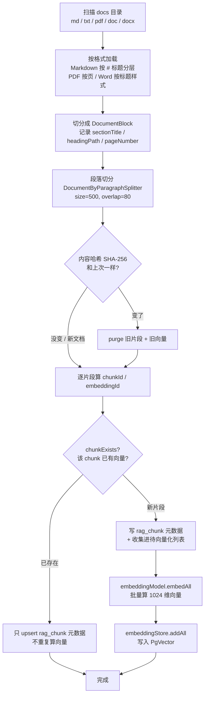
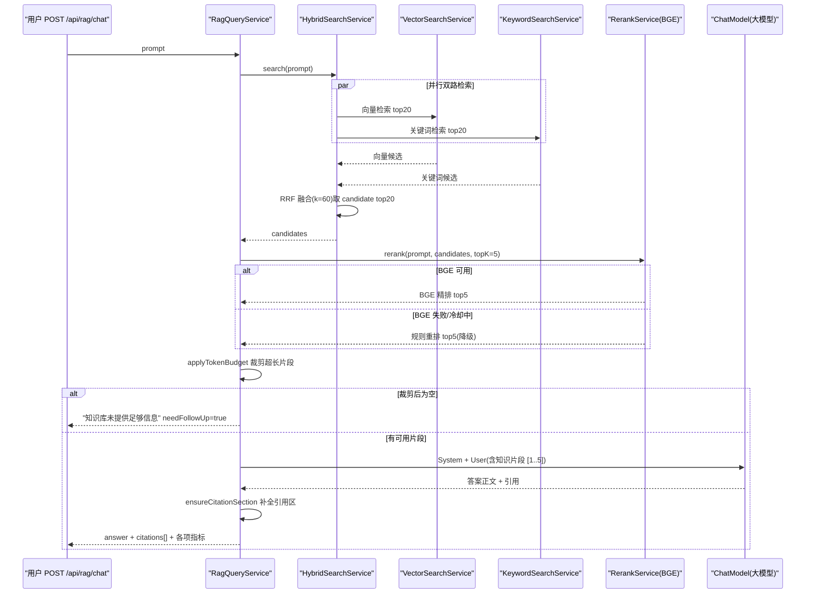

# 03 RAG 知识库检索增强

> 大模型不知道你公司的内部文档,问它"RAG-409 是什么错误"只会一本正经地胡编。RAG(检索增强生成)就是给模型"开卷考试"——先去知识库里翻出相关段落,再让模型照着这些段落作答,还要标上 `[1][2]` 告诉你答案出自哪一页哪一段。
>
> 读完本章你能回答:
> - 一份 Markdown / PDF / Word 文档,是怎么变成"可检索、可溯源"的向量片段的?
> - 为什么要"向量 + 关键词"两路一起检索,再用 RRF 把它们融合?
> - BGE 重排服务挂了会怎样?为什么要"失败 60 秒冷却 + 降级规则重排"?
> - 答案里的 `[1][2]` 引用是怎么和原文段落对上号的?Token 预算又是怎么把超长上下文裁掉的?

## 一句话定位

RAG 是本项目的"检索增强地基":它把企业文档摄取成带元数据的向量片段(摄取流水线),在用户提问时混合检索 + 重排 + 裁剪上下文,最后让大模型生成一段**带 `[1][2]` 引用、可溯源**的答案(查询流水线)。对应入口是 `POST /api/rag/chat`。

## 为什么需要它(动机:没有它会怎样)

大语言模型有三个先天毛病:

1. **不知道你的私有知识**。模型的训练数据截止到某个时间点,而且绝不会包含你公司昨天才写的运维手册。直接问"RAG-409 是什么错误",它要么说不知道,要么"幻觉"——编一个听起来很像那么回事但完全错误的答案。
2. **没法溯源**。就算它答对了,你也不知道这句话是从哪来的、可不可信。对企业问答来说,"这条结论出自哪份文档第几页"往往比答案本身更重要。
3. **上下文窗口有限**。你不可能把整个知识库几百万字一股脑塞进 prompt——既贵又超长,模型还会"读不过来"。

RAG 的思路很朴素,就是把闭卷考试改成**开卷考试**:

- 提前把文档拆成小片段、建好"索引"(摄取);
- 用户提问时,先用问题去索引里**捞出最相关的几段**(检索);
- 把这几段连同问题一起交给模型,要求它**只能照着这些段落回答,并标注来源**(生成)。

没有 RAG,你的 Agent 就是一个"博学但记不住公司内部事的实习生";有了 RAG,它变成一个"会查资料、会标页码、不许瞎编"的助理。

## 核心概念(用大白话 + 小表格解释术语)

| 术语 | 大白话解释 | 在本项目里对应 |
| --- | --- | --- |
| 摄取 / Ingestion | 把文档"消化"成可检索的小片段并入库 | `DocumentIngestionService` |
| 切分 / Chunking | 把长文档剪成 500 字左右的小段,带 80 字重叠 | `DocumentByParagraphSplitter(500, 80)` |
| 分层感知 | 切分时记住"这段属于哪个标题章节",路径形如 `一级标题 > 二级标题` | `heading_path` 字段 |
| Embedding / 向量 | 把一段文字变成一串数字(1024 维),语义近的文字向量也近 | `HashEmbeddingModel`(见下方"坑") |
| 向量检索 | 用"语义相似度"找片段——问题和片段意思接近就能命中 | `VectorSearchService` |
| 关键词检索 | 用 SQL `like` 找片段——问题里的词字面出现在片段里就命中 | `KeywordSearchService` |
| RRF 融合 | Reciprocal Rank Fusion,按"排名"而非"分数"把两路结果合并打分,k=60 | `HybridSearchService` |
| Rerank / 重排 | 用更强的模型把候选片段重新精排,只留最相关的 top-k | `BgeRerankService` |
| 降级 / Fallback | 重排服务挂了,临时改用本地"规则重排",不让整条链路崩 | `RuleBasedRerankService` |
| Citation / 引用溯源 | 答案里的 `[1]` 对应到具体文件 / 章节 / 页码 / 段号 | `Citation` DTO |
| Token 预算 | 估算 prompt 占多少 token,超了就把片段截短,别撑爆模型 | `applyTokenBudget()` |

一句话串起来:**切分 → 向量化 → 入库**(摄取);**双路检索 → RRF 融合 → 重排 → 裁剪 → 带引用生成**(查询)。

## 工作流程(含 mermaid 图)

### 摄取流水线:文档怎么变成可检索片段

`DocumentIngestionService.ingestDocument()` 是核心。一份文档进来,大致经历"加载 → 分块感知章节 → 段落切分 → 内容哈希做增量 → 写 `rag_chunk` 元数据 → 计算 Embedding → 写 PgVector"。



### 查询流水线:一次提问发生了什么

`RagQueryService.chatWithCitations()` 是主流程(`agent/src/main/java/com/lou/infinitechatagent/rag/RagQueryService.java:69`)。



## 代码走读(关键类/方法 + path:line,讲清控制流)

下面按"摄取 → 检索 → 融合 → 重排 → 主流程"五段走读,只贴关键几行。

### 1. 摄取:分层切分 + 内容哈希增量

`DocumentIngestionService` 先按文件格式抽取"块"。Markdown 走 `parseMarkdownBlocks`,逐行匹配 `^(#{1,6})\s+(.+)$`,维护一个 `headings[6]` 数组拼出 `headingPath`(`agent/src/main/java/com/lou/infinitechatagent/rag/DocumentIngestionService.java:278`):

```java
headings[level - 1] = title;
Arrays.fill(headings, level, headings.length, null);
currentHeadingPath = buildHeadingPath(headings); // "一级 > 二级 > 三级"
```

PDF 则**按页**抽取,每页一个块并记录 `pageNumber`(`DocumentIngestionService.java:419`);Word(docx)按标题样式 `Heading1` / `标题1` / `h1` 识别层级(`DocumentIngestionService.java:486`)。这就是后面引用能精确到"第 3 页 第 3 段"的底气。

块抽好后,统一交给 `DocumentByParagraphSplitter(segmentSize=500, segmentOverlap=80)` 做段落级二次切分(`DocumentIngestionService.java:334`)。`overlap=80` 是关键:相邻片段保留 80 字重叠,防止把一句话从中间劈断导致两边都检索不到。

**增量更新**靠两层 SHA-256 哈希(`DocumentIngestionService.java:113`):

```java
String docId = "doc_" + sha256(fileName);
String contentHash = sha256(document.text() + "\nchunk_profile:" + chunkProfile(fileName));
```

- `contentHash` 把"全文 + 切分参数(size/overlap/min)"一起哈希。文档内容**或**切分策略变了,哈希就变,触发 `purgeDocumentChunks(docId)` 清掉旧片段和旧向量(`DocumentIngestionService.java:116`、`:671`)。
- 单个 `chunkId = "chunk_" + sha256(docId + chunkIndex + chunkText)`。若 `chunkExists(chunkId)` 已存在,就只 `upsert` 元数据、**不重复计算向量**(`DocumentIngestionService.java:191`)。这让重复入库变得很便宜。

最后批量算向量并入库(`DocumentIngestionService.java:204`):

```java
List<Embedding> embeddings = embeddingModel.embedAll(segments).content();
embeddingStore.addAll(ids, embeddings, segments);
```

注意写进向量库的文本是 `fileName + "\n" + chunkText`(`:196`),把文件名也喂进了向量,检索侧再用 `cleanSnippet` 把这行前缀剥掉。

### 2. 向量检索:语义召回,带最低分门槛

`VectorSearchService.search()` 把问题向量化后丢给 `EmbeddingStore`,带一个 `minScore=0.75` 的门槛(`agent/src/main/java/com/lou/infinitechatagent/rag/VectorSearchService.java:32`):

```java
EmbeddingSearchRequest request = EmbeddingSearchRequest.builder()
        .queryEmbedding(queryEmbedding)
        .maxResults(maxResults)   // 20
        .minScore(minScore)       // 0.75,低于此分的片段直接不要
        .build();
```

命中的每条 `EmbeddingMatch` 被转成 `RetrievedChunk`,`retrievalSource="vector"`,`vectorScore=match.score()`(`VectorSearchService.java:46`)。

### 3. 关键词检索:字面兜底

向量检索擅长"意思相近",但碰到**专有名词 / 错误码**(如 `RAG-409`)这种"字面必须精确命中"的场景就容易漏。`KeywordSearchService` 用最朴素的 SQL `like` 补这个短板(`agent/src/main/java/com/lou/infinitechatagent/rag/KeywordSearchService.java:21`):

- `extractKeywords` 把问题按非中文/字母数字切词,过滤掉长度 < 2 的,最多取 8 个(`KeywordSearchService.java:61`);
- 对每个关键词拼 `(content like ? or file_name like ? or chunk_id like ?)`,用 `or` 连接;
- `keywordScore = 命中关键词数 / 总关键词数`(`KeywordSearchService.java:88`),纯字面命中率。

### 4. RRF 融合:按"排名"而不是"分数"合并

向量分(余弦相似度)和关键词分(命中率)**量纲完全不同**,直接相加没意义。`HybridSearchService` 用 RRF(Reciprocal Rank Fusion)解决:只看每条结果在各自列表里**排第几名**,名次越靠前贡献越大(`agent/src/main/java/com/lou/infinitechatagent/rag/HybridSearchService.java:69`):

```java
double rrfScore = 1.0 / (RRF_K + i + 1);  // RRF_K = 60, i 是该路里的下标
```

排第 1 名得 `1/61`,第 2 名 `1/62`……同一个 `chunkId` 若两路都出现,两个 RRF 分**相加**(`HybridSearchService.java:83`),所以"向量和关键词都认它"的片段融合分最高。`fillRetrievalSource` 据此把来源标成 `hybrid` / `vector` / `keyword`(`:88`)。两路检索还是**并行**跑的——`CompletableFuture.supplyAsync` 各起一个,`join` 汇合(`HybridSearchService.java:38`),省一半等待时间。融合后按 `fusionScore` 降序取 `candidateResults=20`。

> 小提醒:`RRF_K = 60` 是写死的常量(`HybridSearchService.java:19`),不是配置项,application.yml 里改不了。

### 5. 重排:BGE 精排 + 60 秒冷却降级

候选 20 条还是太多太糙,`RerankService` 把它们精排到 top-5。默认实现是 `BgeRerankService`,它会调用外部 BGE 重排服务(`http://localhost:8080/rerank`)。重点是这套**层层降级**的防御(`agent/src/main/java/com/lou/infinitechatagent/rag/BgeRerankService.java:58`):

```java
if (isRuleBasedProvider()) return fallbackRerankService.rerank(...);   // provider 配成 rule
if (!isBgeProvider())     return fallbackRerankService.rerank(...);   // 不认识的 provider
if (!StringUtils.hasText(endpoint)) return fallbackRerankService...;  // 没配 endpoint
if (System.currentTimeMillis() < unavailableUntilMs) return fallback; // 冷却期内直接降级
```

一旦真的发起 HTTP 调用并抛异常,它会记一个"熔断时间戳"(`BgeRerankService.java:87`):

```java
unavailableUntilMs = System.currentTimeMillis() + Math.max(1000, failureCooldownMs); // 60000ms
```

意思是:**BGE 挂了之后的 60 秒内,不再傻傻地重试**,直接走 `RuleBasedRerankService`。这避免了"下游挂了,我每次请求还硬试一遍、又慢又拖垮整链路"。请求体支持两种格式:TEI(`query`/`texts`/`truncate`)和通用 rerank API(`model`/`query`/`documents`/`top_n`),由 `request-format` 决定(`BgeRerankService.java:111`)。

降级用的 `RuleBasedRerankService` 是纯本地打分,公式很直白(`agent/src/main/java/com/lou/infinitechatagent/rag/RuleBasedRerankService.java:28`):

```java
return 0.75 * vectorScore + 0.20 * termScore + 0.05 * titleScore;
// 75% 看向量分,20% 看正文关键词重合,5% 看文件名重合
```

效果不如 BGE,但保证"重排服务不可用时,RAG 仍能正常出结果",这就是**优雅降级**的价值。

### 6. 主流程:Token 预算 + Prompt 组装 + 引用补全

回到 `RagQueryService.chatWithCitations()`,前面检索/重排拿到 `chunks` 后,先过 Token 预算(`RagQueryService.java:80`、`:144`):

```java
int promptBudgetChars = Math.max(0, (int) ((maxInputTokens - reservedSystemTokens) * charsPerToken));
// (1800 - 300) * 2.0 = 3000 字符可用
int contextBudgetChars = Math.max(minChunkChars, promptBudgetChars - fixedPromptChars);
```

总字符没超就原样用;超了就标记 `contextTruncated=true`,按"每片段平分预算"把每段从句末(`。` / `\n` / `；`)优雅截断并加 `...`(`RagQueryService.java:161`、`truncateByBudget` 在 `:191`)。如果裁剪后**一片都不剩**,直接返回固定话术 `"当前知识库未提供足够信息……"`,并置 `needFollowUp=true`(`RagQueryService.java:84`)——这就是"宁可不答也不瞎编"。

有片段时,`buildUserPrompt` 把每个片段格式化成带编号 `[1]`、文件名、章节、页码、各路分数的结构化文本(`RagQueryService.java:245`),`buildSystemPrompt` 则用强约束的系统提示压制幻觉(`RagQueryService.java:218`):

> "你必须严格根据提供的知识片段回答…如果知识片段不足以回答,请明确说明…引用列表只能列出本次提供的知识片段编号,不得编造来源。"

调用模型时显式限制 `maxOutputTokens=500`(`RagQueryService.java:113`)。拿到答案后:

```java
List<Citation> citations = budgetedChunks.stream()
        .map(chunk -> chunk.toCitation(budgetedChunks.indexOf(chunk) + 1))  // 编号从 1 开始
        .toList();
String answer = ensureCitationSection(response.aiMessage().text(), citations);
```

`toCitation` 把 `RetrievedChunk` 的元数据(文件名/章节/页码/段号/各路分数)原样搬进 `Citation`(`agent/src/main/java/com/lou/infinitechatagent/rag/dto/RetrievedChunk.java:48`)。`ensureCitationSection` 是"安全网":万一模型偷懒没写引用区,代码会**手动拼一段引用列表**补上(`RagQueryService.java:349`),保证响应里永远有可溯源信息。最终 `RagQueryResponse` 还带回 `retrievalCostMs` / `modelCostMs` / `estimatedInputTokens` / `contextTruncated` 等一堆可观测指标(详见 [09-observability.md](09-observability.md))。

## 关键配置(从 application.yml 摘相关项)

下表来自 `agent/src/main/resources/application.yml` 的 `rag.*`(行号见括注):

| 配置键 | 含义 | 默认值 |
| --- | --- | --- |
| `rag.docs-path` | 知识文档根目录 | `src/main/resources/docs` |
| `rag.chunk.segment-size` | 段落切分目标长度(字符) | `500` |
| `rag.chunk.segment-overlap` | 相邻片段重叠长度 | `80` |
| `rag.chunk.min-chars` | 片段最小字符数(过短丢弃) | `40` |
| `rag.chunk.chars-per-token` | 字符↔token 估算系数 | `2.0` |
| `rag.retrieval.vector-results` | 向量检索召回数 | `20` |
| `rag.retrieval.keyword-results` | 关键词检索召回数 | `20` |
| `rag.retrieval.candidate-results` | 融合后候选数 | `20` |
| `rag.rerank.enabled` | 是否启用重排 | `true` |
| `rag.rerank.provider` | 重排提供方(bge / rule) | `bge` |
| `rag.rerank.endpoint` | BGE 重排服务地址 | `http://localhost:8080/rerank` |
| `rag.rerank.model` | 重排模型名 | `BAAI/bge-reranker-v2-m3` |
| `rag.rerank.request-format` | 请求体格式(tei / 通用) | `tei` |
| `rag.rerank.max-document-chars` | 单文档送进重排的最大字符 | `3500` |
| `rag.rerank.failure-cooldown-ms` | BGE 失败后冷却降级时长 | `60000` |
| `rag.rerank.top-k` | 重排后保留片段数 | `5` |
| `rag.citation.min-score` | 向量检索最低分门槛 | `0.75` |
| `rag.citation.snippet-max-chars` | 引用片段最大展示字符 | `500` |
| `rag.citation.max-output-tokens` | 答案最大输出 token | `500` |
| `rag.token.max-input-tokens` | 输入 token 预算上限 | `1800` |
| `rag.token.reserved-system-tokens` | 给系统提示预留的 token | `300` |
| `rag.token.min-chunk-chars` | 裁剪时每片段保底字符 | `180` |
| `rag.token.chars-per-token` | 字符↔token 估算系数 | `2.0` |

向量库连接见 `pgvector.*`,维度固定 `1024`(`EmbeddingStoreConfig.java:50`),PgVector 不可用时自动降级 `InMemoryEmbeddingStore`(`EmbeddingStoreConfig.java:57`)。

## 动手试一试(curl 示例)

> 前缀提醒:`server.port=10010`,`context-path=/api`,所以所有路由都带 `/api`。

### 1. 入库一份文档(把 docs 目录里的文件灌进向量库)

```bash
# 入库默认 docs 目录(同步返回 chunkCount)
curl -X POST http://localhost:10010/api/rag/documents/ingest \
  -H "Content-Type: application/json" \
  -d '{"path":"src/main/resources/docs"}'
```

也可以异步上传单个文件(支持 md / txt / pdf / doc / docx,见 `RagDocumentController.java:86`):

```bash
curl -X POST http://localhost:10010/api/rag/documents/upload \
  -F "file=@./manual.pdf"
# 返回 jobId,再用 GET /api/rag/documents/jobs/{jobId} 查进度
```

### 2. 带引用的问答(核心接口)

```bash
curl -X POST http://localhost:10010/api/rag/chat \
  -H "Content-Type: application/json" \
  -d '{
        "userId": 1,
        "sessionId": 1001,
        "prompt": "RAG-409 是什么错误？它的常见原因和处理建议是什么？"
      }'
```

返回 `RagQueryResponse`:`answer`(含 `[1][2]` 引用)、`citations[]`(文件/章节/页码/段号 + 各路分数)、`retrievalHit`、`retrievedCount`、以及 `retrievalCostMs` / `modelCostMs` 等指标。若知识库没料,`answered=false` 且 `needFollowUp=true`。

### Postman 集合

`docs/postman/` 下有三个直接相关的集合,导入即用:

- `rag-citation.postman_collection.json` —— 引用溯源主场景(自我介绍、知识命中、`RAG-409` 查询等)。
- `hybrid-rag-rerank.postman_collection.json` —— 验证向量 + 关键词混合检索与重排效果。
- `pdf-rag.postman_collection.json` —— PDF 上传入库 + 按页码溯源的端到端流程。

## 常见坑与注意点

- **当前 Embedding 是"哈希伪向量",不是真语义模型**。`AiModelConfig.embeddingModel()` 注入的是 `HashEmbeddingModel`(`agent/src/main/java/com/lou/infinitechatagent/config/AiModelConfig.java:51`),它把词做 SHA-256 散列到 1024 维桶里(`HashEmbeddingModel.java:37`)。这本质是"加权词袋",**只能匹配字面相同的词,没有真正的语义理解**。所以在当前配置下,关键词检索这一路其实是主力,向量检索更像"词共现"兜底。要上线真语义,需替换成真实 Embedding 模型(如 bge-m3),且维度要和 PgVector 的 `dimension=1024` 对齐。
- **`min-score=0.75` 配的是哈希向量的相似度门槛**。换了真 Embedding 模型后,这个阈值多半要重新调,否则可能全被过滤或全部放行。
- **RRF 的 k=60 写死在代码里**(`HybridSearchService.java:19`),application.yml 改不动。想调融合权重得改源码。
- **BGE 没起服务也不会报错,而是静默降级**。本地没跑 `http://localhost:8080/rerank` 时,首次请求会超时一次、然后 60 秒内全走规则重排。日志里看到 `自动使用规则重排` 别慌,是预期行为;但如果你以为在用 BGE,结果质量会和预期不符——查日志确认。
- **`segment-overlap` 改了会触发全量重切**。因为 `contentHash` 把切分参数也哈希进去了(`DocumentIngestionService.java:114`),改 `segment-size` / `overlap` / `min-chars` 任一项,旧片段会被 `purge` 重建。批量调参时注意这点。
- **过短片段会被丢弃**。`isValidChunk` 要求片段 ≥ `min-chars=40`(除非含冒号),且纯标题行不算有效片段(`DocumentIngestionService.java:347`)。FAQ 那种"一句话问答"要确保超过门槛或含 `：`。
- **本地入库路径有越权校验**。`allow-external-paths=false` 时,`/ingest` 只接受 `docs-path` 目录内的路径(`RagDocumentController.java:230`),想入库外部目录得显式开开关。

## 小结 & 延伸阅读

本章拆开了 RAG 的两条流水线:**摄取**(分层切分 → 内容哈希增量 → Embedding → PgVector + `rag_chunk` 元数据)和**查询**(向量 + 关键词并行 → RRF 融合 → BGE 重排 / 60 秒冷却降级 → Citation 溯源 → Token 预算裁剪 → 带 `[1][2]` 引用生成)。一句话:RAG 让模型"开卷考试 + 标页码",既补上私有知识、又压住幻觉。

但这套"检索一次就答"的固定流程也有局限:问题模糊、一轮检索不够准时怎么办?这正是下一章要解决的——

- 上一章:[02-basic-chat-streaming.md](02-basic-chat-streaming.md) —— 基础对话与流式输出,理解最朴素的"不查资料直接答"。
- 下一章:[04-adaptive-rag.md](04-adaptive-rag.md) —— 自适应 RAG,给检索加上"判断够不够、要不要改写问题再来一轮"的脑子。
- 配套:[09-observability.md](09-observability.md) —— `RagQueryResponse` 里那一堆耗时/token 指标怎么被监控起来。
- 速查:[10-run-and-api-reference.md](10-run-and-api-reference.md) —— 本地起服务 + RAG 接口完整清单。

回到学习地图:[README.md](README.md)
