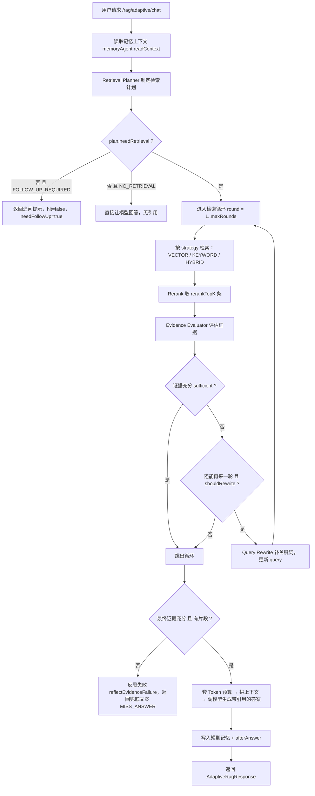

# 04 自适应 RAG(让检索自己做决策)

> 第 3 章我们把"检索 + 拼上下文 + 让模型回答"这条流水线焊死了:不管你问什么,它都老老实实地去向量库搜一遍。本章在这条流水线上面盖一层"大脑":先判断**要不要检索**、**用哪种检索**,检索完还要**自己打分判断证据够不够**,不够就**改写问题再搜一遍**。
>
> 读完本章你能回答:
> - 为什么不是所有问题都该走 RAG?系统怎么判断"这个问题不用查知识库"?
> - VECTOR / KEYWORD / HYBRID / NO_RETRIEVAL / FOLLOW_UP_REQUIRED 这五种策略分别在什么场景被选中?
> - "证据够不够"是用什么数字算出来的?不够的时候系统会做什么?
> - 规则 Planner 和 LLM Planner 是怎么切换的?LLM 挂了会发生什么?

## 一句话定位

自适应 RAG 是第 3 章那套固定检索流水线的**编排层(orchestrator)**:它不重新发明检索,而是用一个"计划 → 检索 → 评估 → 改写重试"的状态机,在运行时决定**是否检索、用哪种检索、检索几轮**。

对应代码就一个入口:`AdaptiveRagOrchestrator.chat(...)`,REST 路径 `POST /api/rag/adaptive/chat`。

## 为什么需要它(动机:没有它会怎样)

回顾第 3 章的固定 RAG:**任何**输入都会触发一次向量检索,然后把召回的片段塞给大模型。这在真实业务里有三个尴尬:

1. **不该查的也查了。** 用户说"你好,帮我润色一句话",这跟企业知识库八竿子打不着。固定 RAG 还是会去搜一遍,搜出一堆不相关片段污染上下文,既慢又容易把答案带偏。
2. **该追问的不追问。** 用户只说"这个错误怎么处理?",连错误码都没给。固定 RAG 拿着"这个错误"四个字去搜,基本搜不到对的东西,然后硬着头皮编一个答案。
3. **一次搜不到就放弃。** 固定 RAG 是"一锤子买卖":召回质量差也照样喂给模型。它没有"哎这次搜得不好,我换个词再搜一次"的能力。

自适应 RAG 就是来补这三个洞的。它在检索**前**加一个"要不要查、怎么查"的决策(Retrieval Planner),在检索**后**加一个"查得够不够"的体检(Evidence Evaluator),体检不及格就改写问题再来一轮(Query Rewrite),最多两轮(`max-rounds=2`)。

> 类比:第 3 章的 RAG 像一个"只会查字典"的实习生 —— 不管你问啥他都去翻字典。自适应 RAG 给他配了个组长:组长先判断这问题要不要翻字典、翻哪本;实习生翻完,组长还要检查"你抄回来的内容能回答问题吗",不行就让他换个关键词重翻一遍。

## 核心概念(用大白话 + 小表格解释术语)

整套系统由三个角色 + 一个总指挥构成:

| 角色 | 代码接口/类 | 大白话 | 它产出什么 |
|---|---|---|---|
| 检索规划器 Retrieval Planner | `RetrievalPlanner`(路由 `AdaptiveRetrievalPlannerRouter`) | "组长":判断要不要查、用哪种查法 | 一份 `RetrievalPlan`(策略 + 查询词 + topK) |
| 证据评估器 Evidence Evaluator | `RuleBasedEvidenceEvaluator` | "质检员":给召回结果打分,判断够不够 | 一份 `EvidenceEvaluation`(够不够 + 缺什么) |
| 查询改写器 Query Rewrite | `RuleBasedQueryRewriteService` | "补刀":证据不够时,往查询里补关键词 | 一份 `QueryRewriteResult`(改写后的新查询) |
| 总指挥 Orchestrator | `AdaptiveRagOrchestrator` | 把上面三个串成一个循环,并最终调模型生成答案 | `AdaptiveRagResponse` |

**五种检索策略(RetrievalStrategy)**,定义在 `rag/adaptive/dto/RetrievalStrategy.java:3`:

| 策略 | 触发场景(大白话) | 之后怎么搜 |
|---|---|---|
| `NO_RETRIEVAL` | 闲聊、润色、翻译、通用常识 —— 根本不用查知识库 | 不检索,直接让模型回答 |
| `FOLLOW_UP_REQUIRED` | 信息太少(如"这个错误怎么处理")—— 没法查 | 不检索,反问用户补充信息 |
| `VECTOR` | 概念/流程/"为什么""是什么"类问题 —— 看语义 | 走语义向量检索 |
| `KEYWORD` | 带错误码/配置项/类名/方法名 —— 看精确词 | 走关键词检索 |
| `HYBRID` | 既要语义又要精确词 | 向量 + 关键词并发,再 RRF 融合 |

**证据评估的三个体检指标**(对应已核实的默认阈值):

| 指标 | 含义(大白话) | 默认阈值(application.yml) | 不达标后果 |
|---|---|---|---|
| `topScore` | 召回片段里**最高**的那条得分 | `min-top-score=0.45` | 标记 `top_score_below_threshold` |
| `coverageScore` | 问题里的"关键词"被召回片段覆盖的比例 | `min-coverage-score=0.5` | 标记 `required_terms_not_covered` |
| `citationCount` | 召回片段条数 | `min-citations=1` | 标记 `citation_count_below_threshold` |

只要这三项里有任意一项"挂科"(`missingAspects` 非空),证据就判为**不充分**,触发改写重试。注意:`coverageScore` 只在问题里**真的含有**错误码/配置项这类"硬词"时才参与判断;如果问题里压根没有这种词,覆盖率直接算 1.0(见 `RuleBasedEvidenceEvaluator.java:107`)。

## 工作流程(含 mermaid 图)

下面这张状态机图就是 `AdaptiveRagOrchestrator.chat(...)` 的完整控制流。注意中间那个"评估 → 改写 → 再检索"的循环,最多转 `max-rounds=2` 圈。



## 代码走读(关键类/方法 + path:line,讲清控制流)

### 1. 总入口:`AdaptiveRagOrchestrator.chat`

整个编排从 `agent/src/main/java/com/lou/infinitechatagent/rag/adaptive/AdaptiveRagOrchestrator.java:88` 开始。前几行先读记忆、再让 Planner 出计划,然后用 `needRetrieval` 这个开关分叉:

```java
RetrievalPlan plan = retrievalPlanner.plan(request);              // 第 93 行:出计划
if (!Boolean.TRUE.equals(plan.getNeedRetrieval())) {             // 第 95 行:不用检索就走捷径
    return handleNoRetrieval(...);
}
```

`handleNoRetrieval`(第 219 行)内部又分两种:`FOLLOW_UP_REQUIRED` 时直接返回固定追问文案(第 226-231 行),其它(即 `NO_RETRIEVAL`)则让模型用"无引用"格式直接答(第 233-253 行)。

### 2. 检索循环:计划 → 检索 → 评估 → 改写

核心循环在第 107-127 行,这是本章的精华:

```java
for (int round = 1; round <= maxRounds; round++) {
    RetrievalRoundResult roundResult = executeRetrievalRound(prompt, currentPlan, round); // 一轮:搜+rerank+评估
    evaluation = roundResult.evaluation();
    if (Boolean.TRUE.equals(evaluation.getSufficient())) break;   // 证据够了 → 收工
    if (!shouldRewrite(round, evaluation)) break;                 // 不该改写 → 收工
    QueryRewriteResult rewrite = queryRewriteService.rewrite(...); // 补关键词
    if (!Boolean.TRUE.equals(rewrite.getRewritten())) break;     // 没改出新东西 → 收工
    currentPlan = copyPlanWithQuery(currentPlan, rewrite.getRewrittenQuery()); // 用新 query 进下一轮
}
```

`executeRetrievalRound`(第 366 行)是"一轮"的实现:`search()` 按策略检索(第 436 行的 `switch`)→ `rerankService.rerank()` 重排取 topK → `evidenceEvaluator.evaluate()` 体检,并把这一轮的细节封进一个 `AdaptiveRagStep` 加入 trace。

`shouldRewrite`(第 391 行)是"该不该再来一轮"的闸门,四个条件全满足才放行:`rewriteEnabled && round < maxRounds && evaluation != null && evaluation.shouldRewrite==true`。注意 `round < maxRounds`:因为第 2 轮(也是最后一轮)即便不充分也没必要再改写了。

### 3. Planner 的双模 + 降级:`AdaptiveRetrievalPlannerRouter`

`agent/src/main/java/com/lou/infinitechatagent/rag/adaptive/AdaptiveRetrievalPlannerRouter.java:25` 是一个极简路由,靠 `rag.adaptive.planner.mode` 决定走哪个实现(默认 `RULE_BASED`):

```java
if ("LLM".equalsIgnoreCase(plannerMode)) return llmRetrievalPlanner.plan(request);
return ruleBasedRetrievalPlanner.plan(request);
```

它标了 `@Primary`,所以注入 `RetrievalPlanner` 的地方拿到的就是这个路由器。

- **规则版**(`RuleBasedRetrievalPlanner.java:30`):一串 `if` 顺序判断。空输入 → `NO_RETRIEVAL`;命中"模糊错误"模式(如"这个错误怎么处理"且不含错误码)→ `FOLLOW_UP_REQUIRED`(第 35 行 + `isFollowUpRequired` 第 107 行);不含"知识库/配置/错误码/架构…"等触发词 → `NO_RETRIEVAL`(`shouldRetrieve` 第 68 行);含错误码/配置项/类名等"硬词" → `KEYWORD`(`isKeywordHeavy` 第 88 行);含"为什么/是什么/流程/架构" → `VECTOR`;其余 → `HYBRID`。判断错误码/配置项靠正则 `CODE_OR_IDENTIFIER_PATTERN`(第 13 行)。
- **LLM 版**(`LlmRetrievalPlanner.java:47`):把问题丢给大模型,要求它**只输出 JSON**(system prompt 见第 89 行),然后 `parsePlan`(第 66 行)用 `extractJson` 从回复里抠出 `{...}` 解析。关键的健壮性设计在第 58-63 行:**LLM 任何异常都会 fallback 到规则版**,并在 reason 前缀上"LLM Retrieval Planner 失败,降级规则 Planner",topK 还会被 `clampTopK` 夹到合法区间。

> 这就是"双模 + router 降级":正常用 LLM 灵活判断,LLM 挂了/超时/吐了非法 JSON,自动退回规则版,保证服务不崩。

### 4. 证据评估:`RuleBasedEvidenceEvaluator.evaluate`

在 `agent/src/main/java/com/lou/infinitechatagent/rag/adaptive/RuleBasedEvidenceEvaluator.java:30`。逻辑很直白:

- 召回为空 → 直接 `sufficient=false`、`shouldRewrite=true`(第 32-43 行)。
- 否则算三个数:`topScore` 取所有片段的"最佳分"中的最大值(`bestScore` 第 76 行,在 rerank/fusion/vector/keyword 四个分里取最大);`coverageScore` 是"问题里的硬词被片段命中的比例"(第 106 行);把不达标项塞进 `missingAspects`(第 53-61 行)。
- `sufficient = missingAspects.isEmpty()`,`shouldRewrite = !sufficient`(第 63、70 行)。

注意它**只看分数和关键词命中**,不让大模型参与评估 —— 纯规则,快且零成本。

### 5. 查询改写:`RuleBasedQueryRewriteService.rewrite`

在 `agent/src/main/java/com/lou/infinitechatagent/rag/adaptive/RuleBasedQueryRewriteService.java:25`。它从四个地方"凑关键词"(`collectRewriteTerms` 第 52 行):
1. 问题里的错误码/配置项正则匹配;
2. 评估结果里 `missing_term:` 标记的缺失词(第 77 行);
3. 上一轮召回片段里的错误码/配置项/文件名词(第 87 行,只看前 3 条);
4. 通用提示词 —— 比如问题含 `504` 就补"超时/重试/处理建议",含"错误/异常/报错"就补"原因/处理建议"(`collectGenericHints` 第 111 行)。

最后把这些词去重后**拼到原查询后面**(`mergeQuery` 第 131 行,已存在的词不重复加)。如果一个新词都没凑出来,就返回 `rewritten=false`,循环随即结束。

### 6. 命中后的收尾:Token 预算 + 生成 + 引用

循环结束后(第 130 行起):只有 `sufficient==true` 才会调 `applyTokenBudget`(第 497 行)按 `rag.token.*` 预算裁剪片段;`hit` 同时要求裁剪后片段非空(第 134 行)。

- **没命中**(第 136 行):调 `memoryAgent.reflectEvidenceFailure` 做一次"失败反思",返回兜底文案 `MISS_ANSWER`("当前知识库未提供足够信息…",第 50 行),`hit=false / answered=false / needFollowUp=true`。
- **命中**(第 172 行起):拼 system + user prompt(强制"回答 / 引用"固定格式,见 `buildSystemPrompt` 第 547 行)→ `chatModel.chat` 生成 → 用 `ensureCitationSection` 兜底补引用区(第 634 行)→ 写记忆。返回的 `strategy` 字段统一前缀成 `"ADAPTIVE_" + 策略`(第 199 行),`rounds` 就是实际跑过的轮数 `trace.size()`。

### 7. Controller:`AdaptiveRagController`

`agent/src/main/java/com/lou/infinitechatagent/controller/AdaptiveRagController.java:27`。`@RequestMapping("/rag/adaptive")` + context-path `/api` ⇒ 完整路径 `POST /api/rag/adaptive/chat`。它做的事很薄:设置监控上下文 → 调 orchestrator → 用 `ChatHistoryService` 记一条成功/失败审计(把 strategy 和引用条数写进 metadata)→ 清理上下文。

## 关键配置(从 application.yml 摘相关项)

以下均来自 `agent/src/main/resources/application.yml` 的 `rag.adaptive.*`(以及复用的 `rag.token.*`):

| 配置键 | 含义 | 默认值 |
|---|---|---|
| `rag.adaptive.enabled` | 是否启用自适应 RAG | `true` |
| `rag.adaptive.knowledge-base` | 目标知识库名 | `agent_docs` |
| `rag.adaptive.max-rounds` | 检索循环最大轮数 | `2` |
| `rag.adaptive.max-output-tokens` | 最终答案的最大输出 token | `500` |
| `rag.adaptive.memory-max-messages` | 写入短期会话记忆的窗口大小 | `20` |
| `rag.adaptive.planner.mode` | Planner 模式 `RULE_BASED` / `LLM` | `RULE_BASED`(env `RAG_ADAPTIVE_PLANNER_MODE`) |
| `rag.adaptive.planner.max-output-tokens` | LLM Planner 出 JSON 的 token 上限 | `300` |
| `rag.adaptive.retrieval.vector-top-k` | 向量检索召回数 | `20` |
| `rag.adaptive.retrieval.keyword-top-k` | 关键词检索召回数 | `20` |
| `rag.adaptive.retrieval.rerank-top-k` | rerank 后保留条数 | `5` |
| `rag.adaptive.evidence.min-top-score` | 证据"最高分"阈值 | `0.45` |
| `rag.adaptive.evidence.min-coverage-score` | 关键词覆盖率阈值 | `0.5` |
| `rag.adaptive.evidence.min-citations` | 最少召回条数 | `1` |
| `rag.adaptive.rewrite.enabled` | 是否允许查询改写重试 | `true` |
| `rag.token.max-input-tokens` | 输入 token 预算(裁剪上下文用) | `1800` |
| `rag.token.reserved-system-tokens` | 预留给 system prompt 的 token | `300` |
| `rag.token.min-chunk-chars` | 每个片段裁剪后保底字符数 | `180` |

> 切换到 LLM Planner:启动前设环境变量 `RAG_ADAPTIVE_PLANNER_MODE=LLM` 即可,无需改代码。

## 动手试一试(curl 示例)

服务跑在 `http://localhost:10010`,所有路由带 `/api` 前缀。下面四个例子覆盖了四种典型策略,记得带 `"debug": true` 才能看到 `retrievalPlan` / `adaptiveTrace` / `evidenceEvaluation` 这些内部决策。

```bash
# 1) 错误码 → 走 KEYWORD
curl -s -X POST http://localhost:10010/api/rag/adaptive/chat \
  -H "Content-Type: application/json" \
  -d '{"userId":1001,"sessionId":92001,"prompt":"ORDER-409 是什么原因？请给出引用。","debug":true}'

# 2) 语义类("为什么…") → 走 VECTOR
curl -s -X POST http://localhost:10010/api/rag/adaptive/chat \
  -H "Content-Type: application/json" \
  -d '{"userId":1001,"sessionId":92003,"prompt":"为什么 RAG 回答需要引用来源？","debug":true}'

# 3) 信息不足 → FOLLOW_UP_REQUIRED(hit=false，反问补信息)
curl -s -X POST http://localhost:10010/api/rag/adaptive/chat \
  -H "Content-Type: application/json" \
  -d '{"userId":1001,"sessionId":92004,"prompt":"这个错误怎么处理？","debug":true}'

# 4) 闲聊/润色 → NO_RETRIEVAL(不检索，直接答)
curl -s -X POST http://localhost:10010/api/rag/adaptive/chat \
  -H "Content-Type: application/json" \
  -d '{"userId":1001,"sessionId":92005,"prompt":"你好，帮我润色一句话：系统已经完成升级。","debug":true}'
```

看返回时重点盯这几个字段:顶层的 `strategy`(形如 `ADAPTIVE_KEYWORD`)、`hit`、`rounds`;以及 `debug.retrievalPlan.strategy`、`debug.adaptiveTrace[].topScore/coverageScore`、`debug.evidenceEvaluation.sufficient`、`debug.queryRewrites`。

完整的 8 个用例(含"多轮 Query Rewrite""LLM Planner 模式""debug=false 隐藏调试字段")已经整理在 Postman 集合里,直接导入即可一键跑通:`docs/postman/adaptive-rag.postman_collection.json`(集合内 `baseUrl` 已设为 `http://localhost:10010/api`)。

## 常见坑与注意点

- **看不到决策细节?** 一定要在请求体里带 `"debug": true`。`AdaptiveRagResponse` 上 `@JsonInclude(NON_NULL)`,debug 为 null 时整个字段都不会出现(见 `dto/AdaptiveRagResponse.java:16`)。
- **`rounds` 不一定等于 2。** 它是**实际**跑过的轮数(`trace.size()`):证据一轮就够、或改写凑不出新词,都会提前 break。`NO_RETRIEVAL`/`FOLLOW_UP_REQUIRED` 分支固定 `rounds=1`。
- **改写最多只补一次。** `shouldRewrite` 里有 `round < maxRounds`,而 `maxRounds=2`,所以只有第 1 轮结束后才会改写,第 2 轮不充分就直接兜底返回了。想多搜几轮就调大 `rag.adaptive.max-rounds`。
- **`coverageScore` 可能"虚高"。** 当问题里没有错误码/配置项这类正则能识别的"硬词"时,覆盖率直接算 1.0(`RuleBasedEvidenceEvaluator.java:107`),此时证据充分与否基本只由 `topScore` 决定。纯自然语言问题别指望 coverage 帮你把关。
- **LLM Planner 静默降级。** LLM 超时/返回非 JSON 时不会报错,而是悄悄退回规则 Planner(`LlmRetrievalPlanner.java:58`)。判断它有没有降级,要看 `debug.retrievalPlan.reason` 是否以"LLM Retrieval Planner 失败"开头。
- **strategy 字段带前缀。** 顶层 `strategy` 是 `"ADAPTIVE_" + 枚举名`(如 `ADAPTIVE_HYBRID`),而 `debug.retrievalPlan.strategy` 才是裸枚举(`HYBRID`)。两处别看混了。
- **rerank 服务挂了会影响评估。** 评估的 `topScore` 优先取 rerank 分;若 rerank 服务不可用(见第 3 章 BGE rerank 配置与冷却),分数来源会退化,可能间接拉低证据充分率。

## 小结 & 延伸阅读

自适应 RAG 没有发明新的检索算法,它发明的是**"在检索周围做决策"的循环**:先用 Planner 决定查不查、怎么查(五种策略 + 规则/LLM 双模 + 降级),检索后用 Evidence Evaluator 用 `topScore/coverage/citationCount` 三个数体检,不够就用 Query Rewrite 补词再来一轮(上限 2 轮)。它是第 3 章那条固定流水线之上的"大脑"。

延伸阅读:
- 上一章把检索流水线本身讲透了 —— [03-rag-retrieval.md](03-rag-retrieval.md)(向量/关键词/混合检索、RRF 融合、rerank、引用与 Token 预算的实现细节)。
- 同样是"会推理 + 多步决策"的范式,但面向工具调用而非检索 —— [05-react-agent.md](05-react-agent.md)(ReAct Agent 的规划/工具调度,也有规则/LLM 双模 planner)。
- 本章多次出现的 `memoryAgent.readContext / reflectEvidenceFailure / afterAnswer` —— [07-memory-system.md](07-memory-system.md)。
- 想看请求整体怎么流转、各层如何拼装,回到 [01-architecture-overview.md](01-architecture-overview.md);本地起服务与 API 速查见 [10-run-and-api-reference.md](10-run-and-api-reference.md)。
