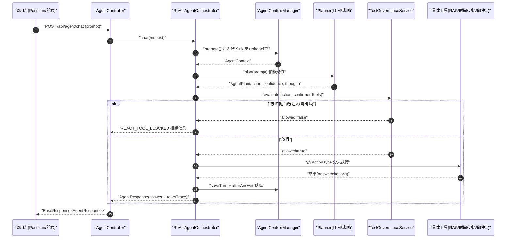

# 05 ReAct Agent：推理与工具调度

> 前面几章里,系统要么"老实检索知识库"(第 3、4 章),要么"老实查记忆"(第 7 章)。但真实用户的一句话可能是闲聊、可能要查时间、可能要发邮件、也可能要查私有文档——**到底走哪条路,得有人来"拍板"**。这一章讲的就是系统里最像"大脑调度中心"的一层:ReAct Agent。
>
> 读完本章你能回答:
> - ReAct 是什么?它和"直接让大模型回答"有什么本质区别?
> - 一个请求进来后,系统是怎么"先想再做再看结果"的(Plan → Gate → Act → Observe)?
> - Planner 有规则版和 LLM 版两种,默认走哪个?LLM 挂了会怎样?
> - 为什么说当前实现"只走了一步"(step=1),离教科书里的多轮 ReAct 还有多远?

---

## 一句话定位

`ReActAgentOrchestrator` 是整个 Agent 的**总调度器**:它先让 Planner 判断"这句话该用哪个工具",再过一道权限护轨(Gate),然后按工具类型分支去真正执行(检索 / 查时间 / 写记忆 / 发邮件 / 联网搜索 / 直接回答),最后把"想法 + 动作 + 执行结果"打包成一条 `ReActStep` 轨迹返回。

对应入口源码:`agent/src/main/java/com/lou/infinitechatagent/agent/ReActAgentOrchestrator.java:89`(`chat` 方法)。

---

## 为什么需要它(动机:没有它会怎样)

假设没有这一层,你只有一个"裸的大模型 + 一个 RAG 接口"。会遇到三类尴尬:

1. **该检索的不检索,不该检索的乱检索。** 用户问"现在几点",你去查企业知识库,既慢又答不出实时时间;用户问"ORDER-409 是什么原因",你却让模型凭空编,结果一本正经地胡说。
2. **危险动作没人把关。** 用户说"给 xxx@xx.com 发封邮件",模型如果能直接调发信工具,就等于把"产生外部副作用"的权力裸奔交给了一句自然语言。一旦被 Prompt Injection(提示词注入)攻击,后果不可控。
3. **没有可解释的轨迹。** 出了问题你想复盘"模型当时为什么这么干",但什么都没留下。

ReAct 这套思路就是为了解决这些问题:**让 Agent 像人一样"边想边做"**——先在脑子里想一下(Reason),决定做什么动作(Act),做完看一眼结果(Observe),再决定下一步。每一步都留痕、都可拦截。`ReActAgentOrchestrator` 就是把这套"想-做-看"的循环工程化落地的地方。

---

## 核心概念(用大白话 + 小表格解释术语)

| 术语 | 大白话解释 | 在本项目里对应什么 |
| --- | --- | --- |
| **ReAct** | Reason(推理)+ Act(行动)的缩写。核心是"先想清楚要干嘛,再动手,动完看结果"。不是一上来就让模型吐答案。 | `chat()` 里的 Plan → Gate → 分支执行 → Observation 这一整套流程 |
| **Planner(规划器)** | 专门负责"拍板下一步动作"的角色,**它本身不回答用户问题**。就像导诊台护士,只告诉你去几号窗口。 | `LlmAgentPlanner` / `RuleBasedAgentPlanner` |
| **Action / ActionType(动作)** | Planner 拍板的结果。比如"走知识库检索""查时间""发邮件"。 | `AgentActionType` 枚举,共 7 种可执行动作 |
| **Tool(工具)** | 每个动作背后真正干活的能力,带名字、描述、风险等级。 | `ToolRegistry` 注册的 7 个工具 |
| **Observation(观察)** | 工具执行完的"回执":成功没?花了多久?有几条引用? | `AgentObservation` |
| **ReActStep(步骤轨迹)** | 把"想法 + 动作 + 观察 + 治理决策"打包成一条记录,可解释、可审计。 | `ReActStep`,当前固定 `step=1` |
| **Governance Gate(治理护轨)** | 动作执行前的"安检门":查注入、按风险等级要不要人工确认。 | `ToolGovernanceService`(详见 [06-governance-guardrail.md](06-governance-guardrail.md)) |

一句话串起来:**Planner 想 → Gate 安检 → Tool 干活 → Observation 回执 → 打包成 ReActStep**。

---

## 工作流程(含 mermaid 时序图)

下面这张图是一次 `POST /api/agent/chat` 的完整链路。注意红框逻辑:**治理 Gate 在工具执行之前,拦下来就直接返回拒绝信息,根本不会碰到真实工具。**



---

## 代码走读(关键类/方法 + path:line)

### 1. 入口:`chat()` 把整条流程串起来

`ReActAgentOrchestrator.chat()` 的骨架非常清晰,就是教科书 ReAct 的工程化版本(`ReActAgentOrchestrator.java:89`):

```java
String prompt = normalizePrompt(request.getPrompt());
AgentContext agentContext = agentContextManager.prepare(...);   // ① 备料:记忆+历史+token预算
AgentPlan plan = plan(prompt);                                  // ② Plan:拍板动作
AgentAction action = plan.getAction();
ToolGovernanceDecision governanceDecision =
        toolGovernanceService.evaluate(..., action, request.getConfirmedTools()); // ③ Gate:安检
if (!Boolean.TRUE.equals(governanceDecision.getAllowed())) {
    return blockedByGovernance(...);                            // 被拦 → 直接返回拒绝
}
return switch (action.getType()) {                              // ④ Act:按动作类型分支
    case HYBRID_SEARCH -> answerWithRag(...);
    case CURRENT_TIME  -> answerWithCurrentTime(...);
    case MEMORY_WRITE  -> answerWithMemoryWrite(...);
    ...
};
```

读这段要抓住四件事:**先备料(Context)、再拍板(Plan)、然后安检(Gate)、最后分支干活(Act)**。`switch` 里每个分支最后都会构造一条 `ReActStep` 放进 `reactTrace`,这就是"Observe"。

### 2. Plan:Planner 双模 + 失败 fallback

拍板逻辑在 `plan()` 里(`ReActAgentOrchestrator.java:118`):

```java
private AgentPlan plan(String prompt) {
    if ("LLM".equalsIgnoreCase(plannerMode)) {
        return llmAgentPlanner.plan(prompt);
    }
    return ruleBasedAgentPlanner.plan(prompt);
}
```

`plannerMode` 来自 `${AGENT_REACT_PLANNER_MODE:LLM}`,**线上默认值是 `LLM`**(见 application.yml 第 171 行)。

> ⚠️ 容易踩坑的地方:`@Value("${agent.react.planner.mode:RULE_BASED}")`(`ReActAgentOrchestrator.java:86`)里那个 `RULE_BASED` 只是"配置项完全缺失时"的兜底默认。由于 `application.yml` 显式写了 `mode: LLM`,**实际运行默认走 LLM Planner**,不要被代码里的字符串误导。

**两个 Planner 的分工:**

- **`LlmAgentPlanner`(默认)** —— 让大模型读一段 System Prompt(里面列了 7 种动作的判断标准),然后**只输出一段 JSON**(`actionType / needRetrieval / actionReason / confidence / arguments`)。代码再把 JSON 解析成 `AgentPlan`,`plannerType` 标为 `"LLM"`(`LlmAgentPlanner.java:42` 起)。
  - 关键的健壮性设计在 `LlmAgentPlanner.java:56`:**只要 LLM 调用抛异常、或返回的不是合法 JSON,就 fallback 到规则 Planner**,并把 `plannerType` 改写为 `"RULE_BASED_FALLBACK"`。这样即使模型抽风,系统也不会崩,只是退化成规则判断。
  - JSON 抽取很"防呆":`extractJson()` 直接取第一个 `{` 到最后一个 `}` 之间的内容(`LlmAgentPlanner.java:127`),容忍模型在 JSON 外面多吐几句废话。

- **`RuleBasedAgentPlanner`(兜底/可切换)** —— 纯关键词 + 正则匹配,**零模型调用、零网络延迟**。按固定优先级判断:空输入 → 问时间 → 发邮件 → 写记忆 → 查记忆 → 联网搜索 → 该检索吗 → 否则直接回答(`RuleBasedAgentPlanner.java:27` 起的一串 `if`)。比如 `shouldRetrieve()`(`RuleBasedAgentPlanner.java:189`)只要命中"知识库/配置/错误码/架构"等词,或正则匹配到 `ORDER-409`、`xxx.yyy` 这类标识符,就判定要走 RAG。

两者最终都通过 `buildPlan()` / `parsePlan()` 调 `toolRegistry.requireTool(actionType)` 拿到工具元数据,把 `riskLevel`、`toolDescription` 塞进 `action.arguments`,供后面的 Gate 使用。

### 3. Gate:治理护轨拦在工具前面

`toolGovernanceService.evaluate(...)` 的判定顺序很重要(`ToolGovernanceService.java:43`):

1. 治理总开关关了 → 直接放行(仍记审计)。
2. 动作为空 / 工具没注册 → 拒绝。
3. **Prompt Injection 检查**:命中"忽略系统规则""ignore previous instructions"等模式 → 拒绝(`ToolGovernanceService.java:73`)。
4. **风险等级比对**:工具风险 ≥ 阈值(默认 `HIGH`)且用户没在 `confirmedTools` 里确认过 → 返回 `confirmationRequired=true` 的拒绝。
5. 全过 → `allowed=true` 放行。

每条决策无论放行还是拒绝,都会 `audit(...)` 写一条审计记录到 `agent_tool_audit` 表。本章只需知道"Gate 在工具之前、拦下就短路返回",治理细节请看 [06-governance-guardrail.md](06-governance-guardrail.md)。

### 4. ToolRegistry:7 个工具与风险分级

工具元数据集中注册在 `ToolRegistry.java:24` 起的一个不可变 Map 里,一个 `AgentActionType` 对应一个 `AgentTool`:

| 工具名 | ActionType | 风险等级 | 需确认 | 干什么 |
| --- | --- | --- | --- | --- |
| `current_time` | `CURRENT_TIME` | LOW | 否 | 查 Asia/Shanghai 当前时间 |
| `hybrid_search` | `HYBRID_SEARCH` | MEDIUM | 否 | 调企业知识库 Hybrid RAG(向量+关键词+RRF+重排+引用) |
| `direct_answer` | `NO_RETRIEVAL_ANSWER` | LOW | 否 | 不检索,模型直接答闲聊/润色 |
| `memory_write` | `MEMORY_WRITE` | MEDIUM | 否 | 写长期记忆(偏好/技术栈/项目背景) |
| `memory_search` | `MEMORY_SEARCH` | LOW | 否 | 查长期记忆 |
| `email_send` | `EMAIL_SEND` | **HIGH** | **是** | 发邮件(有外部副作用) |
| `web_search` | `WEB_SEARCH` | MEDIUM | 否 | 联网搜索最新信息 |

只有 `email_send` 是 `HIGH` + `confirmationRequired=true`(`ToolRegistry.java:65`),因为它会真的往外发信。结合 Gate 的阈值 `HIGH`,**默认情况下只有发邮件这一个动作会卡住要你确认**,其余工具直接放行。

> 注:`web-search` 工具虽然注册了,但 `web-search.enabled=false`(默认关闭),真正执行时 `WebSearchService` 会返回"未启用"。Planner 仍可能拍板 `WEB_SEARCH`,只是工具层做了降级。

### 5. Act:按 ActionType 分支执行 + 拼装 ReActStep

`chat()` 里的 `switch` 把每种动作派给一个私有方法。以最常用的 RAG 分支为例(`ReActAgentOrchestrator.java:125` `answerWithRag`):

```java
RagQueryResponse ragResponse =
        ragQueryService.chatWithCitations(sessionId, prompt, agentContext); // 调第3章的RAG
agentContextManager.afterAnswer(userId, sessionId, prompt);                 // 触发第7章记忆沉淀
ReActStep step = ReActStep.builder()
        .step(1)                                  // ← 永远是 1
        .thought(plan.getThought())
        .needRetrieval(plan.getNeedRetrieval())
        .actionReason(plan.getActionReason())
        .confidence(plan.getConfidence())
        .action(plan.getAction())
        .observation(AgentObservation.builder()   // ← Observe:回执
                .success(Boolean.TRUE.equals(ragResponse.getHit()))
                .summary("hybrid search retrieved=... candidates=... citations=...")
                .citationCount(...)
                .costMs(System.currentTimeMillis() - actionStart)
                .build())
        .toolGovernance(governanceDecision)
        .build();
```

这里能直观看到 ReAct 的三要素如何落进一条 `ReActStep`:

- **thought / needRetrieval / actionReason / confidence** —— 全部来自 Planner 的"想法",体现 Reason。
- **action** —— 体现 Act。
- **observation** —— 体现 Observe(成功与否、引用数、耗时)。

其它分支(`answerWithCurrentTime`、`answerWithMemoryWrite`、`answerWithEmailSend`、`answerWithWebSearch`、`answerDirectly`)结构完全一致,差别只在"调哪个工具 + observation 怎么写"。其中带副作用/工具类的几个统一走 `completeToolResponse(...)`(`ReActAgentOrchestrator.java:452`)收尾,保证都 `saveTurn` + `afterAnswer` + 拼 trace。

**它如何串起其他章节:**
- RAG 分支调 `ragQueryService.chatWithCitations(...)` → 复用 [03-rag-retrieval.md](03-rag-retrieval.md) / [04-adaptive-rag.md](04-adaptive-rag.md)。
- 记忆分支调 `longTermMemoryService` / `memoryRetrievalService`,且**每个分支结束都调 `afterAnswer`** 触发记忆沉淀 → 见 [07-memory-system.md](07-memory-system.md)。
- 模型调用走注入的 `ChatModel`(Planner 判断、直接回答都用它)→ 见 [08-model-factory.md](08-model-factory.md)。

### 6. AgentContextManager:开局先"备料"

在拍板之前,`agentContextManager.prepare(...)`(`AgentContextManager.java:46`)就先把上下文备好了:

1. `memoryAgent.readContext(...)` 取出**会话摘要 + 相关长期记忆**,拼成 `memoryText`。
2. `compactHistory(loadMessages(sessionId))` 从 `ChatMemoryStore` 里取最近 N 条对话(`memory-max-messages=20`),**从最新往前倒着塞**,塞到 `max-history-chars=2000` 字符为止,塞不下的就标记 `compacted=true` 并加一行"历史已压缩"提示(`AgentContextManager.java:104`)。
3. `estimateTokens(...)` 用 `chars-per-token=2.0` 粗算 token 数,只要超过 `max-input-tokens(1800) - reserved-system-tokens(400)`,就把 `contextTruncated` 置真。

这套"先估算再截断"的预算控制,目的是**别让历史 + 记忆把模型的输入窗口撑爆**。直接回答分支会通过 `buildDirectPrompt(...)`(`AgentContextManager.java:75`)把"记忆上下文 + 最近对话 + 用户问题"拼成最终 user prompt 喂给模型。

---

## 关键配置(从 application.yml 摘相关项)

| 配置键 | 含义 | 默认值 |
| --- | --- | --- |
| `agent.react.planner.mode` | Planner 模式,`LLM` 走大模型规划,`RULE_BASED` 走关键词规则 | `LLM` |
| `agent.react.planner.max-output-tokens` | LLM Planner 输出 JSON 的最大 token(只需吐一小段 JSON,故较小) | `300` |
| `agent.react.max-output-tokens` | 直接回答分支模型输出上限 | `500` |
| `agent.react.memory-max-messages` | 短期对话窗口最多保留多少条消息 | `20` |
| `agent.react.context.max-history-chars` | 注入历史的字符上限,超了就压缩 | `2000` |
| `agent.react.context.max-input-tokens` | 估算输入 token 的总预算 | `1800` |
| `agent.react.context.reserved-system-tokens` | 给 System Prompt 预留的 token | `400` |
| `agent.react.context.chars-per-token` | 字符换算 token 的粗略系数 | `2.0` |
| `agent.tool-governance.enabled` | 是否启用工具治理护轨 | `true` |
| `agent.tool-governance.confirmation-threshold` | 风险达到该等级才要求人工确认 | `HIGH` |
| `agent.tool-governance.prompt-injection-check.enabled` | 是否开启提示词注入检测 | `true` |

> 小贴士:`mode` 实际由环境变量 `AGENT_REACT_PLANNER_MODE` 控制,改成 `RULE_BASED` 即可在没有可用模型 / 想省 token / 要做确定性测试时切到纯规则版,**无需改代码、无需重新编译**。

---

## 动手试一试(curl 示例)

> 服务前缀是 `/api`(`server.servlet.context-path=/api`),端口 `18080`。下面假设服务跑在本机。

**① 直接回答(不检索)——预期 `strategy=REACT_DIRECT`:**

```bash
curl -X POST http://localhost:18080/api/agent/chat \
  -H "Content-Type: application/json" \
  -d '{"userId":1001,"sessionId":91001,"prompt":"帮我把这句话润色一下:系统已经完成升级。"}'
```

**② 查时间(走工具)——预期 `strategy=REACT_TOOL`,`action.type=CURRENT_TIME`:**

```bash
curl -X POST http://localhost:18080/api/agent/chat \
  -H "Content-Type: application/json" \
  -d '{"userId":1001,"sessionId":91002,"prompt":"现在几点?"}'
```

**③ 知识库检索——预期 `strategy=REACT_HYBRID_RAG`,`needRetrieval=true`,带 `citations`:**

```bash
curl -X POST http://localhost:18080/api/agent/chat \
  -H "Content-Type: application/json" \
  -d '{"userId":1001,"sessionId":91003,"prompt":"ORDER-409 是什么原因?请给出引用。"}'
```

**④ 发邮件被护轨拦下(HIGH 风险需确认)——预期 `toolGovernance.confirmationRequired=true`:**

```bash
curl -X POST http://localhost:18080/api/agent/chat \
  -H "Content-Type: application/json" \
  -d '{"userId":1001,"sessionId":91005,"prompt":"请发送邮件给 test@example.com,标题测试,内容这是一封测试邮件。"}'
```

**⑤ 带 `confirmedTools` 确认后再发——这次才真正执行:**

```bash
curl -X POST http://localhost:18080/api/agent/chat \
  -H "Content-Type: application/json" \
  -d '{"userId":1001,"sessionId":91005,"prompt":"请发送邮件给 test@example.com,标题测试,内容这是一封测试邮件。","confirmedTools":["email_send"]}'
```

**查看已注册工具:**

```bash
curl http://localhost:18080/api/agent/tools
```

> 对应的 Postman 集合在 `docs/postman/` 下:
> - `react-agent.postman_collection.json` —— 直接回答 / 时间 / 知识库检索这条主链路。
> - `react-agent-tools.postman_collection.json` —— memory_write / memory_search / email_send(含确认前后两步)/ web_search 的工具编排与治理验证。
>
> 把 JSON 导入 Postman,改一下 `baseUrl`(默认 `http://localhost:18080/api`)即可一键跑通。

---

## 常见坑与注意点

1. **"默认 Planner 是 LLM,不是代码里写的 RULE_BASED"。** 代码 `@Value` 的兜底字符串只在配置项缺失时生效;`application.yml` 显式写了 `LLM`,所以线上默认走 LLM 规划。判断走哪个,**以 `application.yml` / 环境变量为准**。
2. **当前是"单步 ReAct"(`step=1`),不是多轮循环。** 所有分支构造 `ReActStep` 时都硬编码 `.step(1)`,`switch` 也没有"回到 Plan 再来一轮"的回路。`AgentActionType` 里虽然定义了 `SECOND_RETRIEVAL`,但 `ReActAgentOrchestrator` 根本没有 `case SECOND_RETRIEVAL` 分支——它在本类里是未使用的占位。真正的"多轮检索/反思"目前体现在第 4 章的 Adaptive RAG(`max-rounds=2`)内部,而不是这一层。换句话说:**这一层是"想一次、做一次、看一次"就结束**,适合先建立直觉,别误以为它会自动多跳工具。
3. **`finalAction` 永远是 `FINAL_ANSWER`。** 不管走哪个分支,顶层 `AgentResponse.finalAction` 都被设成 `FINAL_ANSWER`,真正区分动作类型要看 `reactTrace[0].action.type` 和 `strategy` 字段。
4. **LLM Planner 失败是"静默降级"而非报错。** 模型超时/吐了非 JSON,会 fallback 到规则 Planner,`plannerType` 变成 `RULE_BASED_FALLBACK`。如果你发现明明配了 LLM 却老是规则的判断结果,去查日志 `LLM planner failed, fallback...`(`LlmAgentPlanner.java:57`),多半是模型那头出了问题。
5. **记忆 / 邮件类动作依赖 `userId`。** `MEMORY_WRITE`、`MEMORY_SEARCH` 在 `userId == null` 时直接返回"需要提供 userId"并把 observation 标 `success=false`(`ReActAgentOrchestrator.java:236`/`279`)。本地测试记得带上 `userId`。
6. **历史被压缩 ≠ 报错。** `contextTruncated=true` 只是提示"上下文太长被截了一部分",属于正常预算控制,不影响返回。但如果你发现答案"忘了前文",可以调大 `max-history-chars` / `max-input-tokens`。
7. **Planner 拍板的 `confidence` 只是参考值,不参与放行决策。** 是否执行完全由 Gate(注入检查 + 风险阈值 + 确认)决定,`confidence` 低不会被拦,高也不会跳过安检。

---

## 小结 & 延伸阅读

这一章把系统"最聪明的一层"拆开看了:

- **流程主线**:`prepare`(备料)→ `plan`(Planner 拍板)→ `evaluate`(Gate 安检)→ 按 `ActionType` 分支执行 → 拼 `ReActStep`(Observe)返回。
- **Planner 双模**:默认 LLM(输出 JSON),失败 fallback 规则版;规则版纯关键词/正则,零延迟、可做确定性测试。
- **7 个工具 + 风险分级**:只有 `email_send` 是 HIGH 且需确认,卡在 Gate;其余默认放行。
- **诚实结论**:当前是单步实现(`step=1`),`SECOND_RETRIEVAL` 是未启用的占位,真正的多轮在第 4 章 Adaptive RAG 内部。

接着往下读:

- 想知道 Gate 是怎么查注入、怎么按风险等级要求确认、审计表长什么样 → [06-governance-guardrail.md](06-governance-guardrail.md)
- 想知道 RAG 分支里 `chatWithCitations` 到底干了啥 → [03-rag-retrieval.md](03-rag-retrieval.md) 与 [04-adaptive-rag.md](04-adaptive-rag.md)
- 想知道 `prepare` / `afterAnswer` 背后的记忆读写与沉淀 → [07-memory-system.md](07-memory-system.md)
- 想知道 Planner 和直接回答用的 `ChatModel` 从哪来 → [08-model-factory.md](08-model-factory.md)
- 想回看一次请求在全局的位置 → [01-architecture-overview.md](01-architecture-overview.md)
- 想直接动手把所有接口跑一遍 → [10-run-and-api-reference.md](10-run-and-api-reference.md)
