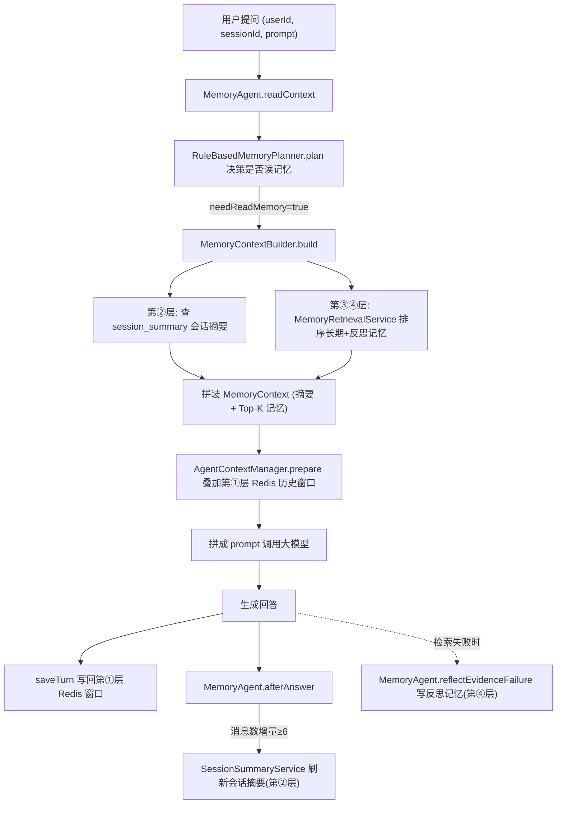
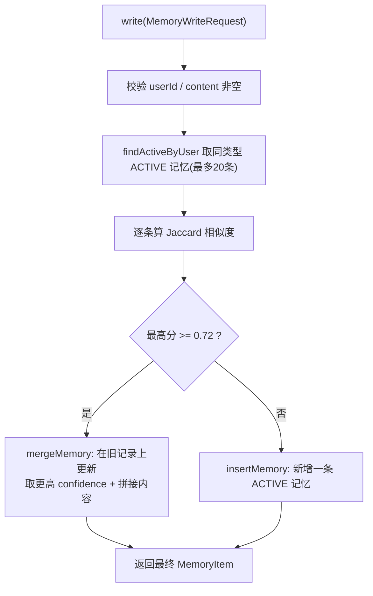

# 07 记忆系统:四层记忆与去重纠错

> 一个 LLM 天生"健忘"——每次请求都是一张白纸。这一章讲清楚 InfiniteChat-Agent 是怎么用四层结构让 Agent"记得住"的:从几秒钟的会话窗口,到永久的用户画像,再到从失败里学到的教训。
>
> 读完本章你能回答:
> 1. 为什么光靠"把历史对话塞进 prompt"做不出真正的长期记忆?四层记忆各自解决什么问题?
> 2. 写入长期记忆时,系统怎么判断"这条和已有的太像了,应该合并而不是新增"?Jaccard 0.72 是怎么算出来的?
> 3. 用户说"你记错了",系统具体做了哪两步动作?为什么新记忆的 confidence 是 0.95?
> 4. `MemoryAgent` 的 `readContext` / `afterAnswer` / `reflectEvidenceFailure` 分别在 Chat、ReAct、RAG 的哪个时刻被调用?

---

## 一句话定位

记忆系统是 Agent 的"大脑海马体":它把转瞬即逝的对话(Redis 短期窗口)逐层沉淀为可长期复用的用户画像(MySQL 长期记忆),并在检索失败时把教训写成"反思记忆",让 Agent 越用越懂你、越用越不犯同样的错。

---

## 为什么需要它(动机:没有它会怎样)

大模型有一个反直觉的特性:**它没有记忆**。每次调用 `chatModel.chat(...)`,模型看到的只有你这一次发过去的内容,上一轮说过什么它一概不知。

那"ChatGPT 不是能记住上文吗?"——那是因为客户端每次都把**全部历史对话重新发了一遍**。这个朴素做法在简单场景能用,但放到企业级 Agent 上会撞三堵墙:

| 问题 | 朴素做法(全量回灌历史)会怎样 |
|---|---|
| **窗口爆炸** | 对话越长,prompt 越长,token 成本线性增长,最终超过模型上下文上限直接报错。 |
| **跨会话失忆** | 用户今天告诉你"我项目用 PgVector",明天换个 sessionId 又得重新说一遍。 |
| **重复犯错** | 知识库里查不到某个错误码,这次答错了,下次同类问题还是答错——它没"长记性"。 |

记忆系统就是为了同时解决这三件事:

- **短期窗口**(Redis)解决"刚刚说了啥",但有上限,不会无限膨胀;
- **会话摘要**(MySQL)把长对话压缩成几百字,解决"窗口装不下了怎么办";
- **长期记忆**(MySQL)把用户的稳定事实(技术栈、偏好)沉淀下来,跨会话复用;
- **反思记忆**(MySQL)把失败经验变成下次的行动指南,解决"重复犯错"。

一句话:**没有记忆系统,Agent 只是个无状态的问答接口;有了它,才像个会成长的助理。**

---

## 核心概念(用大白话 + 小表格解释术语)

### 四层记忆速览

| 层 | 存哪 | 装什么 | 生命周期 | 类比 |
|---|---|---|---|---|
| ① 短期会话窗口 | Redis(降级内存) | 最近 N 条原始对话消息 | 几分钟~几小时,滚动淘汰 | 工作记忆,说完就忘 |
| ② 会话摘要 | MySQL `session_summary` | 一整段会话压缩后的几百字摘要 | 整个会话期间,滚动刷新 | 会议纪要 |
| ③ 长期用户记忆 | MySQL `agent_memory` | 跨会话的用户稳定事实(6 类型) | 永久(可禁用/过期) | 个人档案 |
| ④ 反思记忆 | MySQL `agent_memory`(类型 REFLECTION) | 失败/纠错后总结的行动准则 | 永久 | 错题本 |

注意:③ 和 ④ 其实是同一张表 `agent_memory`,只是 `memory_type` 不同。反思记忆是长期记忆的一种特殊类型。

### 长期记忆的 6 种类型

代码定义在 `agent/src/main/java/com/lou/infinitechatagent/memory/dto/MemoryType.java:3`:

| 类型 | 含义 | 举例 |
|---|---|---|
| `USER_PREFERENCE` | 用户偏好/习惯 | "喜欢简洁回答,不要客套" |
| `PROJECT_CONTEXT` | 项目背景 | "在做一个 LangChain4j 的 Agent 项目" |
| `TECH_STACK` | 技术栈 | "用 Spring Boot 3 + Redis + PgVector" |
| `OUTPUT_STYLE` | 输出格式偏好 | "希望给技术路线文档 + Postman" |
| `IMPORTANT_FACT` | 通用重要事实(默认类型) | "团队规模 5 人" |
| `REFLECTION` | 反思记忆(系统自动生成) | "证据不足时不要强答,先追问" |

### 几个容易混的术语

| 术语 | 大白话 |
|---|---|
| **Jaccard 相似度** | 把两句话拆成词的集合,算"交集 ÷ 并集"。完全相同=1,毫不相关=0。这里阈值 0.72,即两条记忆有七成多的词重叠就判定"太像了,合并"。 |
| **去重合并(dedup)** | 写新记忆前先找最像的旧记忆,够像就在旧记录上更新(取更高 confidence、拼接内容),而不是新增一条。防止同一个事实被记成十几遍。 |
| **纠错(correction)** | 用户说"记错了"。系统把该类型下所有旧记忆禁用,再写一条 confidence 很高(0.95)的新事实顶替。 |
| **confidence(置信度)** | 这条记忆有多可信,0~1。检索排序、合并取最大值都看它。 |
| **token 预算** | 注入给模型的记忆不能无限多。系统按字符数算个粗略 token 数,卡住上限,优先塞最相关的几条。 |

---

## 工作流程(含 mermaid 图)

### 四层记忆的读写全景

下面这张图把"一次带记忆的对话"拆开看:读取阶段(prepare)注入哪些记忆,回答之后(afterAnswer)又沉淀了什么。



### 写入长期记忆的去重判定

这是本章的"灵魂逻辑"。每次 `write` 都先走去重检查,决定是"合并旧的"还是"插入新的":



---

## 代码走读(关键类/方法 + path:line,讲清控制流)

### 1. MemoryAgent:统一编排入口

所有上层(Chat / ReAct / Adaptive RAG)都不直接碰四层细节,而是通过 `MemoryAgent` 这三个方法交互。它是整个记忆系统的"门面"。

`agent/src/main/java/com/lou/infinitechatagent/memory/MemoryAgent.java:28`

- **`readContext(userId, sessionId, prompt)`** —— 回答**前**调用。先让 planner 决策要不要读记忆(`memoryPlanner.plan`),要读就交给 `MemoryContextBuilder.build` 把第②③④层拼成一个 `MemoryContext`;不读就返回一个空壳。

```java
// MemoryAgent.java:30-40
MemoryDecision decision = memoryPlanner.plan(userId, sessionId, prompt);
MemoryContext context = Boolean.TRUE.equals(decision.getNeedReadMemory())
        ? memoryContextBuilder.build(userId, sessionId, prompt)
        : MemoryContext.builder()...build(); // 空上下文
```

- **`afterAnswer(userId, sessionId, prompt)`** —— 回答**后**调用。如果 planner 判断需要写摘要,就触发 `sessionSummaryService.refreshIfNeeded`(里面再判断是否真的够了刷新阈值)。`MemoryAgent.java:49`

- **`reflectEvidenceFailure(...)`** —— RAG 检索**失败时**调用,把这次失败写成反思记忆。`MemoryAgent.java:64`

谁在调用它?三处:
- `agent/src/main/java/com/lou/infinitechatagent/agent/context/AgentContextManager.java:47`(ReAct / 基础对话的上下文准备 `prepare`,以及 `afterAnswer`)
- `agent/src/main/java/com/lou/infinitechatagent/rag/adaptive/AdaptiveRagOrchestrator.java:91`(Adaptive RAG 读上下文)
- `AdaptiveRagOrchestrator.java:137`(检索失败时写反思)、`:144`(回答后刷摘要)

### 2. RuleBasedMemoryPlanner:用规则决定"读不读、写不写"

这里没有用 LLM 做决策,而是一套朴素规则(便宜、确定、可解释)。`agent/src/main/java/com/lou/infinitechatagent/memory/RuleBasedMemoryPlanner.java:14`

控制流很直白:
- 有 `sessionId` → 读 `SESSION_SUMMARY`;
- 有 `userId` → 读 `LONG_TERM_MEMORY` 和 `REFLECTION`;
- prompt 里含"继续/上面/刚刚/之前/我这个/我的项目"这类延续词,即使没有 id 也尝试读记忆(`isContextual`,`RuleBasedMemoryPlanner.java:35`);
- `needWriteSummary` 只有在 **userId 和 sessionId 都有**时才为 true(`:29`)。

### 3. MemoryContextBuilder + MemoryRetrievalService:读取与排序

`MemoryContextBuilder.build` 做两件事:取会话摘要 + 取相关长期记忆,然后拼成 `MemoryContext`。`agent/src/main/java/com/lou/infinitechatagent/memory/MemoryContextBuilder.java:25`

真正的"挑哪几条记忆"逻辑在 `MemoryRetrievalService.retrieveRelevantMemories`(`agent/src/main/java/com/lou/infinitechatagent/memory/MemoryRetrievalService.java:32`):

1. 先捞候选:`findActiveByUser(userId, null, max(maxMemoryItems*4, 10))`,即默认捞 20 条(`5*4`)。
2. **打分**(`score`,`:66`):基础分 = `confidence * 0.15`;prompt 整串命中 +0.6;query 词命中按比例加分;再叠加**类型加权**`typeBoost`。
3. **类型加权**(`typeBoost`,`:81`)是个小巧思:如果问题里出现"java/spring/redis",`TECH_STACK` 记忆 +0.3;出现"格式/文档/postman",`OUTPUT_STYLE` +0.25……让"对题"的记忆更容易被选中。
4. **过滤**:分数低于 `min-relevance-score`(0.08)的丢掉(除非 query 没切出词)。
5. **token 预算**(`applyBudget`,`:48`):按分数从高到低选,累计字符不超过 `max-memory-chars`(1200),且最多 `max-memory-items`(5)条。

最终这些记忆会被 `AgentContextManager.memoryContextText` 渲染成 `- [TECH_STACK] xxx` 这样的列表,塞进 prompt 的"记忆上下文"段落。`AgentContextManager.java:148`

### 4. LongTermMemoryService:写入、去重、合并、纠错(核心)

`agent/src/main/java/com/lou/infinitechatagent/memory/LongTermMemoryService.java`

**去重写入** `writeWithDedup`(`:33`):

```java
// LongTermMemoryService.java:33-40
MemoryType memoryType = ...IMPORTANT_FACT; // 默认类型
Optional<MemoryItem> similar = findMostSimilarMemory(userId, memoryType, content);
if (similar.isPresent()) {
    return mergeMemory(similar.get(), request); // 够像 → 合并
}
return insertMemory(request, memoryType);      // 不像 → 新增
```

**相似度怎么算的**?`findMostSimilarMemory`(`:103`)在同用户同类型的 ACTIVE 记忆里,对每条算 Jaccard 相似度,**只保留 >= 0.72 的,再取最高分那条**:

```java
// LongTermMemoryService.java:107-111
.map(memory -> new SimilarMemory(memory, similarity(memoryText(memory), content)))
.filter(similar -> similar.score() >= 0.72)
.max(...);
```

`similarity`(`:266`)就是标准 Jaccard:先 `tokenize` 切词(按中英文标点切,只留长度 ≥2 的词),然后 `交集.size / 并集.size`。

**合并** `mergeMemory`(`:114`):内容用 `mergeText` 拼接(一方包含另一方就取长的,否则用"\n补充:"连起来,`:241`),confidence 取**两者的较大值**,source 标成 `merged:...`。这样旧记录被原地更新,不会产生重复条目。

**纠错** `correct`(`:43`)是两步走:

```java
// LongTermMemoryService.java:51-64
List<MemoryItem> candidates = findActiveByUser(userId, memoryType, 20);
candidates.stream().map(MemoryItem::getMemoryId).forEach(this::disable); // ① 禁用同类型旧记忆
// ② 写新事实,confidence 默认 0.95,source="correction"
writeRequest.setConfidence(request.getConfidence() == null ? 0.95 : ...);
writeRequest.setSource("correction");
return insertMemory(writeRequest, memoryType); // 注意:走 insert,不走去重
```

要点:纠错走的是 `insertMemory`(直插)而非 `writeWithDedup`,因为旧的已经被禁用了,新事实必须独立写入、且默认给一个很高的 confidence(0.95)。`disable`(`:194`)只是把 `status` 从 `ACTIVE` 改成 `DISABLED`——**软删除**,数据还在,只是查询时被 `status = ACTIVE` 过滤掉了。

### 5. SessionSummaryService:把长对话压成摘要(第②层)

`agent/src/main/java/com/lou/infinitechatagent/memory/SessionSummaryService.java`

`refreshIfNeeded`(`:68`)是带阈值的"懒刷新":

```java
// SessionSummaryService.java:76-83
int messageCount = messages.size();
int previousCount = findSummary(...).map(SessionSummary::getTurnCount).orElse(0);
if (messageCount - previousCount < triggerTurns) { // 增量 < 6 条就不刷
    return;
}
refreshNow(userId, sessionId);
```

也就是说:只有当**这次对话比上次摘要时多攒了至少 6 条消息**(`trigger-turns=6`),才真正调用 LLM 重新总结。`refreshNow`(`:86`)从 Redis 窗口(最多 `window-messages=30` 条)取消息,连同旧摘要一起喂给模型,要求保留"用户目标/已完成/未完成/技术约束/偏好"五要素,产出新摘要并 upsert 进 `session_summary` 表(`:138`)。

### 6. ReflectiveMemoryService:从失败里学习(第④层)

`agent/src/main/java/com/lou/infinitechatagent/memory/ReflectiveMemoryService.java`

它支持 **5 种触发场景**(`ReflectionTrigger.java:3`):

| 触发 | 什么时候 | 默认 confidence(`defaultConfidence`,`:115`) |
|---|---|---|
| `EVIDENCE_INSUFFICIENT` | 检索到了但证据评分不够 | 0.82 |
| `RETRIEVAL_FAILED` | 多轮检索仍失败 | 0.86 |
| `USER_CORRECTION` | 用户纠正了上次回答 | 0.9 |
| `TOOL_FAILED` | 工具调用失败 | 0.8 |
| `LOW_CONFIDENCE` | 回答本身置信度低 | 0.7 |

核心方法 `reflect`(`:29`)的控制流:
1. 反思未启用 / 缺 userId → 跳过;
2. 算出 confidence,**低于 `min-confidence`(0.55)就跳过**(`:38`)——不是每次失败都值得记;
3. 按触发类型用 `buildContent`(`:78`)生成一条"以后该怎么做"的行动准则文本(是模板拼装,不调 LLM);
4. 以 `MemoryType.REFLECTION` 调 `longTermMemoryService.write` 写入——**注意它也走去重**,所以重复的反思也会被合并而非堆积。

RAG 失败专用入口 `reflectEvidenceFailure`(`:61`):根据轮数选触发类型(`rounds>1` 选 `RETRIEVAL_FAILED`,否则 `EVIDENCE_INSUFFICIENT`),并用 `calculateConfidence`(`:105`)根据证据评分动态算 confidence(评分越高、说明本不该失败,惩罚越大,但有下限 `minConfidence`)。

### 7. MemorySchemaInitializer:开机自动建表

`agent/src/main/java/com/lou/infinitechatagent/memory/MemorySchemaInitializer.java:18` 在 `@PostConstruct` 阶段建好 `session_summary` 和 `agent_memory` 两张表及索引,并区分 MySQL / H2 两套 DDL(`:62` 是 H2 降级路径)。所以你本地起项目不用手动跑建表脚本。

---

## 关键配置(从 application.yml 摘相关项)

均位于 `agent/src/main/resources/application.yml` 的 `memory:` 段(`:129` 起)。

| 键 | 含义 | 默认值 |
|---|---|---|
| `memory.enabled` | 记忆系统总开关 | `true` |
| `memory.summary.trigger-turns` | 距上次摘要新增多少条消息才刷新 | `6` |
| `memory.summary.window-messages` | 摘要时从 Redis 窗口取多少条消息 | `30` |
| `memory.summary.max-output-tokens` | 摘要生成的最大输出 token | `500` |
| `memory.context.max-summary-chars` | 注入会话摘要的最大字符数(超出截断) | `800` |
| `memory.context.max-memory-items` | 单次最多注入几条长期记忆 | `5` |
| `memory.context.max-memory-chars` | 注入长期记忆的总字符预算 | `1200` |
| `memory.context.min-relevance-score` | 相关性低于此分的记忆被过滤 | `0.08` |
| `memory.long-term.max-items` | 长期记忆条数上限相关 | `5` |
| `memory.reflection.enabled` | 反思记忆开关 | `true` |
| `memory.reflection.min-confidence` | 反思置信度低于此值不写入 | `0.55` |

> 注意几个**硬编码、不在配置里**的常量,改它们要动代码:Jaccard 去重阈值 `0.72`(`LongTermMemoryService.java:109`)、纠错新事实默认 confidence `0.95`(`:62`)、候选记忆查询上限 `20`(`findActiveByUser` 里 `Math.min(limit, 20)`,`:168`)。

短期会话窗口的相关参数挂在 ReAct 段(见 [05-react-agent.md](05-react-agent.md)):`agent.react.memory-max-messages=20` 控制 Redis 窗口大小,`AgentContextManager.java:31`。

---

## 动手试一试(curl 示例)

前提:服务已启动,端口 `18080`,context-path `/api`,基础地址 `http://localhost:18080/api`。

### 1. 写入一条长期记忆

```bash
curl -X POST http://localhost:18080/api/memory/write \
  -H "Content-Type: application/json" \
  -d '{
    "userId": 1001,
    "sessionId": 96001,
    "memoryType": "TECH_STACK",
    "content": "用户的 Agent 项目核心技术栈是 Spring Boot 3、Java 17、LangChain4j、Redis、MySQL。",
    "summary": "Agent 技术栈:Spring Boot 3 + Java 17 + LangChain4j + Redis + MySQL。",
    "confidence": 0.95,
    "source": "manual"
  }'
```

### 2. 写入高度相似的一条,观察去重合并(不会新增第二条)

再发一遍内容几乎一样的 `TECH_STACK` 记忆,然后查询:

```bash
curl "http://localhost:18080/api/memory/user/1001?memoryType=TECH_STACK&limit=10"
```

如果 Jaccard ≥ 0.72,你会看到列表里仍然只有**一条**,且 `confidence` 取了两者较大值——这就是去重生效。

### 3. 用户纠错:禁用旧记忆 + 写新事实

```bash
curl -X POST http://localhost:18080/api/memory/correct \
  -H "Content-Type: application/json" \
  -d '{
    "userId": 1001,
    "sessionId": 96001,
    "memoryType": "TECH_STACK",
    "correctedContent": "用户的 Agent 项目数据库是 MySQL + PgVector,MySQL 存业务,PgVector 存向量。",
    "correctedSummary": "数据库纠正:MySQL 存业务,PgVector 存向量。",
    "reason": "用户纠正旧技术栈描述",
    "confidence": 0.98
  }'
```

返回里的 `disabledMemoryIds` 是被禁用的旧记忆 id,`correctedMemory` 是新写入的事实。再查一次 `memory/user/1001?memoryType=TECH_STACK`,只会看到纠正后的那条 ACTIVE 记忆。

### 4. 构建记忆上下文(看看会注入什么)

```bash
curl -X POST http://localhost:18080/api/memory/context \
  -H "Content-Type: application/json" \
  -d '{
    "userId": 1001,
    "sessionId": 96001,
    "prompt": "我的 Agent 项目数据库应该怎么描述?"
  }'
```

返回的 `MemoryContext` 里有 `sessionSummary`、`longTermMemories`、`usedMemoryCount`、`estimatedMemoryTokens`,正是注入给模型前的成品。

### Postman 集合

更完整的端到端流程已经准备好,直接导入即可:

- `docs/postman/memory-agent.postman_collection.json` —— 20 个请求,覆盖短期记忆积累、手动生成摘要、写 6 类长期记忆、MemoryAgent 决策、RAG 失败自动写反思等全链路。
- `docs/postman/memory-dedup-correction.postman_collection.json` —— 6 个请求,专门演示"写入 → 相似合并 → 纠错禁用 → 验证只剩 ACTIVE"的去重纠错闭环。

---

## 常见坑与注意点

1. **没有 userId / sessionId,记忆几乎不工作。** `RuleBasedMemoryPlanner` 的读写决策强依赖这两个 id;`needWriteSummary` 更是要求两者都有(`RuleBasedMemoryPlanner.java:29`)。集成时务必透传稳定的 userId/sessionId。

2. **去重是"同用户 + 同类型"范围内的。** `findMostSimilarMemory` 只在相同 `memoryType` 里找相似项(`LongTermMemoryService.java:103`)。同一句话写成 `TECH_STACK` 和写成 `IMPORTANT_FACT` 不会互相去重。

3. **Jaccard 是按词重叠算的,中文分词很粗。** `tokenize` 只是按标点切 + 留长度 ≥2 的片段(`:279`),对中文长句其实是按标点切分。措辞差异大的同义表达可能算不到 0.72,从而被当成新记忆——这是已知的精度局限,详见 [IMPROVEMENTS.md](IMPROVEMENTS.md)。

4. **纠错是"按类型整批禁用"。** `correct` 会禁用该用户**该类型下全部** ACTIVE 记忆(最多 20 条,`:51`),不是只禁用最相似的那一条。如果你在同一类型里存了多条互不冲突的事实,纠错会把它们一起禁掉,使用前要想清楚类型粒度。

5. **摘要刷新是"懒触发",不是每轮都刷。** 增量不足 `trigger-turns`(6)就直接返回(`SessionSummaryService.java:80`)。所以前几轮对话查 `session/summary` 可能是空的,属于正常现象;想立刻生成可手动调 `POST /memory/session/summarize`。

6. **反思也走去重 + 阈值过滤。** 不是每次失败都会留下反思记忆:confidence < 0.55 会被跳过(`ReflectiveMemoryService.java:38`),且重复反思会被 Jaccard 合并。所以"失败了一次但没看到新反思"未必是 bug。

7. **`findActiveByUser` 的 limit 被硬卡在 20。** 即便你传 `limit=1000`,实际也只返回最多 20 条(`Math.min(limit, 20)`,`:168`)。这是有意的保护,但要知道它存在。

8. **`agent_memory` 的删除是软删除。** `disable` 只改 status,数据不会真删(`:194`)。统计、审计时记得加 `status = 'ACTIVE'` 过滤。

---

## 小结 & 延伸阅读

这一章我们看清了 Agent 的记忆是怎么"分层"的:

- **第①层 Redis 短期窗口**装最近对话,滚动淘汰,解决"刚刚说了啥";
- **第②层 MySQL 会话摘要**(`trigger-turns=6` 懒触发)把长对话压成几百字,解决"窗口装不下";
- **第③层长期用户记忆**(6 类型,Jaccard 0.72 去重合并,5 触发的纠错),沉淀跨会话的稳定事实;
- **第④层反思记忆**(5 种触发,min-confidence 0.55)把失败变成行动准则;
- 上面这一切由 **`MemoryAgent`** 三个方法(`readContext` / `afterAnswer` / `reflectEvidenceFailure`)统一编排,被 Chat、ReAct、Adaptive RAG 在不同时刻调用。

延伸阅读:

- 上一章 [06-governance-guardrail.md](06-governance-guardrail.md) —— 工具治理与输入护轨,理解记忆写入前的安全边界。
- 记忆是怎么被 ReAct 注入到推理上下文的,见 [05-react-agent.md](05-react-agent.md)(`AgentContextManager`)。
- 反思记忆的触发源头之一来自检索失败,见 [04-adaptive-rag.md](04-adaptive-rag.md)(`AdaptiveRagOrchestrator` 的 `reflectEvidenceFailure` 调用)。
- 想看整条请求生命周期里记忆所处的位置,回到 [01-architecture-overview.md](01-architecture-overview.md)。
- 已知精度局限与改进方向,见 [IMPROVEMENTS.md](IMPROVEMENTS.md);本地运行与全部 API 速查见 [10-run-and-api-reference.md](10-run-and-api-reference.md)。
