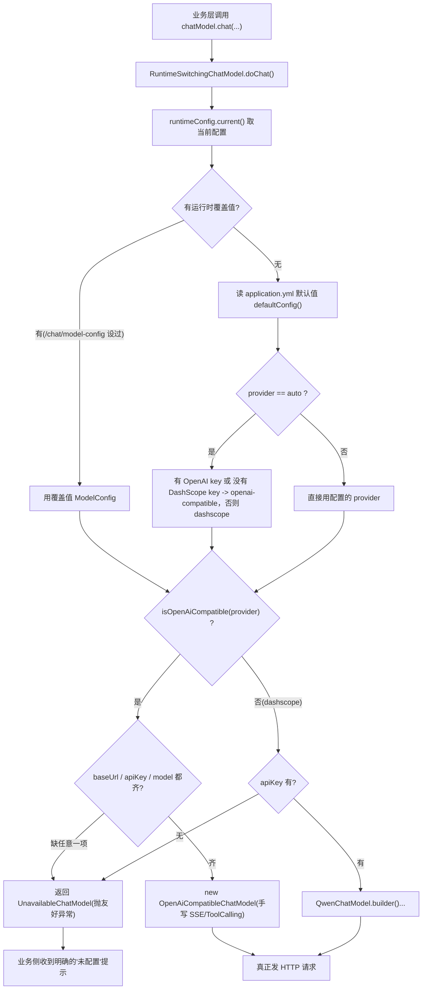

# 08 模型工厂:运行时切换与降级

> 不管你用的是 RAG、ReAct 还是基础对话,最终都要"找一个大模型说话"。本章讲的就是这层"找模型"的底座——它怎么挑供应商、怎么不重启就换模型、怎么在没配 key 时优雅地报错。
>
> 读完本章你能回答:
> - 为什么所有 LLM 调用都先经过一个"包装层",而不是直接 new 一个 `QwenChatModel`?
> - `provider=auto` 到底是怎么在 OpenAI 兼容和 DashScope(通义千问)之间做选择的?
> - 我能不能在程序运行时,通过一个 HTTP 接口把模型从 `gpt-5.4-mini` 换成 `qwen-plus`,且不重启服务?
> - 没配 API key、PgVector 连不上、MCP 没开,系统会崩吗?它怎么"降级"?

相关章节:上游怎么用模型见 [02-basic-chat-streaming.md](02-basic-chat-streaming.md) 和 [05-react-agent.md](05-react-agent.md);Embedding 在检索里的角色见 [03-rag-retrieval.md](03-rag-retrieval.md);监控埋点见 [09-observability.md](09-observability.md)。

---

## 一句话定位

模型工厂是一层"运行时可切换的大模型适配器":它把"用哪个供应商、哪个模型、什么参数"这件事从编译期延后到了每一次调用,并在任何一环缺失时用"占位模型 / 内存实现"兜底,保证服务不会因为少配一个 key 就启动失败。

---

## 为什么需要它(没有它会怎样)

先想象最朴素的写法——在 Spring 里直接注册一个 Bean:

```java
@Bean
public ChatModel chatModel() {
    return QwenChatModel.builder().apiKey(KEY).modelName("qwen-plus").build();
}
```

这种写法有四个现实问题:

| 痛点 | 朴素写法的后果 |
| --- | --- |
| 换供应商 | 想从通义千问换成 OpenAI?得改代码、重新打包、重启服务。 |
| 缺 key 启动 | `apiKey` 是空串时,要么启动报错,要么第一次调用才炸,且报错信息对运维不友好。 |
| 调参 | 想把 `temperature` 从 0.7 调到 0.3 做个对比实验?同样要重启。 |
| 多家协议不一致 | OpenAI 的 `/chat/completions`、通义千问的 SDK、各自的 tool calling 格式都不一样,业务代码要去适配。 |

模型工厂把这些痛点统一兜住:业务层永远只依赖 LangChain4j 的标准接口 `ChatModel` / `StreamingChatModel`,而"背后到底连谁"由一个**运行时配置对象**决定,可以随时改、随时降级。这就是典型的"面向接口编程 + 策略模式"在 LLM 场景的落地。

---

## 核心概念(大白话 + 小表格)

| 术语 | 大白话解释 |
| --- | --- |
| `ChatModel` / `StreamingChatModel` | LangChain4j 定义的标准"聊天模型"接口。前者一次性返回完整答案,后者边生成边吐(SSE 流式)。整个项目的业务代码只认这俩接口。 |
| RuntimeSwitching 包装模型 | 一个"空壳"模型。它本身不会聊天,每次被调用时才去读当前配置、临时造出一个真正的 delegate(委托)模型来干活。换配置 = 下次调用造出来的 delegate 就变了。 |
| `AiModelRuntimeConfig` | 当前生效配置的"唯一真相源"。内部用一个 `AtomicReference` 存"运行时覆盖值",没覆盖就回退到 application.yml 里的默认值。 |
| Provider(供应商) | 三类:`openai-compatible`(含 `openai`/`deepseek` 别名)、`dashscope`(通义千问)、`auto`(自动二选一)。 |
| OpenAI 兼容模型 | 自己手写的 `OpenAiCompatibleChatModel`,直接用 HTTP/SSE 调 `/v1/chat/completions`,不依赖官方 SDK。好处是任何"声称兼容 OpenAI 协议"的厂商(DeepSeek、各种本地推理服务)都能接。 |
| reasoningEffort(推理强度) | 给 `gpt-5*` / `o*` 这类推理模型的额外参数,告诉它"想多深"。普通模型(如 qwen)不支持,会被自动跳过。 |
| Embedding(向量化模型) | 把文本变成一串数字(向量)用于检索。本项目默认用 `HashEmbeddingModel`——一个不依赖任何外部服务的"假"向量模型,后面会讲它的取舍。 |
| 降级(fallback) | 外部依赖不可用时,换一个"能跑但功能弱"的本地实现顶上,而不是直接崩。 |

把这几个串起来一句话:**业务代码 → 标准接口 → 运行时包装层 → 读配置 → 造真实 delegate(OpenAI 兼容 / 通义 / 占位)**。

---

## 工作流程(含 mermaid 图)

下面这张图描述"业务发起一次对话"时,模型工厂内部是怎么解析配置、挑供应商、必要时降级的。



关键点:**每一次调用都重新解析配置**(图里的 C 到 J),所以改了配置无需重启,下一次调用立刻生效。

---

## 代码走读(控制流)

### 1. 注册的是"包装层",不是真实模型

`AiModelConfig` 是整个工厂的入口,它把三个 `@Primary` Bean 暴露给整个 Spring 上下文:

```java
// agent/src/main/java/com/lou/infinitechatagent/config/AiModelConfig.java:37
@Bean @Primary
public ChatModel chatModel(RestClient.Builder b) {
    return new RuntimeSwitchingChatModel(aiModelRuntimeConfig, b, aiModelMonitorListener);
}
```

- `ChatModel` → `RuntimeSwitchingChatModel`(`AiModelConfig.java:72`)
- `StreamingChatModel` → `RuntimeSwitchingStreamingChatModel`(`AiModelConfig.java:133`)
- `EmbeddingModel` → `HashEmbeddingModel`(`AiModelConfig.java:49`)

注意 `@Primary`:这样即便 classpath 里还存在 LangChain4j 自动装配出来的其他模型 Bean,业务注入时也优先拿到我们的包装层。

### 2. 包装层每次调用才"现造" delegate

`RuntimeSwitchingChatModel.doChat()` 本身只有一行 `return delegate().chat(request);`,真正的逻辑在 `delegate()`(`AiModelConfig.java:104`):

```java
// AiModelConfig.java:104
private ChatModel delegate() {
    ModelConfig config = runtimeConfig.current();          // ① 取当前配置
    if (AiModelRuntimeConfig.isOpenAiCompatible(config.provider())) {
        String missing = openAiCompatibleMissingMessage(config);
        if (missing != null) return new UnavailableChatModel(missing, config.model()); // ② 缺料兜底
        return new OpenAiCompatibleChatModel(config.baseUrl(), config.apiKey(), config.model(),
                config.temperature(), config.maxOutputTokens(), restClientBuilder.build(),
                List.of(listener), config.reasoningEffort());                            // ③ OpenAI 兼容
    }
    if (!hasText(config.apiKey()))
        return new UnavailableChatModel("AI 模型未配置：请设置 DASHSCOPE_API_KEY...", config.model());
    return QwenChatModel.builder().apiKey(config.apiKey())
            .modelName(config.model()).listeners(List.of(listener)).build();             // ④ 通义千问
}
```

这就是热切换的全部秘密:**delegate 不缓存**,配置变了,下次 `current()` 返回的就是新值,造出来的 delegate 自然换人。代价是每次调用都 new 一个对象——对 LLM 这种动辄几百毫秒的网络调用来说,这点开销完全可以忽略。

### 3. 配置解析与 auto 选择逻辑

`AiModelRuntimeConfig` 是"配置真相源"。它用一个 `AtomicReference<ModelConfig> override` 存运行时覆盖值(`AiModelRuntimeConfig.java:40`):

```java
// AiModelRuntimeConfig.java:63
public ModelConfig current() {
    ModelConfig custom = override.get();
    return custom == null ? defaultConfig() : custom;   // 没改过 -> 用 yml 默认
}
```

`auto` 的二选一规则在 `defaultConfig()`(`AiModelRuntimeConfig.java:189`):

```java
// AiModelRuntimeConfig.java:191
if ("auto".equals(provider)) {
    provider = hasText(defaultOpenAiApiKey) || !hasText(defaultDashScopeApiKey)
            ? "openai-compatible" : "dashscope";
}
```

用大白话翻译这行三目:**配了 OpenAI key 就走 OpenAI 兼容;否则——只要你配了 DashScope key——就走通义。** 注意一个细节:如果两个 key 都没配,`!hasText(defaultDashScopeApiKey)` 为真,结果仍然落到 `openai-compatible`,然后在 `delegate()` 里被 `UnavailableChatModel` 拦下,给出"请设置 OpenAI key"的提示。换句话说,**auto 在两边都空时偏向 OpenAI 兼容分支**。

供应商别名归一化在 `normalizeProvider()`(`AiModelRuntimeConfig.java:234`):`openai` 和 `deepseek` 都会被改写成 `openai-compatible`,`isOpenAiCompatible()`(`:228`)据此判断走哪条路。

### 4. OpenAI 兼容模型:手写 SSE / Tool Calling / JSON Schema

`OpenAiCompatibleChatModel` 同时实现了 `ChatModel` 和 `StreamingChatModel`,不依赖 OpenAI 官方 SDK,纯手写 HTTP。几个值得看的点:

- **非流式**:`doChat(ChatRequest)`(`OpenAiCompatibleChatModel.java:116`)用 Spring 的 `RestClient` POST 到 `/v1/chat/completions`,然后 `parseResponseBody()` 解析。它甚至兼容了"对方明明该返回 JSON 却返回了 SSE"的情况(`parseSseResponse`,`:249`),非常防御性。
- **流式**:`doChat(ChatRequest, handler)`(`:162`)用 JDK 原生 `HttpClient` + `BodyHandlers.ofLines()` 逐行读 SSE,每来一段 `delta` 就 `handler.onPartialResponse(...)` 吐给前端(`handleStreamingLine`,`:400`)。它还同时认两种事件协议:新的 `response.output_text.delta`(Responses API)和经典的 `choices[].delta.content`(Chat Completions)。
- **Tool Calling**:`buildRequestBody()`(`:362`)把 LangChain4j 的 `ToolSpecification` 转成 OpenAI 的 `tools` 数组(`toOpenAiTool`,`:506`);返回里若带 `tool_calls`,`buildAiMessage()`(`:586`)再转回 `ToolExecutionRequest`。这就是 ReAct Agent 能在 OpenAI 兼容模型上调工具的桥梁。
- **JSON Schema 转换**:`toJsonSchema()`(`:514`)把 LangChain4j 的各种 `JsonXxxSchema`(object/string/array/enum/ref/anyOf…)逐类翻译成标准 JSON Schema,供 function calling 的 `parameters` 字段使用。
- **reasoningEffort 的门槛**:只有当模型名以 `gpt-5` 或 `o` 开头时才会把 `reasoning_effort` 塞进请求体:

```java
// OpenAiCompatibleChatModel.java:369
if (reasoningEffort != null && AiModelRuntimeConfig.supportsReasoningEffort(requestModel)) {
    body.put("reasoning_effort", reasoningEffort);
}
```

`supportsReasoningEffort()` 的判断见 `AiModelRuntimeConfig.java:253`(`startsWith("gpt-5") || startsWith("o")`)。所以你给 `qwen-plus` 配了 `reasoningEffort=high` 也不会出错,只是被静默忽略。合法取值在 `normalizeReasoningEffort()`(`:242`):`none/minimal/low/medium/high/xhigh`,其它值归一化为 `null`。

> 还有个有趣的细节:对 `gpt` 开头的模型,请求会带上一个伪装成 Codex Desktop 客户端的 `User-Agent`(`OpenAiCompatibleChatModel.java:60`、`124`、`172`),用于通过某些上游的客户端校验。

### 5. /chat 模型配置热更新接口

三个 REST 接口都挂在 `/chat` 下(`ChatHistoryController.java:53`),记得加上全局前缀 `/api`,实际路径是 `/api/chat/...`:

| 方法 | 路径 | 作用 | Controller 行号 |
| --- | --- | --- | --- |
| `GET` | `/api/chat/model-status` | 查当前生效配置 + 是否已配置 | `ChatHistoryController.java:53` |
| `POST` | `/api/chat/model-config` | 运行时改配置(写 `override`) | `:58` |
| `GET` | `/api/chat/models` | 列上游可用模型(仅 OpenAI 兼容) | `:63` |

Controller 只是薄薄一层转发,真正逻辑在 `AiModelRuntimeConfig`:

- `update(request)`(`AiModelRuntimeConfig.java:68`):做"部分更新"——只填了 `model` 就只改模型,`baseUrl/apiKey` 沿用旧值(`firstText(...)` 逐级回退,`:77`)。最后 `override.set(next)` 一锤定音。如果切到 dashscope 分支,会清空 `baseUrl/temperature/reasoningEffort` 等 OpenAI 专属字段(`:88`)。
- `status()`(`:165`):回 `ModelStatusResponse`,其中 `configured` 表示"该供应商所需字段是否齐全",`runtimeEditable` 恒为 `true` 告诉前端"这玩意儿能在线改"。
- `listModels()`(`:103`):仅 OpenAI 兼容时才真的去 `GET {baseUrl}/v1/models`;失败时降级返回"当前配置的那一个模型"作为 fallback(`configuredModelFallback`,`:301`)。

### 6. MCP 工具集成(time + BigModel 搜索)

`McpToolConfig`(`McpToolConfig.java:42`)产出一个 `McpToolProvider`,被 `AiChatService` 注入给 Agent(`ai/AiChatService.java:72` 的 `.toolProvider(mcpToolProvider)`)。它的开关逻辑很直白:

```java
// McpToolConfig.java:44
if (!mcpEnabled) {                    // 总开关 mcp.enabled=false(默认) -> 空 provider
    return McpToolProvider.builder().mcpClients(List.of()).build();
}
```

总开关打开后,再按子开关挂两类客户端:

- **BigModel 联网搜索**(`:53`):走 HTTP+SSE,`sseUrl` 拼上 `bigmodel.api-key`。需要 `mcp.bigmodel-search.enabled=true` 且 key 非空,否则只打 warn 跳过。
- **time 时间工具**(`:67`):走 stdio,实际是本地拉起子进程 `uvx mcp-server-time --local-timezone=Asia/Shanghai`。需要 `mcp.time.enabled=true`,且机器上得装了 `uvx`。

默认三个开关全是 `false`,所以开箱即用时 Agent 拿到的是一个"空工具集"——不会因为没装 uvx 或没配 BigModel key 而启动失败。

### 7. Embedding 与各级降级

这是本章"降级"思想最集中的地方:

| 组件 | 正常实现 | 降级实现 | 触发条件 | 代码位置 |
| --- | --- | --- | --- | --- |
| Embedding 模型 | (项目里直接用)`HashEmbeddingModel` | 它本身就是"零依赖"实现 | 始终 | `AiModelConfig.java:49`、`HashEmbeddingModel.java` |
| 向量库 | `PgVectorEmbeddingStore` | `InMemoryEmbeddingStore` | PgVector 连不上且 `agent.local-fallback.enabled=true` | `EmbeddingStoreConfig.java:39` |
| 业务/审计/记忆库 | 配置的 MySQL DataSource | 内存 H2(`MODE=MySQL`) | JDBC 连不上且 `local-fallback.enabled=true` | `RagJdbcConfig.java:36` |
| 聊天模型 | OpenAI 兼容 / 通义 | `UnavailableChatModel`(抛友好异常) | 缺 baseUrl/apiKey/model | `AiModelConfig.java:191` |

`HashEmbeddingModel` 值得单独说一句:它不调任何外部 API,把文本按空白切词,对每个 token 做 SHA-256,落到某个维度的"桶"里再归一化(`HashEmbeddingModel.java:37`)。优点是**完全离线、零成本、永远可用**,适合开发自测和"语义没那么重要"的场景;缺点是它只是"哈希散列"而非真正的语义向量,**检索语义相关性弱**。要上生产语义检索,应换成真正的 Embedding 模型(项目 yml 里已预留了 DashScope `text-embedding-v4` 的配置位)。

`UnavailableChatModel` / `UnavailableStreamingChatModel`(`AiModelConfig.java:191`、`:219`)是一种特别的降级——它不是"换个弱模型顶上",而是"造一个一调用就抛 `MissingAiModelConfigurationException` 的占位对象"。这样做的妙处:**应用照常启动**,只有真正去聊天时才报错,且错误信息是中文、可读、告诉你缺哪个 key。

> 旁注:`DashScopeModelConfig`(`DashScopeModelConfig.java:18`)是一套"老式"直连通义的配置,被 `@ConditionalOnProperty(agent.model.legacy-dashscope-config.enabled=true)` 守着,默认不生效。它和运行时包装层是互斥的两条路——日常用前者(运行时切换),它只是历史兼容留存。

---

## 关键配置(摘自 application.yml)

| 键 | 含义 | 默认值 |
| --- | --- | --- |
| `agent.model.provider` | 供应商:`auto` / `openai-compatible`(别名 `openai`/`deepseek`) / `dashscope` | `auto` |
| `agent.model.openai-compatible.base-url` | OpenAI 兼容端点基址(自动补 `/v1`) | `https://api.openai.com` |
| `agent.model.openai-compatible.api-key` | OpenAI 兼容 API key | 空 |
| `agent.model.openai-compatible.chat-model` | OpenAI 兼容模型名 | `gpt-5.4-mini` |
| `agent.model.openai-compatible.temperature` | 采样温度 | `0.7` |
| `agent.model.openai-compatible.max-output-tokens` | 单次最大输出 token | `1024` |
| `agent.model.openai-compatible.reasoning-effort` | 推理强度(仅对 `gpt-5*`/`o*` 生效) | `high`(代码默认,yml 未显式列出) |
| `langchain4j.community.dashscope.chat-model.model-name` | 通义模型名 | `qwen-plus` |
| `langchain4j.community.dashscope.chat-model.api-key` | 通义 API key | 空 |
| `mcp.enabled` | MCP 工具总开关 | `false` |
| `mcp.bigmodel-search.enabled` | BigModel 联网搜索子开关 | `false` |
| `mcp.time.enabled` | time(uvx)子开关 | `false` |
| `bigmodel.api-key` | BigModel 搜索所需 key | 空 |
| `agent.local-fallback.enabled` | 是否允许向量库/数据库降级到内存 | `true` |
| `agent.model.legacy-dashscope-config.enabled` | 是否启用老式直连通义配置 | `false`(未配即不生效) |

> 小心:`reasoning-effort` 在 application.yml 里**没有**显式键,默认值 `high` 来自代码里的 `@Value("${...:high}")`(`AiModelRuntimeConfig.java:49`)。环境变量都用 `${...}` 占位,意味着这些值优先从环境变量读,没有才用默认。

---

## 动手试一试

> 服务端口 `10010`,全局前缀 `/api`。下面以本机为例。

**1）查当前模型配置:**

```bash
curl http://localhost:10010/api/chat/model-status
```

返回里关注 `provider` / `model` / `configured`。`configured=false` 说明缺 key,这时去聊天会收到友好报错。

**2)运行时切到通义千问(不重启):**

```bash
curl -X POST http://localhost:10010/api/chat/model-config \
  -H "Content-Type: application/json" \
  -d '{"provider":"dashscope","apiKey":"sk-你的DashScopeKey","model":"qwen-plus"}'
```

**3)再切回 OpenAI 兼容,并把模型换成支持推理的 gpt-5:**

```bash
curl -X POST http://localhost:10010/api/chat/model-config \
  -H "Content-Type: application/json" \
  -d '{"provider":"openai-compatible","baseUrl":"https://api.openai.com","apiKey":"sk-...","model":"gpt-5.4-mini","reasoningEffort":"high","temperature":0.3}'
```

**4)列上游可用模型(仅 OpenAI 兼容有效):**

```bash
curl http://localhost:10010/api/chat/models
```

**对照实验**:把上面切换接口和 `docs/postman/react-agent.postman_collection.json` 配合使用——先用该集合里的 ReAct 请求跑一次、记下答案与延迟;再 POST `/chat/model-config` 换供应商;重跑同一请求,直观对比"换模型前后"的表现差异。其余接口集合在 `docs/postman/` 下,可整目录导入 Postman。

---

## 常见坑与注意点

- **auto 在两个 key 都空时偏向 OpenAI 兼容分支**,然后被 `UnavailableChatModel` 拦下并提示"请设置 OpenAI key"。如果你本意是用通义,记得显式配 `DASHSCOPE_API_KEY`(或把 `provider` 写死成 `dashscope`)。
- **`reasoningEffort` 不是万能参数**:只对 `gpt-5*` / `o*` 生效,其它模型会被静默忽略;非法取值(不在 `none/minimal/low/medium/high/xhigh` 内)会被归一化成 `null`。
- **`/chat/model-config` 是部分更新**:只传 `model` 不传 `apiKey` 时,旧 key 会被沿用;但**从 OpenAI 兼容切到 dashscope 时,OpenAI 专属字段(baseUrl/temperature/reasoningEffort)会被清空**(`AiModelRuntimeConfig.java:88`)。
- **运行时覆盖值存在内存里**(`AtomicReference`),**重启即丢失**,回到 yml 默认。需要持久化得自己落库。
- **`HashEmbeddingModel` 不是语义向量**:开发可用,生产语义检索请换真 Embedding,否则 RAG 召回质量会很差(详见 [03-rag-retrieval.md](03-rag-retrieval.md))。
- **MCP time 工具依赖本机 `uvx`**:开了 `mcp.time.enabled=true` 但没装 uvx,stdio 子进程会拉起失败;BigModel 搜索开了但 `bigmodel.api-key` 为空只会打 warn 跳过,不会让应用崩。
- **`local-fallback.enabled=true` 是一把双刃剑**:它能让你在没有 PgVector/MySQL 的环境一键起服务,但也可能"悄悄"让数据落进内存 H2 / InMemory 而你以为连上了正式库。生产环境建议显式关掉,让连接失败直接暴露。

---

## 小结 & 延伸阅读

- 模型工厂用"运行时包装层 + 配置真相源"把"用哪个模型"延后到每次调用,实现**不重启热切换**。
- `provider=auto` 按"有没有 key"二选一,缺料时用 `UnavailableChatModel` 抛**友好异常**而非启动失败。
- `OpenAiCompatibleChatModel` 手写 SSE / Tool Calling / JSON Schema,让任意"OpenAI 协议兼容"厂商都能接入;`reasoningEffort` 仅对 `gpt-5*`/`o*` 生效。
- Embedding、向量库、数据库、聊天模型四层各有降级策略,核心思想都是"**能跑就先跑起来,再把缺失点明确暴露**"。

延伸阅读:
- 上一章 [07-memory-system.md](07-memory-system.md) —— 记忆系统如何依赖这层模型做总结/反思。
- 下一章 [09-observability.md](09-observability.md) —— `AiModelMonitorListener` 怎么给每次模型调用埋点、暴露 Prometheus 指标。
- 想看模型在完整请求里的位置,回到 [01-architecture-overview.md](01-architecture-overview.md) 的请求生命周期图。
- API 速查见 [10-run-and-api-reference.md](10-run-and-api-reference.md)。
