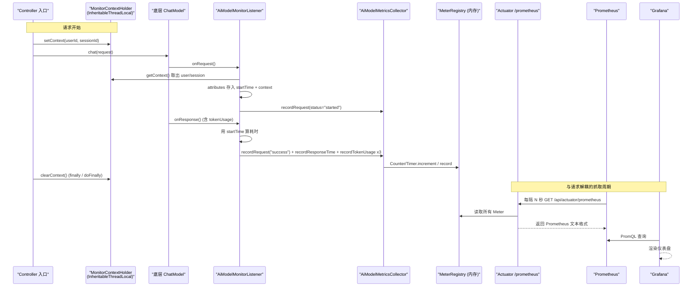

# 09 可观测性与监控

> 一个 AI 系统在生产环境里跑起来后，最怕的不是出错，而是"出错了你不知道、变慢了你看不见、烧 token 了你算不清"。本章讲这个项目怎么让自己"被看见"。
>
> 读完本章你能回答：
> - 一次模型调用的耗时、Token 消耗、成功/失败，是在哪一行代码、用什么手段采集到的？
> - 流式输出会换线程，监控上下文(谁的请求、哪个会话)是怎么跨线程不丢的？
> - Prometheus 去哪个 URL 抓数据？为什么只暴露了三个 Actuator 端点？
> - 应用一启动就把本地文档灌进向量库，是哪段代码干的？

## 一句话定位

可观测性模块 = **一个 LangChain4j 监听器** 在模型调用前后埋点，**一个 Micrometer 采集器** 把指标按维度累加进内存，**一个 Actuator 端点** 把这些指标以 Prometheus 文本格式吐出去，外加 **一个启动加载器** 在应用起来时把知识库文档灌进向量存储。

## 为什么需要它(动机:没有它会怎样)

假设你把这个 Agent 部署上线，没有任何监控。某天用户投诉"问答很慢"，你打开日志，看到的可能只是一堆请求进出，但是：

- **慢在哪一步?** 是模型推理慢、还是 RAG 检索慢、还是 rerank 服务超时? 你无从区分。
- **慢到什么程度?** "很慢"是 2 秒还是 20 秒? p99 是多少? 没有数据。
- **谁在烧钱?** AI 调用按 token 计费，哪个用户、哪个会话、哪个模型消耗最大? 一笔糊涂账。
- **错误率多少?** 模型偶尔超时返回错误，占比 0.1% 还是 30%? 你只能靠用户投诉来"采样"。

传统 Web 服务有现成的 APM 工具，但 **AI 调用有它自己的关键指标**——Token 消耗、模型名、单次推理耗时——这些是通用监控不会自动帮你采集的。所以这个项目专门做了一层"AI 模型监控"，把每一次模型调用都变成可量化、可聚合、可告警的数字。

类比：这就像给一辆车装仪表盘。没有仪表盘车也能开，但你不知道油还剩多少、水温多高、时速多少——直到抛锚在路上。本章的代码就是这套仪表盘。

## 核心概念(用大白话 + 小表格解释术语)

| 术语 | 大白话解释 |
| --- | --- |
| **Micrometer** | Java 世界的"指标门面"。你用它写一套埋点代码，底层可以对接 Prometheus、Datadog 等任意后端。类比 SLF4J 之于日志。 |
| **Counter(计数器)** | 只增不减的数字。适合"请求次数""错误次数""累计 token"。本项目用它记 `ai_model_requests_total` 等。 |
| **Timer(计时器)** | 记录一段耗时，并自动算出次数、总时长、最大值等。本项目用它记模型响应耗时。 |
| **Tag(标签/维度)** | 给一个指标贴上若干键值对，比如 `user_id=1`、`model_name=gpt-5.4-mini`。同一个指标按不同标签组合拆成多条线，这样才能"按用户/会话/模型"分别看。 |
| **MeterRegistry** | Micrometer 的"指标仓库"。所有 Counter/Timer 都注册到它里面，Actuator 再从它读取并导出。Spring Boot 自动给你装配好。 |
| **ChatModelListener** | LangChain4j 提供的钩子接口，模型调用的 `onRequest / onResponse / onError` 三个时机会被回调。我们在这三个回调里埋点。 |
| **Actuator** | Spring Boot 的运维端点集合(健康检查、指标导出等)。我们只开放其中三个。 |
| **Prometheus** | 时序数据库 + 抓取器。它定时来 HTTP 拉一次 `/actuator/prometheus`，把当前所有指标存成带时间戳的历史曲线。 |
| **InheritableThreadLocal** | "可继承的线程局部变量"。普通 ThreadLocal 只在当前线程可见；这个变种在**新线程被创建时**会把父线程的值拷贝过去——对流式场景很关键(下文细说)。 |

一句话串起来：**监听器在模型调用前后被回调 → 调采集器把数字累加进 MeterRegistry → Actuator 端点把 MeterRegistry 导出成文本 → Prometheus 来抓 → Grafana 画图。**

## 工作流程(含 mermaid 图)

下面这张图把"一次模型调用是怎么被监控的"和"指标怎么流到 Grafana"画在一起。注意左半边发生在**每次请求**，右半边发生在**Prometheus 的抓取周期**(两者是解耦的)。



## 代码走读(关键类/方法 + path:line,讲清控制流)

### 1) 入口处:把"谁的请求"放进上下文

每个会触发模型调用的 Controller，在调用业务逻辑前先把 `userId` / `sessionId` 塞进一个线程局部变量，并在 `finally` 里清掉。以非流式 Agent 为例：

`agent/src/main/java/com/lou/infinitechatagent/controller/AgentController.java:55`
```java
MonitorContextHolder.setContext(MonitorContext.builder()
        .userId(request.getUserId())
        .sessionId(request.getSessionId())
        .build());
try {
    // ... 调用 reActAgentOrchestrator.chat(request) ...
} finally {
    MonitorContextHolder.clearContext();   // :83 一定要清，否则线程复用会污染下一个请求
}
```

`MonitorContext` 只是个携带 `sessionId` / `userId` 的小 POJO(`monitor/MonitorContext.java:14`)，用 Lombok 的 `@Data @Builder` 生成。它实现了 `Serializable`，方便日后跨进程/缓存传递。

> 注意：`setContext` 和 `clearContext` 必须成对出现。Tomcat 的线程是复用的，如果某次请求只 set 不 clear，下一个落到同一线程的请求就会读到上一个用户的上下文——这是个隐蔽的串号 bug，所以四个 Controller 都老老实实写了 `finally`(流式那个用的是 `doFinally`，见第 3 点)。

### 2) MonitorContextHolder:为什么用 InheritableThreadLocal

`agent/src/main/java/com/lou/infinitechatagent/monitor/MonitorContextHolder.java:8`
```java
private static final ThreadLocal<MonitorContext> CONTEXT_HOLDER = new InheritableThreadLocal<>();
```

这里用的是 `InheritableThreadLocal` 而不是普通 `ThreadLocal`。区别只在一句话：**当你的代码 `new Thread()` 派生子线程时，子线程会自动继承父线程当前的值。**

为什么需要这个特性? 因为流式聊天(SSE)里，真正调用模型、触发 `onRequest` 回调的，往往不是接收 HTTP 请求的那个 Tomcat 线程，而是 Reactor / 模型 SDK 内部的工作线程。如果用普通 ThreadLocal，子线程里 `getContext()` 会拿到 `null`，监听器就只能记一条 `userId=unknown` 的指标——维度全丢了。`InheritableThreadLocal` 让上下文"顺着线程派生关系流下去"，是这个项目让监控在流式场景下不掉链子的关键小技巧。

(它不是银弹:线程池复用的已有线程不会重新继承,所以流式入口才需要在 `Flux.defer` 里**重新** `setContext`——见下一点。)

### 3) 流式场景:在 Flux.defer 里重新 set,在 doFinally 里 clear

`agent/src/main/java/com/lou/infinitechatagent/controller/AiChatController.java:76`
```java
return Flux.defer(() -> {
    MonitorContextHolder.setContext(context);   // :77 在订阅发生的线程上重新绑定
    // ... 拼装 start / delta / done 三段 SSE ...
    return Flux.concat(start, delta, done)
            // ...
            .doFinally(signal -> MonitorContextHolder.clearContext());   // :135
});
```

`Flux.defer` 把"设置上下文"推迟到**真正被订阅时**才执行，确保它运行在即将驱动数据流的那个线程上；`doFinally` 则是响应式世界里的 `finally`——无论正常完成、报错还是被取消，都会清理上下文。这是把"线程局部变量"和"响应式异步"这两个原本不太搭的东西缝合起来的标准做法。

### 4) AiModelMonitorListener:三个时机埋点

这个类实现了 LangChain4j 的 `ChatModelListener`，在模型调用生命周期的三个点被回调。

`agent/src/main/java/com/lou/infinitechatagent/monitor/AiModelMonitorListener.java:30`(onRequest)：
```java
requestContext.attributes().put(START_TIME_KEY, Instant.now());   // :32 记下开始时刻
MonitorContext context = MonitorContextHolder.getContext();       // :34 从 ThreadLocal 取
// ...
requestContext.attributes().put(MONITOR_CONTEXT_KEY, context);    // :43 顺手存进 attributes
aiModelMetricsCollector.recordRequest(userId, sessionId, modelName, "started");  // :49
```

这里有个巧妙设计：`onRequest` 不仅从 ThreadLocal 读上下文，还把它**塞进 `requestContext.attributes()`**。`attributes` 是 LangChain4j 在同一次调用的 request/response/error 三个回调之间共享的一个 Map。这相当于给上下文上了"双保险"——即便 `onResponse` 跑在另一个 ThreadLocal 读不到的线程上，也能从 attributes 里把它捞回来。

`AiModelMonitorListener.java:53`(onResponse)：
```java
MonitorContext context = (MonitorContext) attributes.get(MONITOR_CONTEXT_KEY);  // :58 优先从 attributes 取
// ...
Duration durationMs = calculateDuration(attributes);          // :68 用 startTime 算耗时
TokenUsage tokenUsage = ...metadata().tokenUsage();           // :71
aiModelMetricsCollector.recordRequest(userId, sessionId, modelName, "success");  // :75
aiModelMetricsCollector.recordResponseTime(userId, sessionId, modelName, durationMs);  // :76
if (tokenUsage != null) {
    aiModelMetricsCollector.recordTokenUsage(..., "input", tokenUsage.inputTokenCount());   // :79
    aiModelMetricsCollector.recordTokenUsage(..., "output", tokenUsage.outputTokenCount()); // :80
    aiModelMetricsCollector.recordTokenUsage(..., "total", tokenUsage.totalTokenCount());   // :81
}
```

可以看到一次成功的响应会落 **5 类数字**：一个 `success` 计数、一个耗时、三个 token 计数(输入/输出/合计)。`calculateDuration`(`:117`)就是简单的 `Instant.now() - startTime`；取不到开始时间就返回 `Duration.ZERO` 兜底。

`AiModelMonitorListener.java:86`(onError)：失败时先尝试 `MonitorContextHolder.getContext()`，拿不到再从 `attributes` 补救(`:94`)，然后记一条 `error` 请求计数 + 一条错误明细 + 一条耗时。注意**失败也记耗时**——这样"慢到超时的失败"也能在耗时分布里体现。

### 5) AiModelMetricsCollector:按维度累加,且缓存 Meter

`agent/src/main/java/com/lou/infinitechatagent/monitor/AiModelMetricsCollector.java:30`(recordRequest)：
```java
String safeUserId = (userId == null) ? "unknown" : userId;   // :32 Micrometer 标签不允许 null
// ... 其余字段同样做 null 兜底 ...
String key = String.format("%s_%s_%s_%s", safeUserId, safeSessionId, safeModel, safeStatus);  // :37
Counter counter = requestCountersCache.computeIfAbsent(key, k ->
        Counter.builder("ai_model_requests_total")
                .tag("user_id", safeUserId)
                .tag("session_id", safeSessionId)
                .tag("model_name", safeModel)
                .tag("status", safeStatus)
                .register(meterRegistry));   // :44
counter.increment();   // :46
```

两个要点：

1. **null 兜底**：Micrometer 的标签值**绝对不能是 null**，否则注册时直接抛异常。所以这里把每个可能为空的字段都替换成 `"unknown"`。这就是为什么你在监控里有时会看到 `user_id="unknown"` 的曲线——那通常是上下文没传进来的请求。
2. **ConcurrentMap 缓存 Meter**：每个独特的标签组合(key)只会创建一个 Counter/Timer，之后复用。类里有四个独立缓存：`requestCountersCache` / `errorCountersCache` / `tokenCountersCache` / `responseTimersCache`(`:22-25`)。为什么要自己缓存? 因为反复 `Counter.builder(...).register(...)` 虽然 Micrometer 内部也会去重，但用 `computeIfAbsent` 显式缓存更省、更快，也让"一个标签组合对应一个 Meter"的关系一目了然。用 `ConcurrentHashMap` 是因为多个请求线程会并发调它。

> 维度警告(重要):请求计数和 token 计数都把 `user_id` 和 `session_id` 当成标签。`session_id` 通常每次会话都不同——**这意味着指标基数(cardinality)会随会话数无限增长**,在高流量生产环境可能把内存和 Prometheus 撑爆。这是教学项目里很常见、但上线前必须正视的设计点,详见"常见坑"。

本采集器导出的指标清单：

| 指标名 | 类型 | 标签 | 含义 |
| --- | --- | --- | --- |
| `ai_model_requests_total` | Counter | user_id, session_id, model_name, status | 请求次数，status ∈ {started, success, error} |
| `ai_model_errors_total` | Counter | user_id, session_id, model_name, error_message | 错误次数(按错误消息细分) |
| `ai_model_tokens_total` | Counter | user_id, session_id, model_name, token_type | Token 累计，token_type ∈ {input, output, total} |
| `ai_model_response_duration_seconds` | Timer | user_id, session_id, model_name | 响应耗时(Timer 自动产出 count/sum/max) |

### 6) 监听器是怎么挂到模型上的

埋点代码写好了，还得让它真正"挂"到模型调用链上。这一步在 `AiModelConfig`：注入监听器 Bean，再在构造每个底层模型时把它传进 `listeners(...)`。

`agent/src/main/java/com/lou/infinitechatagent/config/AiModelConfig.java:31`
```java
@Resource
private AiModelMonitorListener aiModelMonitorListener;
```

`AiModelConfig.java:118` / `:128`(分别是 OpenAI 兼容模型与 DashScope 的 Qwen 模型)：
```java
// OpenAI 兼容
new OpenAiCompatibleChatModel(..., List.of(listener), ...);   // :118
// DashScope
QwenChatModel.builder().apiKey(...).modelName(...).listeners(List.of(listener)).build();  // :128
```

注意 `chatModel` / `streamingChatModel` 两个 Bean 都被包成 `RuntimeSwitchingChatModel`(运行时可切换模型,见 [08-model-factory.md](08-model-factory.md)),监听器透过它一路传给真正干活的底层模型。**只要走的是这两个 Bean,无论你切到哪个 provider,监控都自动生效**——这就是把监听器装在工厂层而不是业务层的好处。

### 7) RagDataLoader:启动即灌库

最后这个类和"监控"没有直接关系，但同属"应用启动期的基础设施动作"，所以放在本章一起讲。

`agent/src/main/java/com/lou/infinitechatagent/job/RagDataLoader.java:12`
```java
@Component
public class RagDataLoader implements CommandLineRunner {
    @Value("${rag.docs-path}")
    private String docsPath;
    @Resource
    private DocumentIngestionService documentIngestionService;

    @Override
    public void run(String... args) {                         // :21 Spring 启动完成后自动执行一次
        int chunkCount = documentIngestionService.ingestDocumentsFromPath(docsPath);  // :24
        // ... 打印写入了多少个可溯源片段 ...
    }
}
```

`CommandLineRunner` 是 Spring Boot 的"启动后回调"接口：容器装配完毕、应用就绪后，`run(...)` 会被自动调用一次。这里它把 `rag.docs-path`(默认 `src/main/resources/docs`)下的文档读出来、切片、写进向量库，这样应用一启动就有知识可检索，不用手动调接口灌数据。切片与入库的细节见 [03-rag-retrieval.md](03-rag-retrieval.md)。它对异常做了 `try/catch`——**文档加载失败只打日志、不阻断启动**，应用仍能正常起来(只是 RAG 检索可能空库)。

## 关键配置(从 application.yml 摘相关项:键 / 含义 / 默认值,用表格)

监控相关的配置非常克制，核心只有 `management.*` 几行(`application.yml:174`)：

| 配置键 | 含义 | 值 |
| --- | --- | --- |
| `management.endpoints.web.exposure.include` | 通过 HTTP 暴露哪些 Actuator 端点(白名单) | `health,info,prometheus` |
| `management.endpoint.health.show-details` | 健康检查是否展开各组件明细 | `always` |
| `management.health.mail.enabled` | 是否启用邮件健康检查 | `false`(项目未必配 SMTP，关掉避免误报不健康) |
| `server.port` | 服务端口 | `10010` |
| `server.servlet.context-path` | 全局路由前缀 | `/api` |
| `rag.docs-path` | 启动加载器扫描的文档目录 | `src/main/resources/docs` |

**端点最终路径怎么算出来的?** Actuator 默认基础路径是 `/actuator`，再叠加全局 `context-path: /api`，所以三个端点的真实地址是：

- `GET /api/actuator/health` —— 健康检查(展开明细)
- `GET /api/actuator/info` —— 应用信息
- `GET /api/actuator/prometheus` —— **Prometheus 抓取入口**

> 为什么只暴露三个? Actuator 默认能暴露 `env`、`beans`、`mappings`、`heapdump` 等几十个端点，其中不少会泄露配置、环境变量甚至堆内存。**只用白名单放出运维真正需要的三个**，是最小权限原则的体现——这也是为什么这里用 `include: health,info,prometheus` 而不是 `include: '*'`。

依赖侧(`agent/pom.xml:106` 与 `:112`)只需两个：

| 依赖 | 作用 |
| --- | --- |
| `spring-boot-starter-actuator` | 提供 Actuator 端点框架与自动配置 |
| `micrometer-registry-prometheus` | 让 Micrometer 能把指标导出成 Prometheus 文本格式，并自动注册 `/actuator/prometheus` 端点 |

## 动手试一试(curl 示例)

本章没有专属 Postman 集合。思路是：**先用任意一个会触发模型调用的接口造点流量，再去看 `/actuator/prometheus`。**

### 第一步:看健康状态(无需触发模型)

```bash
curl http://localhost:10010/api/actuator/health
# 期望看到 {"status":"UP", "components":{...}}，因为 show-details=always 会展开各组件
```

### 第二步:造一点流量

随便挑一个聊天/Agent 接口发一条请求(具体报文见各章或 `docs/postman/` 下对应集合，例如基础聊天集合见 [02-basic-chat-streaming.md](02-basic-chat-streaming.md))：

```bash
curl -X POST http://localhost:10010/api/chat \
  -H "Content-Type: application/json" \
  -d '{"userId":1,"sessionId":1001,"prompt":"你好"}'
```

### 第三步:抓取 Prometheus 指标,过滤出 AI 相关的

```bash
curl -s http://localhost:10010/api/actuator/prometheus | grep ai_model
```

你应该能看到类似下面这样的输出(标签里带着你刚才请求的 user/session/model)：

```text
ai_model_requests_total{model_name="gpt-5.4-mini",session_id="1001",status="success",user_id="1"} 1.0
ai_model_tokens_total{model_name="gpt-5.4-mini",session_id="1001",token_type="total",user_id="1"} 137.0
ai_model_response_duration_seconds_count{model_name="gpt-5.4-mini",session_id="1001",user_id="1"} 1.0
ai_model_response_duration_seconds_sum{model_name="gpt-5.4-mini",session_id="1001",user_id="1"} 0.842
```

### 接 Prometheus + Grafana 的思路

把下面这段加进 `prometheus.yml`，让 Prometheus 定时来抓(注意 `metrics_path` 要带上 `/api` 前缀)：

```yaml
scrape_configs:
  - job_name: 'infinitechat-agent'
    metrics_path: '/api/actuator/prometheus'
    scrape_interval: 15s
    static_configs:
      - targets: ['localhost:10010']
```

Grafana 里几条常用 PromQL：

| 你想看的 | PromQL |
| --- | --- |
| 每分钟成功请求数 | `rate(ai_model_requests_total{status="success"}[1m]) * 60` |
| 错误率 | `sum(rate(ai_model_requests_total{status="error"}[5m])) / sum(rate(ai_model_requests_total{status=~"success\|error"}[5m]))` |
| 平均响应耗时 | `rate(ai_model_response_duration_seconds_sum[5m]) / rate(ai_model_response_duration_seconds_count[5m])` |
| 每分钟总 token 消耗 | `sum(rate(ai_model_tokens_total{token_type="total"}[1m])) * 60` |
| 按模型分组的 token | `sum by (model_name) (ai_model_tokens_total{token_type="total"})` |

## 常见坑与注意点

1. **高基数标签会爆内存(最重要)**。`session_id` 作为标签，每个新会话都会创建一组全新的 Counter/Timer，永远留在内存里(`AiModelMetricsCollector` 的四个缓存只增不减)。低流量教学环境无所谓，但生产环境跑久了，内存和 Prometheus 存储都会被几十万条 series 压垮。生产化建议：把 `session_id`(甚至 `user_id`)从指标标签里拿掉，改用日志/链路追踪(traceId)关联个体请求，指标只保留 `model_name`、`status` 这类低基数维度。

2. **`error_message` 当标签同样危险**。`ai_model_errors_total` 把原始错误消息直接当标签值，而错误消息里常含变化的内容(超时时间、请求 id 等)，基数会爆。同上，生产环境应归一化成有限的错误类别(如 `TIMEOUT` / `RATE_LIMIT` / `AUTH`)。

3. **忘记 clearContext 会串号**。前面强调过：Tomcat 线程复用，只 set 不 clear 会让下一个请求读到上一个用户的上下文。流式接口尤其要用 `doFinally` 而不是普通 `finally`(普通 finally 在响应式里根本拦不住异步流的结束)。

4. **`MonitorContext is null` 日志**。如果监听器里频繁打 `MonitorContext is null when processing request`，说明有调用链没经过 Controller 入口的 `setContext`(比如某个内部任务直接调了模型),或者上下文在线程切换中丢了。这时指标会退化成 `user_id="unknown"`,不致命但维度失真。

5. **端点路径别漏 `/api`**。因为有全局 `context-path: /api`，访问 Actuator 必须是 `/api/actuator/prometheus`，直接访问 `/actuator/prometheus` 会 404。配置 Prometheus 抓取时这是最常踩的坑。

6. **`/actuator/prometheus` 是即时快照,不是历史**。每次访问拿到的是"此刻所有指标的当前值"。趋势、告警全靠 Prometheus 周期性抓取后自己存历史——光 curl 这个端点看不出"过去一小时的曲线"。

7. **文档加载失败不报错只打日志**。`RagDataLoader` 吞掉了异常,应用照常启动。如果你发现 RAG 检索老是空,先去启动日志里搜 `RAG - 加载本地文档失败`,而不是怀疑检索逻辑。

## 小结 & 延伸阅读

这一章我们看清了系统"被看见"的全链路：

- **采集**：`AiModelMonitorListener` 实现 `ChatModelListener`，在 `onRequest/onResponse/onError` 三个时机埋点，记请求数、耗时、token、错误。
- **聚合**：`AiModelMetricsCollector` 把数字按 user/session/model/status 维度累加进 Micrometer 的 Counter/Timer，并用 `ConcurrentMap` 缓存每个标签组合对应的 Meter。
- **跨线程**：`MonitorContextHolder` 用 `InheritableThreadLocal` 让监控上下文能随线程派生流到流式工作线程；流式入口再配合 `Flux.defer` 重新绑定、`doFinally` 清理。
- **导出**：Actuator 用白名单只放出 `health/info/prometheus` 三个端点，`/api/actuator/prometheus` 是 Prometheus 的抓取入口，Grafana 在其上用 PromQL 画图。
- **启动**：`RagDataLoader`(`CommandLineRunner`)在应用就绪后把本地文档灌进向量库。

延伸阅读：

- 监听器挂载、运行时模型切换的全貌 → [08-model-factory.md](08-model-factory.md)
- 启动加载的文档是怎么切片、入库、被检索的 → [03-rag-retrieval.md](03-rag-retrieval.md)
- 流式输出与 SSE 的来龙去脉(本章多处提到的 `Flux.defer/doFinally` 场景) → [02-basic-chat-streaming.md](02-basic-chat-streaming.md)
- 本地怎么把这套环境(含 Prometheus 端点)跑起来、完整 API 速查 → [10-run-and-api-reference.md](10-run-and-api-reference.md)
- 这套监控在生产化前还差什么 → [IMPROVEMENTS.md](IMPROVEMENTS.md)

回到学习地图 → [README.md](README.md)
