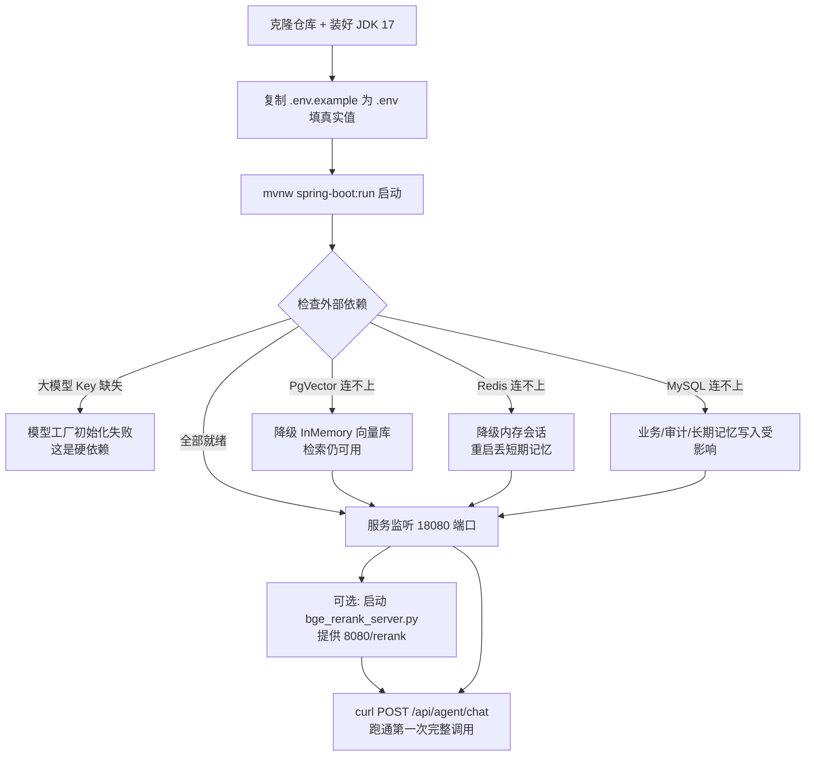

# 10 本地运行与 API 速查

> 前面九章把每个子系统都拆开讲透了，这一章把它们重新拼回去：先把项目在你自己机器上跑起来，再给你一张覆盖全部接口的"地图"，让你照着就能跑通一次完整调用。
>
> 读完本章你能回答：
> - 我至少要装哪些东西才能让服务启动起来？哪些依赖缺了会直接崩，哪些只是"降级"继续跑？
> - `.env.example` 里那一堆环境变量，每个是干嘛的，最少要填几个？
> - 一共有哪些 HTTP 接口、分别打到哪个 Controller、请求体长什么样？
> - BGE 重排序服务是怎么单独跑的，不跑会怎样？

## 一句话定位

这是一份"启动手册 + 接口总表"：把分散在各章的运行前提、降级行为、环境变量和全部路由集中到一页，作为整套文档的"落地入口"。

## 为什么需要它（动机：没有它会怎样）

前面九章每章都聚焦一个能力，但有几个很现实的问题没人专门回答：

- **到底要装什么？** 项目同时连了 MySQL、PgVector、Redis，还可选一个 Python 的 BGE 重排服务。新人最怕的不是"看不懂代码"，而是"我连不上数据库，服务起不来，不知道是哪步漏了"。
- **少装一个会不会崩？** 这套系统的一个关键设计是"依赖不可用就降级"，而不是直接挂掉。但哪些是硬依赖（缺了启动失败）、哪些是软依赖（缺了自动退化到内存/H2），不集中说明，你就只能靠报错猜。
- **接口太多记不住。** 9 个 Controller、30 多个路由，散落在各章。真正动手时你需要的是一张"方法 / 路径 / 作用 / 请求体要点"的速查表，而不是翻九个文件。

这一章就是来补这三个缺口的。把它当成"我要在本地复现一遍"时摊在桌上的那张纸。

## 核心概念（用大白话 + 小表格解释术语）

| 术语 | 大白话解释 |
| --- | --- |
| 硬依赖 | 缺了服务**起不来**。这里主要是大模型的 Key——没有它，模型工厂没法初始化。 |
| 软依赖（可降级） | 缺了服务**照样起**，只是某个能力退化。比如 PgVector 连不上就退回 InMemory 向量库，Redis 连不上就用内存存会话。 |
| `mvnw` / `mvnw.cmd` | Maven Wrapper。一个随项目自带的"Maven 启动器"，你机器上**没装 Maven 也能跑**——它会自动下载约定版本的 Maven。Linux/Mac 用 `./mvnw`，Windows 用 `.\mvnw.cmd`。 |
| `context-path` | 所有接口的统一前缀。本项目是 `/api`，所以书里写的 `/agent/chat` 实际访问路径是 `/api/agent/chat`。 |
| BGE Rerank 服务 | 一个**独立的 Python 进程**（`scripts/bge_rerank_server.py`），专门做"把召回的片段重新打分排序"。Java 主服务通过 HTTP 调它。不跑它，重排会失败并进入冷却，检索退回融合后的原始排序。 |
| `.env` vs `application.yml` | `application.yml` 是配置主文件，但里面大量用了 `${VAR:默认值}` 占位符；`.env`（从 `.env.example` 复制）负责给这些 `VAR` 喂真实值。 |

一句话记忆：**模型 Key 是命门，数据库和重排都能降级。**

## 工作流程（含 mermaid 图）

下面这张图说明"从零到跑通第一个请求"的完整路径，以及每个外部依赖缺失时会走哪条降级分支。



## 代码走读（关键类/方法 + path:line，讲清控制流）

### 1. 端口与统一前缀来自哪里

服务监听端口和 `/api` 前缀都写死在配置里：

- `agent/src/main/resources/application.yml:29` —— `server.port` 默认 `18080`（可被 `SERVER_PORT` 覆盖）。
- `agent/src/main/resources/application.yml:31` —— `servlet.context-path: /api`。

所以**所有**后面表里的路径都要在前面加 `/api`。例如 ReAct 的 `/agent/chat` 真实地址是 `http://localhost:18080/api/agent/chat`。

### 2. 大模型 Key 是硬依赖

DashScope 的三个模型（chat / embedding / streaming）都从同一个 `DASHSCOPE_API_KEY` 取值：

- `agent/src/main/resources/application.yml:47` 起的 `langchain4j.community.dashscope` 段，`api-key: ${DASHSCOPE_API_KEY:}`。

如果你不打算用 DashScope，而是走 OpenAI 兼容端点，则由模型工厂的 `agent.model.provider` 决定（默认 `auto`：有 OpenAI Key 走 OpenAI 兼容，否则回落 DashScope，详见 [08-model-factory.md](./08-model-factory.md)）。无论走哪条，**至少得有一个可用的模型 Key**，否则模型层无法装配。

### 3. 数据库与中间件的降级开关

- **PgVector**：`application.yml:39` 的 `pgvector.*`。连不上时退回 InMemory 向量库（行为见 [03-rag-retrieval.md](./03-rag-retrieval.md)），检索仍能跑，只是数据不持久、重启即丢。
- **Redis**：`application.yml:9` 的 `spring.data.redis.*`。短期会话记忆走 Redis；不可用时降级到进程内内存（见 [07-memory-system.md](./07-memory-system.md)）。
- **MySQL**：`application.yml:4` 的 `spring.datasource.*`，承载业务表、工具审计表、长期记忆。测试或降级场景由 `pom.xml:92` 引入的 H2 兜底。

### 4. 路由是怎么挂上去的

每个 Controller 用类级 `@RequestMapping` 定前缀、方法级注解定子路径。几个容易看混的点：

- `AiChatController`（`controller/AiChatController.java:26`）**没有类级前缀**，所以 `@PostMapping("/chat")`（第 34 行）和 `/streamChat`（第 68 行）直接挂在根上 → `/api/chat`、`/api/streamChat`。
- `ChatHistoryController`（`controller/ChatHistoryController.java:24`）的类级前缀也是 `/chat`，但它的方法都带二级路径（`/sessions`、`/models`…），所以和上面的 `/api/chat` 不冲突——一个是 `POST /chat`，一个是 `GET /chat/sessions`。
- `AutoChatController`（`controller/AutoChatController.java:25`）前缀是 `/chat/auto`，根 `@PostMapping`（第 31 行）就是 `POST /api/chat/auto`，流式版是 `/api/chat/auto/stream`。

### 5. 重排服务是独立进程

Java 侧只持有一个 HTTP 端点配置 `application.yml:93` `endpoint: http://localhost:8080/rerank`；真正干活的是 `agent/scripts/bge_rerank_server.py`。这个 FastAPI 服务加载 `BAAI/bge-reranker-v2-m3` 模型（`bge_rerank_server.py:8`），暴露 `POST /rerank`（第 20 行），输入 `{query, texts}`、输出每段的 `{index, score}`。主服务把召回片段打包发过去拿重排分数。它不可用时，重排会失败并进入 `failure-cooldown-ms`（默认 60000ms）冷却期，期间跳过重排。

## 关键配置（从 application.yml 摘相关项）

启动相关的核心项（完整清单见各专题章）：

| 配置键 | 含义 | 默认值 |
| --- | --- | --- |
| `server.port` | 服务监听端口 | `18080` |
| `server.servlet.context-path` | 所有路由统一前缀 | `/api` |
| `spring.datasource.url` | MySQL 连接串（环境变量 `MYSQL_URL`） | 本地 3306/agent |
| `spring.data.redis.host` / `.port` | Redis 地址（短期会话） | `localhost` / `6379` |
| `pgvector.host` / `.port` / `.database` | 向量库地址 | `localhost` / `5432` / `dp` |
| `langchain4j.community.dashscope.*.api-key` | 通义千问 Key（硬依赖） | 取 `DASHSCOPE_API_KEY` |
| `agent.model.provider` | 模型提供方选择 | `auto` |
| `rag.rerank.enabled` / `.endpoint` | 是否启用重排 / 重排服务地址 | `true` / `localhost:8080/rerank` |
| `mcp.enabled` / `web-search.enabled` | MCP / 联网搜索总开关 | `false` / `false` |
| `management.endpoints.web.exposure.include` | 暴露的 Actuator 端点 | `health,info,prometheus` |

> Actuator 因为也吃 `/api` 前缀，实际路径是 `/api/actuator/health`、`/api/actuator/info`、`/api/actuator/prometheus`（详见 [09-observability.md](./09-observability.md)）。

### `.env.example` 要配的环境变量

从 `agent/.env.example` 复制为 `.env` 后，按需填这些（带 `your_xxx` 占位的都要换成真值）：

| 变量 | 用途 | 必填？ |
| --- | --- | --- |
| `DASHSCOPE_API_KEY` | 通义千问 Key，模型层命门 | 是（除非改用 OpenAI 兼容） |
| `MYSQL_URL` / `MYSQL_USERNAME` / `MYSQL_PASSWORD` | MySQL 连接 | 强烈建议（缺则业务/审计/长期记忆受限） |
| `REDIS_HOST` / `REDIS_PORT` / `REDIS_PASSWORD` | Redis 短期会话 | 可降级 |
| `PGVECTOR_HOST` / `PGVECTOR_PORT` / `PGVECTOR_DATABASE` / `PGVECTOR_USER` / `PGVECTOR_PASSWORD` | 向量库 | 可降级 |
| `RESEND_API_KEY` / `RESEND_FROM` | 邮件工具（ReAct 可用工具之一） | 可选 |
| `MCP_ENABLED` / `WEB_SEARCH_ENABLED` | 功能总开关 | 默认 `false`，可不动 |

> `.env.example` 顶部明确写了"只放示例不放真实密钥"，`.env` 已在 `.gitignore` 里，别把真 Key 提交上去。

## 动手试一试

### 第 0 步：装前置

- **JDK 17**（`pom.xml:30` 锁定 `java.version=17`）。
- **Maven 不用单独装**——仓库自带 `mvnw` / `mvnw.cmd`。
- 可选：本地起 MySQL、PgVector、Redis；以及（可选）Python 环境跑 BGE 重排。

### 第 1 步：配环境变量

```bash
cp agent/.env.example agent/.env
# 编辑 agent/.env，至少填 DASHSCOPE_API_KEY，按需填数据库连接
```

### 第 2 步：启动主服务

Linux / macOS：

```bash
cd agent
./mvnw spring-boot:run
```

Windows（PowerShell）：

```powershell
cd agent
.\mvnw.cmd spring-boot:run
```

启动成功后健康检查应当返回 UP：

```bash
curl http://localhost:18080/api/actuator/health
```

### 第 3 步（可选）：启动 BGE 重排服务

不启动也能跑——重排会失败并进入冷却、检索退回融合排序。要启用就单独跑这个 Python 服务（默认听 8080）：

```bash
pip install fastapi uvicorn FlagEmbedding
uvicorn scripts.bge_rerank_server:app --host 0.0.0.0 --port 8080
```

### 第 4 步：跑通第一次完整调用

写一条知识 → 触发一次带引用的 RAG，照着就能验证整条链路：

```bash
# 1) 写入一条知识点
curl -X POST http://localhost:18080/api/insert \
  -H "Content-Type: application/json" \
  -d '{"question":"千言是什么？","answer":"千言是一个企业级 AI Agent 智能助手。","sourceName":"intro.md"}'

# 2) 带引用地问一句
curl -X POST http://localhost:18080/api/rag/chat \
  -H "Content-Type: application/json" \
  -d '{"userId":1001,"sessionId":93001,"prompt":"千言是什么？"}'

# 3) 让 Adaptive RAG 自己决定要不要检索（debug 看决策链）
curl -X POST http://localhost:18080/api/rag/adaptive/chat \
  -H "Content-Type: application/json" \
  -d '{"userId":1001,"sessionId":93001,"prompt":"介绍一下千言的能力","debug":true}'
```

### Postman 集合对照表（全部在 `docs/postman/`）

10 个集合覆盖了各章能力，按需导入：

| 集合文件 | 覆盖功能 | 对应章节 |
| --- | --- | --- |
| `react-agent.postman_collection.json` | ReAct Agent 对话 `/agent/chat` | [05](./05-react-agent.md) |
| `react-agent-tools.postman_collection.json` | 工具列表 / 审计 `/agent/tools*` | [05](./05-react-agent.md) / [06](./06-governance-guardrail.md) |
| `tool-governance.postman_collection.json` | 工具治理与高风险确认 | [06](./06-governance-guardrail.md) |
| `safe-input-guardrail.postman_collection.json` | 输入护轨（`/chat`、`/streamChat` 注入拦截） | [06](./06-governance-guardrail.md) |
| `adaptive-rag.postman_collection.json` | 自适应 RAG `/rag/adaptive/chat` | [04](./04-adaptive-rag.md) |
| `hybrid-rag-rerank.postman_collection.json` | 混合检索 + 重排 | [03](./03-rag-retrieval.md) |
| `rag-citation.postman_collection.json` | 带引用的 RAG `/rag/chat` | [03](./03-rag-retrieval.md) |
| `pdf-rag.postman_collection.json` | 文档入库（PDF 等）`/rag/documents/*` | [03](./03-rag-retrieval.md) |
| `memory-agent.postman_collection.json` | 记忆编排 `/memory/*` | [07](./07-memory-system.md) |
| `memory-dedup-correction.postman_collection.json` | 记忆去重与纠错 | [07](./07-memory-system.md) |

## 全部接口速查表

> 所有路径都已是**含 `/api` 前缀**的真实访问路径。

### 对话与流式（AiChatController，无类级前缀）

| 方法 | 路径 | 作用 | 请求体要点 |
| --- | --- | --- | --- |
| POST | `/api/chat` | 基础对话（带输入护轨） | `{userId, sessionId, prompt}` |
| POST | `/api/streamChat` | SSE 流式对话 | 同上；返回 `start/delta/done/error` 事件流 |

### 自动路由（AutoChatController，前缀 `/chat/auto`）

| 方法 | 路径 | 作用 | 请求体要点 |
| --- | --- | --- | --- |
| POST | `/api/chat/auto` | 自动判定走直答/RAG/Agent | `{userId, sessionId, prompt}` |
| POST | `/api/chat/auto/stream` | 自动路由 + SSE 流式 | 同上；事件携带 `route/reason/citations/toolTrace` |

### 会话历史与模型管理（ChatHistoryController，前缀 `/chat`）

| 方法 | 路径 | 作用 | 请求体 / 参数要点 |
| --- | --- | --- | --- |
| GET | `/api/chat/sessions` | 列出某用户的会话 | query：`userId`（必填）、`limit`（默认 40） |
| GET | `/api/chat/sessions/{sessionId}` | 单个会话详情 | path：`sessionId`；query：`userId` |
| POST | `/api/chat/sessions` | 新建会话 | body：`ChatSessionCreateRequest` |
| POST | `/api/chat/sessions/{sessionId}/summarize` | 触发会话摘要 | path：`sessionId`；query：`userId` |
| GET | `/api/chat/model-status` | 当前模型运行状态 | 无 |
| POST | `/api/chat/model-config` | 运行时切换模型配置 | `{provider, baseUrl, apiKey, model, temperature, maxOutputTokens, reasoningEffort}` |
| GET | `/api/chat/models` | 可用模型列表 | 无 |

### ReAct Agent 与工具治理（AgentController，前缀 `/agent`）

| 方法 | 路径 | 作用 | 请求体 / 参数要点 |
| --- | --- | --- | --- |
| POST | `/api/agent/chat` | ReAct 推理对话 | `{userId, sessionId, prompt, debug?, confirmedTools?}` |
| GET | `/api/agent/tools` | 已启用工具清单 | 无 |
| GET | `/api/agent/tools/audit` | 工具调用审计记录 | query：`userId?`、`sessionId?`、`limit`（默认 20） |

### 自适应 RAG（AdaptiveRagController，前缀 `/rag/adaptive`）

| 方法 | 路径 | 作用 | 请求体要点 |
| --- | --- | --- | --- |
| POST | `/api/rag/adaptive/chat` | 自适应检索增强对话 | `{userId, sessionId, prompt, debug?}`；`debug=true` 返回检索计划/证据评估 |

### 带引用 RAG（RagChatController，前缀 `/rag`）

| 方法 | 路径 | 作用 | 请求体要点 |
| --- | --- | --- | --- |
| POST | `/api/rag/chat` | 检索 + 引用溯源回答 | `{userId, sessionId, prompt}`；返回 `answer` + `citations` |

### 知识点写入（KnowledgeController，无类级前缀）

| 方法 | 路径 | 作用 | 请求体要点 |
| --- | --- | --- | --- |
| POST | `/api/insert` | 写入一条 QA 知识（同步切分入向量库） | `{question, answer, sourceName?}` |

### 文档入库（RagDocumentController，前缀 `/rag/documents`）

| 方法 | 路径 | 作用 | 请求体 / 参数要点 |
| --- | --- | --- | --- |
| POST | `/api/rag/documents/ingest` | 同步入库本地文档（legacy） | `{path}`，受 docs 目录白名单约束 |
| POST | `/api/rag/documents/local-ingest` | 异步入库本地文档（返回任务） | `{path}` |
| POST | `/api/rag/documents/upload` | 上传文件并异步入库 | multipart：`file`（md/txt/pdf/doc/docx，≤20MB） |
| POST | `/api/rag/documents/text` | 直接贴文本入库 | `{content, title?, fileName?, sourceType?}` |
| GET | `/api/rag/documents/jobs/{jobId}` | 查询入库任务状态 | path：`jobId` |

### 记忆系统（MemoryController，前缀 `/memory`）

| 方法 | 路径 | 作用 | 请求体 / 参数要点 |
| --- | --- | --- | --- |
| GET | `/api/memory/session/summary` | 取会话摘要 | query：`userId`、`sessionId` |
| POST | `/api/memory/session/summarize` | 立即刷新会话摘要 | `{userId, sessionId}` |
| GET | `/api/memory/context` | 构建记忆上下文（GET 版） | query：`userId`、`sessionId`、`prompt?` |
| POST | `/api/memory/context` | 构建记忆上下文（POST 版） | `{userId, sessionId, prompt}` |
| POST | `/api/memory/write` | 写入长期记忆 | `{userId, sessionId, memoryType, content, summary, confidence, source}` |
| POST | `/api/memory/correct` | 纠错（禁用旧记忆 + 写新事实） | `MemoryCorrectionRequest` |
| GET | `/api/memory/user/{userId}` | 列出用户长期记忆 | path：`userId`；query：`memoryType?`、`limit`（默认 10） |
| GET | `/api/memory/item/{memoryId}` | 单条记忆详情 | path：`memoryId` |
| POST | `/api/memory/disable/{memoryId}` | 禁用某条记忆 | path：`memoryId` |
| POST | `/api/memory/reflection` | 写入反思记忆 | `ReflectionRequest` |
| POST | `/api/memory/agent/context` | Memory Agent 统一编排读上下文 | `{userId, sessionId, prompt}` |

### 监控（Actuator，由 management 暴露）

| 方法 | 路径 | 作用 |
| --- | --- | --- |
| GET | `/api/actuator/health` | 健康检查（show-details=always） |
| GET | `/api/actuator/info` | 应用信息 |
| GET | `/api/actuator/prometheus` | Prometheus 指标抓取端点 |

## 常见坑与注意点

- **忘了 `/api` 前缀。** 直接 `curl /agent/chat` 会 404。所有路径都要加 `/api`，这是 `context-path` 决定的。
- **没填模型 Key 就启动。** DashScope/OpenAI 至少配一个有效 Key，否则模型层装配失败、服务起不来。这是唯一的硬依赖。
- **把"连不上数据库"当成 bug。** PgVector / Redis 连不上是**预期内的降级**，服务照样启动，只是数据不持久、重启丢短期记忆。要确认是否降级，看启动日志和 `/api/actuator/health` 明细。
- **以为重排默认就有。** `rag.rerank.enabled=true` 只是"打算用"，真正的打分服务（`bge_rerank_server.py`，听 8080）得你自己起。不起就走冷却 + 退回融合排序，结果质量略降但不报错给用户。
- **把真 Key 提交进 Git。** 用 `.env`（已被忽略），别改 `.env.example` 填真值，也别把 Key 写进 `application.yml`。
- **`/api/chat`（POST）和 `/api/chat/sessions`（GET）看着像冲突。** 它们方法和子路径不同，由不同 Controller 处理，互不影响。
- **Windows 用错脚本。** Windows 用 `.\mvnw.cmd`，不是 `./mvnw`；反之 Linux/Mac 用 `./mvnw`。

## 小结 & 延伸阅读

这一章把"怎么跑起来"和"有哪些接口"两件事一次性讲清：**模型 Key 是唯一硬依赖，数据库与重排都可降级**；用自带的 `mvnw` 启动，统一前缀 `/api`，9 个 Controller 的全部路由都在上面的速查表里，配套的 10 个 Postman 集合在 `docs/postman/`。

接下来可以回到具体能力深挖：

- 想搞懂请求进来后整体怎么流转 → [01-architecture-overview.md](./01-architecture-overview.md)
- 基础对话与 SSE 流式细节 → [02-basic-chat-streaming.md](./02-basic-chat-streaming.md)
- 模型工厂与运行时切换（`/chat/model-config`）→ [08-model-factory.md](./08-model-factory.md)
- 监控端点与指标 → [09-observability.md](./09-observability.md)
- 还有哪些不足与改进方向 → [IMPROVEMENTS.md](./IMPROVEMENTS.md)
- 回到学习地图 → [README.md](./README.md)
