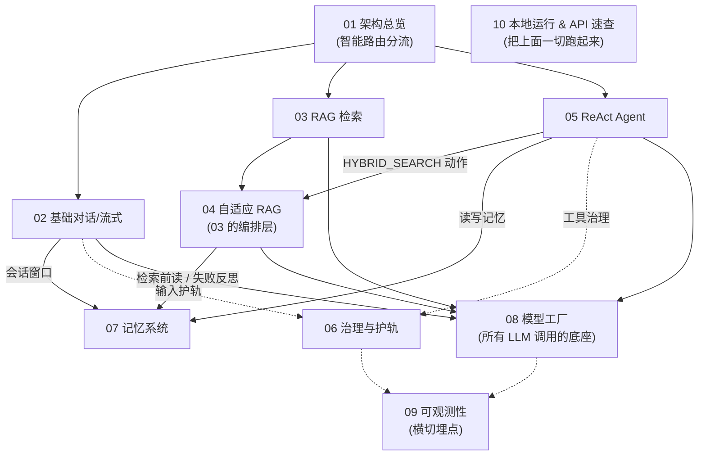

# InfiniteChat-Agent 学习文档（按逻辑链重写版）

> 这是一套**面向学习者**的中文教学文档,目标是让一个「懂 Java / Spring Boot,但没接触过 RAG / ReAct / Agent」的工程师,能顺着一条清晰的逻辑链,从宏观到细节把整套系统读懂、跑通、并看清它的不足。

InfiniteChat-Agent 是一个基于 **Spring Boot 3.5 + Java 17 + LangChain4j + 通义千问** 的企业级智能体后端。它不是普通聊天机器人,而是围绕 **ReAct 推理、Adaptive RAG、长程记忆、工具治理、输入护轨、可观测性** 六大主题构建的一套 Agent 工程实践。

---

## 怎么读这套文档

文档按「**简单 → 组合 → 横切 → 底座 → 实操**」的逻辑链组织,**强烈建议从 01 顺序读到 10**。如果你目标明确,也可以按下表跳读:

| 你的目标 | 推荐路径 |
| --- | --- |
| 先建立全局观,知道有哪些块 | `01` →（任选感兴趣的章) |
| 想搞懂 RAG 检索增强是怎么回事 | `01` → `03` → `04` |
| 想搞懂「Agent / 工具调用」 | `01` → `05` → `06` |
| 想搞懂「让 AI 记得住」 | `07`(可配合 `04`/`05` 看调用点) |
| 只想把项目跑起来、查 API | `10` → `01` |
| 关心工程质量 / 准备改进它 | 全部 + [IMPROVEMENTS.md](IMPROVEMENTS.md) |
| 面试 / 复盘这个项目 | `01` → `03` → `04` → `05` → `07` → [IMPROVEMENTS.md](IMPROVEMENTS.md) |

---

## 学习路线图(10 章)

| # | 章节 | 一句话:读完你会知道 |
| --- | --- | --- |
| 01 | [架构总览与请求生命周期](01-architecture-overview.md) | 5 大子系统怎么拼成一个系统;一个请求进 Controller 后如何被分流到 5 条路径 |
| 02 | [基础对话与流式输出](02-basic-chat-streaming.md) | 最简单的链路:`/chat` vs `/streamChat`;LangChain4j `AiServices` 如何装配模型/记忆/工具/护轨;SSE 事件长什么样 |
| 03 | [RAG 知识库检索增强](03-rag-retrieval.md) | 文档怎么摄取进向量库;向量 + 关键词 + RRF 融合 + Rerank + Citation 的完整检索流水线 |
| 04 | [自适应 RAG](04-adaptive-rag.md) | 在 03 之上加一层「大脑」:要不要查、查哪种、够不够、不够就改写再查(多轮) |
| 05 | [ReAct Agent:推理与工具调度](05-react-agent.md) | 最聪明的一层:Plan → 治理 Gate → 按动作分支 → Observation;Planner 双模;7 个工具 |
| 06 | [工具治理与输入护轨:安全双层](06-governance-guardrail.md) | 横切所有入口的两层安全:输入护轨 + 工具治理(五层检查 + 审计) |
| 07 | [记忆系统:四层记忆与去重纠错](07-memory-system.md) | Redis 短期 + 会话摘要 + 长期记忆 + 反思;Jaccard 去重、用户纠错 |
| 08 | [模型工厂:运行时切换与降级](08-model-factory.md) | 所有 LLM 调用的底座:OpenAI 兼容协议(自实现)与 Qwen 间运行时热切换;层层降级 |
| 09 | [可观测性与监控](09-observability.md) | Micrometer 指标、ChatModelListener 埋点、Actuator/Prometheus、启动加载 |
| 10 | [本地运行与 API 速查](10-run-and-api-reference.md) | 前置依赖、环境变量、怎么启动;一张覆盖全部 Controller 的路由速查表 |

另有一份独立的工程质量审计:

- 📋 [IMPROVEMENTS.md — 不足与改进建议](IMPROVEMENTS.md):22 条经「审计 + 对抗式验证」的真实不足,按严重度分级,含 `file:line` 证据、影响与改进方案。

---

## 逻辑链关系图

这张图说明各章在系统里的「上下游 / 组合」关系——它和阅读顺序不完全一样,但能帮你理解「谁建立在谁之上」。

读图要点:**03 是检索流水线,04 是它的编排层;05 是顶层大脑,会调用 04 的检索和 07 的记忆;06/07/09 是贴在所有路径上的横切设施;08 是所有 LLM 调用共用的底座;10 教你把这一切真正跑起来。**

---

## 技术栈速记

| 层 | 选型 |
| --- | --- |
| 框架 / 语言 | Spring Boot 3.5.13 / Java 17 |
| LLM 编排 | LangChain4j 1.1.0 |
| 大模型 | 通义千问 Qwen(DashScope) + OpenAI 兼容协议(自实现) |
| 向量库 | PostgreSQL + PgVector(不可用降级内存) |
| 业务 / 审计 / 长期记忆 | MySQL(测试降级 H2) |
| 短期会话记忆 | Redis(不可用降级内存) |
| 重排 | 外部 BGE 微服务(可选,失败降级规则重排) |
| 监控 | Micrometer + Prometheus + Actuator |
| 入口 | `http://localhost:10010/api`(端口 10010 + context-path `/api`) |

---

## 配套资源

- **`postman/`**:10 个可直接导入 Postman/Apifox 的 API 测试集合,覆盖 RAG / ReAct / Adaptive RAG / 记忆 / 治理 / 护轨。每章「动手试一试」会指向对应集合。
- **`IMPROVEMENTS.md`**:工程不足与改进建议(已对抗验证)。

## 文档约定

每一章都遵循同一套结构,方便你形成阅读肌肉记忆:

1. **一句话定位** → 这章是干嘛的
2. **为什么需要它** → 动机(没有它会怎样)
3. **核心概念** → 大白话 + 小表格拆术语
4. **工作流程** → 至少一张 mermaid 图
5. **代码走读** → 关键类/方法 + `file:line`,讲清控制流
6. **关键配置** → 从 `application.yml` 摘相关项(键/含义/默认值)
7. **动手试一试** → curl 示例 + 指向 `postman/`
8. **常见坑与注意点** → 真实踩坑提示
9. **小结 & 延伸阅读** → 链接相邻章节

> 文中所有 `file:line` 引用均指向仓库内真实源码(相对仓库根目录,如 `agent/src/main/java/...`),可点开对照。
