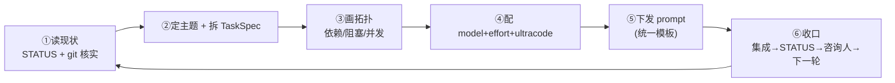
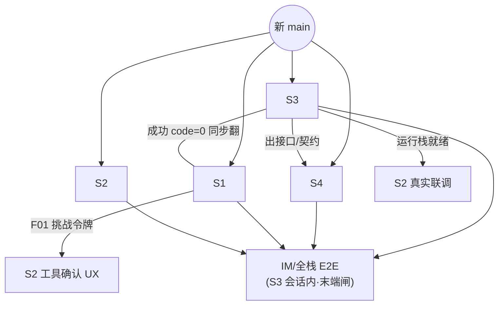
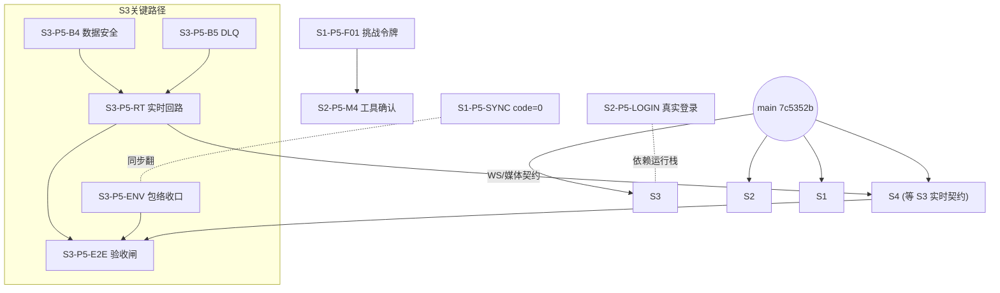

# 编排规范(Orchestration Playbook)

> **这是 HUB 每一轮如何编排 S1–S4 的"规范性流程 + 格式"。** 它回答的是「**怎么编排**」;「编排**什么**」的契约在 [`03-contracts.md`](03-contracts.md),决策在 [`00-master-plan.md`](00-master-plan.md),实时状态在 [`STATUS.md`](STATUS.md)。
>
> 本规范是可复用模板,文末 §7 以**当前 P5 轮**为实例完整走一遍。把这套规范自动化的外部调度器设计在独立项目 `E:\jhw\routines`(见其 `docs/`)。

---

## 0. 为什么需要一套规范

四个工作流并行、靠一个 HUB 人肉协调,最容易出三类事故:① 分工漂移(两个流做同一件事 / 没人做关键件);② 拓扑搞错(让被阻塞的流空跑、或破坏性变更没同步翻导致中途断);③ 资源错配(把关键路径交给低配、把机械活上满配浪费)。本规范用**固定分工 + 显式拓扑 + model/effort 配比方法论 + 统一 prompt/收口格式**把这三类风险工程化。

---

## 1. 固定分工(谁拥有什么 — 不随轮次变)

| 角色 | 代号 | 拥有目录 | 技术栈 | 职责边界 | 产出落点 |
| --- | --- | --- | --- | --- | --- |
| 编排中枢 | **HUB** | `docs/planning/` | Markdown | 拆活/定拓扑/配资源/下发 prompt/集成合并/向人汇报;**只产文档,不写业务码** | 本目录 + `main` 合并 |
| agent 后端 | **S1** | `agent/` | Spring Boot 3.5 + LangChain4j(:18080) | AI 对话/RAG/工具/记忆;消费网关注入身份 | `agent/`、`agent/docs/` |
| agent 前端 | **S2** | `agent-frontend/` | React19+Vite5+HeroUI Pro | AI 助手终端产品(D10) | `agent-frontend/` |
| chat 后端 | **S3** | `chat/` | Spring Boot 2.6 + Spring Cloud Alibaba(网关 :10010) | IM 7 单元 + chat-common + 网关 + E2E | `chat/`、`chat/docs/`、`chat/e2e/` |
| chat 前端 | **S4** | `chat-frontend/` + `packages/design-system` | Vite+React+TS | IM 前端 + 共享设计系统 owner | `chat-frontend/`、`packages/` |

**边界铁律**:每个流**只改自己目录**。跨目录修复必须先在 STATUS 写"交接"。契约级变更(端口/鉴权/包络/ID/数据边界)不由任何流自决,走 HUB 落 `00-master-plan` 决策登记。

---

## 2. 一轮的标准流程(HUB 的回合循环)



| 步 | 动作 | 关键产物 |
| --- | --- | --- |
| ① 读现状 | 读 `STATUS.md` 各流最新条目;`git log --oneline -25` / `git branch -a` **核实**(不轻信描述) | 本轮起点 `main` commit + 各流真实进度 |
| ② 定主题 + 拆活 | 选本轮主题(1 句话),拆成每流的 **TaskSpec**(§3) | 每流 1–4 个 TaskSpec |
| ③ 画拓扑 | 标依赖/阻塞/可并发(§4) | 本轮拓扑图 |
| ④ 配资源 | 给每个 TaskSpec 配 model+effort+是否 ultracode(§5) | 资源配比表 |
| ⑤ 下发 | 按统一模板(§6)生成 4 段 prompt;必要时排程为 scheduled-tasks | 4 段 prompt |
| ⑥ 收口 | 集成检查点合并 + STATUS HUB 条目 + AskUserQuestion 3 问 + 下一轮 prompt(§8) | 新 `main` + 决策 + 下一轮 |

---

## 3. TaskSpec 格式(每个任务怎么写)

每个分给某流的任务都按此结构表达(下发 prompt 时展开为自然语言,调度器里则是结构化字段):

| 字段 | 含义 | 例 |
| --- | --- | --- |
| `id` | 任务号 | `S3-P5-B4` |
| `流` | 归属 | S3 |
| `依赖` | 必须先完成的 TaskSpec / 上游契约 | `chat-common(已交付)` |
| `model+effort` | 见 §5 | Opus 4.8 / xhigh |
| `ultracode` | 是否多 agent 工作流编排 | 是(数据安全设计+对抗验证) |
| `验收判据` | 可验证的出口 | "毒消息进 DLQ 不阻塞;消费中断后历史不丢;IM E2E 绿" |
| `产出物` | 文件/分支 | `feat/chat-backend-p5`,B4/B5 代码 + e2e 脚本 |
| `契约影响` | 是否破坏性/走 expand-contract/需通知谁 | 成功 code=0 翻转 → 通知 S2/S4 |
| `人工闸` | 是否需人拍板/验收 | E2E 验收由 S3 会话内跑后 HUB 过 |

---

## 4. 拓扑与调度规则

**四条依赖铁律**(决定谁阻塞谁):

1. **契约/API 方向**:`S1/S3 的契约与接口 ⟶ 解锁 S2/S4`。后端没出的接口,前端只能 Mock/等。
2. **破坏性契约变更走 expand/contract**:真实 HTTP 状态翻转、删 body userId、ID 串化等——**先并存(双读)→ S1/S3 同步翻 → 翻前在 STATUS 通知 S2/S4**(防中途断)。详见 [`03-contracts.md §10`](03-contracts.md)。
3. **全栈/IM E2E 归 S3 会话内**:跨 `wsl.exe` 调用进程会被拆、网关冷启动反复 000;端到端验收只能在 **S3 常驻 WSL 会话**里跑(中间件全在 WSL,见 [`60-e2e-test-environment.md`](60-e2e-test-environment.md))。
4. **分支隔离防缠**:每流从**同一新 main** 起**自己的** `feat/<scope>-pN` 分支 + 各自 git worktree;**S2 必须用自己的 `feat/agent-frontend-pN`**(历史上 S2 提交多次误落 chat-frontend 分支)。

**一轮的典型拓扑(泛化)**:



> 经验:**瓶颈长期在 S3(关键路径)**。每轮先保 S3 解锁件,其余流安排"不被 S3 挡的契约安全活",避免空等。

---

## 5. model + effort 配比方法论

按任务的**四个维度**打分,映射到 model + effort + 是否 ultracode:

| 维度 | 低 → 高 含义 |
| --- | --- |
| 歧义度 | 需求是否明确、解空间是否窄 |
| 爆炸半径 | 改错的影响面(数据丢失/鉴权/跨流契约 = 最大) |
| 并发正确性 | 是否涉及事务/并发/分布式一致性 |
| 新颖度 | 是否走过的路 / 是否需要设计探索 |

**映射表**(默认值,可按具体情况微调):

| 任务类型 | 典型例子 | model | effort | ultracode? |
| --- | --- | --- | --- | --- |
| 机械低风险 | 配置翻转、删死代码、文案、code=0 同步翻 | Opus **4.7** | low–medium | 否 |
| 标准功能 | 接端点、写组件、加 DTO 校验、Mock→真接 | Opus **4.8** | medium | 否 |
| 关键路径 / 高爆炸半径 | 鉴权翻转、包络收口、live WS 实时回路 | Opus **4.8** | high–xhigh | 视情(设计期可上) |
| 数据安全 / 并发一致性 | outbox 同事务、Kafka DLQ、红包正确性 | Opus **4.8** | **xhigh** | **是**(设计+对抗式验证) |
| 安全设计 | 工具确认挑战令牌、密钥/越权面 | Opus **4.8** | high | 视情 |
| 端到端验收 | IM 全链路 E2E、全栈鉴权 E2E | Opus **4.8** | high | 否(执行型,but 设计用例可 ultracode) |
| 架构/新颖设计 | 新子系统设计、跨栈方案抉择 | Opus **4.8** | xhigh–**max** | **是** |

**原则**:
- **不浪费**:低风险机械活别上 `max`/ultracode(成本与时延);
- **不冒险**:数据丢失/鉴权/跨流契约这类**爆炸半径大**的,宁可上 `xhigh` + ultracode 做对抗式验证;
- **ultracode 用在刀刃**:多方案对比、对抗式找 bug、大范围 sweep、E2E 用例设计——即"靠多 agent 并行+交叉验证显著提质"的场合;单点机械编辑不用。
- `4.7` 仅用于明确机械、低风险的省钱档;有设计/正确性风险一律 `4.8`。

---

## 6. Prompt 统一模板(下发格式)

所有流的 prompt 用同一骨架,确保信息齐、约束一致:

```text
你是 灵犀(Lingxi)的 <子项目>(<S?>)。本轮主题=<一句话>。
【起点】从新 main(<commit>)起你自己的 worktree 分支 feat/<scope>-p<N>。
【先读】03-contracts.md + STATUS.md(+ 本流计划 <x0>-plan.md / IMPROVEMENTS.md)。
【model+effort】<Opus 4.8/4.7 · effort · ultracode?>  ← 供你掌握本轮投入档位
【任务】(按 TaskSpec,逐条give验收判据)
  1. <task1 + exit criteria>
  2. ...
【约束】只改 <自己目录>;破坏性契约变更走 expand/contract,翻前在 STATUS 通知 S2/S4;
        push 用 HTTPS;每完成一单元在 STATUS 自己小节追加记录;<前端:build+verify 保持绿>。
【验收/交接】<谁来验、E2E 归 S3 会话内、需要谁接力>。
```

---

## 7. 本轮实例:P5(IM 实时闭环 + 数据安全)

### 7.1 主题与基线
- **主题**:把"发消息→实时到达+不丢"跑通。
- **基线**:`main = 7c5352b`(P4:统一鉴权 E2E 13/13、IM 前端吃真实读 API、RAG 真嵌入)。
- **末端闸**:S3 在常驻 WSL 会话内跑 IM 全链路 E2E 验收。

### 7.2 任务分解 + 资源配比(TaskSpec 摘要)

| id | 流 | 任务 | model+effort | ultracode | 依赖 | 验收判据 |
| --- | --- | --- | --- | --- | --- | --- |
| S3-P5-B4 | S3 | 消息正文与 outbox **同事务**落库;Offline 降幂等投影 | 4.8 · xhigh | 是 | chat-common | 消费中断/毒消息下历史不丢 |
| S3-P5-B5 | S3 | Kafka DefaultErrorHandler+DLQ+ErrorHandlingDeserializer | 4.8 · xhigh | 是 | — | 毒消息进 DLQ 不阻塞分区 |
| S3-P5-RT | S3 | live WS 发→实时到对端→ACK 回路 + 媒体发送 | 4.8 · high | 否 | B8 握手(已适配) | 对端实时收到 + ACK |
| S3-P5-ENV | S3 | 余下 5 服务接 chat-common 包络收口 | 4.8 · medium | 否 | — | drift 消除 |
| S3-P5-E2E | S3 | IM 全链路 E2E(登录→发→实时收→历史→离线→markRead→媒体) | 4.8 · high | 否 | 上述 | 会话内跑绿 |
| S4-P5-RT | S4 | 按 ADR 0002 切真实 WS:live 发/收 + 媒体写路径 | 4.8 · high | 否 | **S3-P5-RT 契约** | 收发去重/重连 backfill |
| S2-P5-LOGIN | S2 | 真实邮箱登录端到端验(对接运行栈) | 4.8 · low–medium | 否 | 运行栈(S3) | 登录→流式→401 refresh→登出 |
| S2-P5-M3 | S2 | 接 agent 死端点(/chat、/rag、/agent 模式路由) | 4.8 · medium | 否 | — | 死代码清除 |
| S2-P5-M4 | S2 | 工具确认 UX(confirmedTools 重发) | 4.8 · high | 否 | **S1-P5-F01** | 列确认→勾选→重发 |
| S1-P5-SYNC | S1 | 与 S3 同步翻成功 code=0;D5 string id 收尾 | **4.7** · low–medium | 否 | S3 翻转窗口 | 前端双兼容不破 |
| S1-P5-IM | S1 | 备 agent 给"IM 内助手"(/api/agent/chat 经网关流式) | 4.8 · medium | 否 | — | 按真实用户隔离记忆/RAG |
| S1-P5-F01 | S1 | 工具确认挑战令牌(服务端一次性 challenge) | 4.8 · high | 视情 | — | 客户端回传 token 而非工具名 |

### 7.3 本轮拓扑



> 读法:**S3 是关键路径**(数据安全 → 实时回路 → 验收闸);S4 的 live 收发被 S3 的实时/媒体契约阻塞,先做不依赖部分;S1/S2 大体可并发,仅 `code=0 同步翻`与 `F01↔M4`是跨流握手点。

### 7.4 本轮 4 段 prompt
本轮 4 段 prompt 已按 §6 模板下发,并排程为 scheduled-tasks(`agent-backend-p5` / `agent-frontend-p5-real-login-e2e` / `lingxi-chat-frontend-p5`,S3 走常驻 WSL 手动跑),收口排程为 `lingxi-round-close`。prompt 全文见 STATUS 对应轮次的 HUB 下发记录。

---

## 8. 收口格式(round-close)

一轮做完,HUB 按固定动作收口(已固化为定时任务 `lingxi-round-close`):

1. **git 核实汇总**:逐流"完成了什么 + commit + 是否端到端验过",**如实标注仍欠,不夸大**。
2. **集成检查点**(经人同意):`git merge --no-ff feat/<scope>-pN` 逐条并入 `main`(无冲突则 push HTTPS);空分支/缠分支如实说明并修正。
3. **STATUS HUB 条目**:本轮数字(git 核实)/ 已完成 / 仍欠(头号风险)/ 用户拍板 / 下一轮 + 新 `main` commit。
4. **AskUserQuestion 三问**:① 现在合 main? ② 下一轮主题?(给 2–4 个基于现状的候选)③ 下一轮做完谁验收?(默认 S3 会话内 E2E)。
5. **下一轮 prompt**:回到 §2 的回合循环,产出下一轮 4 段 prompt。

**STATUS HUB 条目模板**:
```md
### YYYY-MM-DD · P<N> 集成:<一句话里程碑>;下轮=<主题>
- 本轮 P<N> 数字(git 核实):S1 … / S2 … / S3 … / S4 …
- 里程碑:🎉 …
- 已集成:四条 pN 并入 main = <commit>(冲突情况)
- 仍欠(关键):🔴 …
- 用户拍板:① … ② … ③ …
- 下一轮:S3 … / S4 … / S2 … / S1 …
- 阻塞:… 待中枢确认:…
```

---

*维护:HUB。本规范是"怎么编排"的事实来源;自动化它的外部调度器设计见 `E:\jhw\routines`。*
